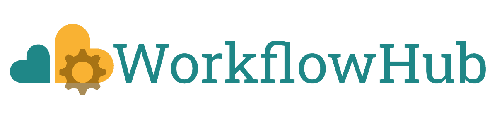
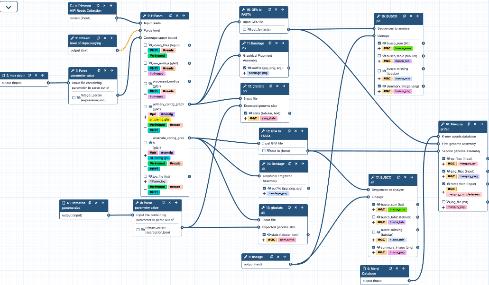

## Biodiversity Genomics in Europe

As part of the Biodiversity Genomics Europe project ([BGE](https://biodiversitygenomics.eu/)), Galaxy and TIaaS were used to teach young researchers how to produce high-quality <i>de-novo</i> genome assemblies and annotations for eukaryotic organisms. Workshops have so far been run in University of Łódź, Poland and at the Berlin Centre for Genomics in Biodiversity Research (BeGendiv), Germany making use of the Galaxy compute infrastructure and TIaaS services. Both the [BRIGHT](https://biodiversitygenomics.eu/2025/04/11/bge-joint-network-training-biodiversity-research-integrating-barcoding-genomics-and-high-throughput-technologies-bright/) and [BeGenDiv](https://biodiversitygenomics.eu/2025/01/14/a-recap-of-the-bge-workshop-at-the-berlin-center-for-genomics-in-biodiversity-research/) workshops for dna barcoding and reference genome generation introduced young researchers to the data, tools and workflows used by the biodiversity genomics community to generate high-quality genomic data for non-model organism, including reference genome assemblies and annotations for all species across the tree of life.

{width="550"}

## Reference Genome Generation in Galaxy

In total, over 50 participants, ranging from master’s students to early-career researchers from Germany and Poland, were introduced to the Galaxy Europe system. They learned how to work with genomic data, how to concatenate tools into custom pipelines, and how to run published complex workflows to generate and evaluate chromosome-scale genome assemblies and high-quality annotations.
Using Galaxy Europe’s compute resources, participants produced and assessed fungal, nematode, and algal genomes up to pseudo-chromosome–scale. These “real-world examples” demonstrated how the European Reference Genome Atlas ([ERGA](https://www.erga-biodiversity.eu/)) and the Earth BioGenome Project ([EBP](https://www.earthbiogenome.org/)) are aiming to deliver high-quality reference genomes for all eukaryotic life in Europe and worldwide.

{width="550"}

We leveraged the Training Infrastructure as a Service (TIaaS) to monitor exercises in real-time and to allocate dedicated resources on-the-fly. This ensured swift tool execution and smooth coordination throughout the workshop. Most participants came in with little or no prior experience on Galaxy. They were unanimously impressed with the platform’s capabilities, its ease of use, its effectiveness as a teaching tool, and its open-source ecosystem of standardised, freely available resources.

All workflows used as part of the training follow the recommendations of the ERGA Sequencing and Assembly Committee ([SAC](https://www.erga-biodiversity.eu/team-1/sac---sequencing-and-assembly-committee)) and were developed by Diego De Panis (IZW) and published for reuse by researchers anywhere openly in [{width="150"}](https://workflowhub.eu/collections/27).

{width="800"}

Example workflow generating contigs from PacBio HiFi long-reads followed by quality control of the generated assembly.

