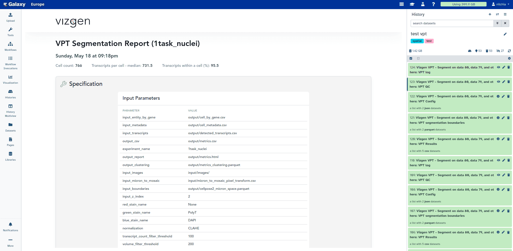
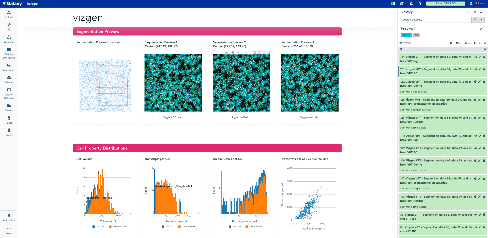
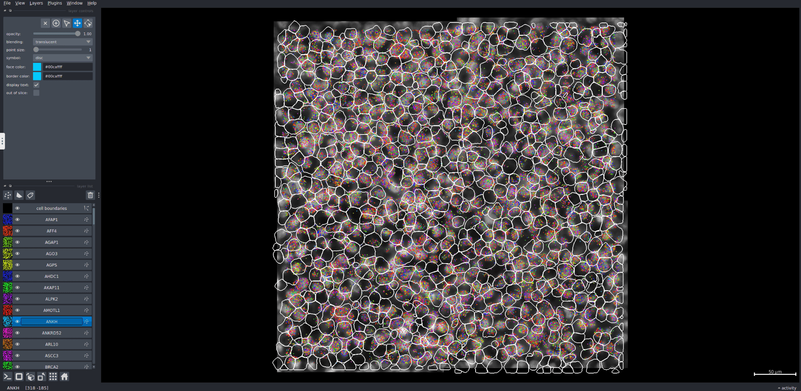

[VPT (Vizgen Post-processing Tool)](https://github.com/Vizgen/vizgen-postprocessing) open-source suite for post-processing MERFISH spatial transcriptomics data from Vizgen, is now available in Galaxy.

# What is VPT?

VPT is a command-line tool enabling VIZGEN users to reprocess and refine single-cell results of MERSCOPE. The "Vizgen VPT - Segment" tool suite in Galaxy provides a user-friendly interface to run `run-segmentation`, `partition-transcripts`, `sum-signals`, `derive-entity-metadata`, and `generate-segmentation-metrics` commands in one step.

This processing including:

* Cell segmentation
* Regenerating single-cell data from the segmentation
* Regenerating cell spatial metadata
* Calculating image intensity in each cell
* Generating a quality report

# How can I use VPT?

"Vizgen VPT - Segment" requires two types of input:

* MERSCOPE images, Micron to mosaic mapping file, and detected transcripts
* Configuration of segmentation steps

The latter can be set easily by `Segmentation configuration file` parameter.

# What are the outputs?

The "Vizgen VPT - Segment" tool suite will output multiple results (depending on the parameters selected):

* VPT Results:
  * Cell by gene file
  * Cell metadata file
  * Detected transcripts file
  * QC metrics as CSV
  * Sum signals

* VPT segmentation boundaries:
  * The cell boundaries in parquet format

* VPT config:
  * The config file used for segmentation

* VPT QC:
  * Quality control result as an HTML

* VPT log:
  * log file generated through the analysis

The output can be easily visualized with [bellavista IT](https://usegalaxy.eu/?tool_id=interactive_tool_bellavista&version=latest) and users can validate the segmentation and generate publication ready images from their spatial results.

 

VPT result - QC

 

VPT result - QC

 

 

Bellavista IT

 

If the current segmentation models can not properly detect cells and provide a good segmentation, users can use the [Vizgen VPT - Extract](https://usegalaxy.eu/?tool_id=toolshed.g2.bx.psu.edu%2Frepos%2Fbgruening%2Fvpt_extract%2Fvpt_extract%2F1.3.0%2Bgalaxy0&version=latest) tool to extract an image batch from the actual MERSCOPE image, manually segment it with cellpose and then train a model based on their segmentation and run the "Vizgen VPT - Segment" again with their trained model.

Try it out on <strong>Galaxy</strong> today and analyze your spatial data!

    <a href="https://usegalaxy.eu/?tool_id=toolshed.g2.bx.psu.edu%2Frepos%2Fbgruening%2Fvpt_segment%2Fvpt_segment%2F1.3.0%2Bgalaxy0&version=latest">
      <button type="button" class="btn btn-primary btn-lg">Start VPT now</button>
    </a>

