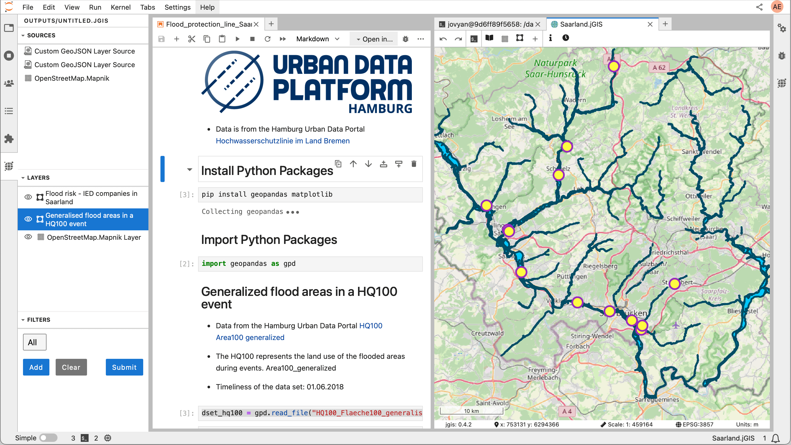

Geospatial research is becoming increasingly collaborative, where people with different expertise work together to solve complex GIS problems. However, commonly used tools in the GIS domain do not have real-time collaboration functionality. [JupyterGIS](https://github.com/geojupyter/jupytergis) is a JupyterLab extension that is developed to meet this need. It provides a web-based environment that supports real-time collaboration, geospatial analysis, and seamless integration with Jupyter notebooks. Here are some features of JupyterGIS:

- QGIS compatibility: You can import and export QGIS project files to JupyterGIS. Both JupyterGIS and QGIS are available in Galaxy, so you can seamlessly transition between them.
- Real-time collaboration: You can work together with your colleagues using features like real-time editing, follow mode, and annotations.
- Notebook integration: You can analyze datasets in Jupyter notebooks by combining the Python API with other widely used geospatial libraries.

Cloud-based: You can use JupyterGIS in Galaxy, local installation is not needed.
JupyterGIS is already being used in real-world research, such as the [FAIR2Adapt](https://eosc.eu/eu-project/fair2adapt/) project. In this project, the aim is to apply the [FAIR principles](https://www.go-fair.org/fair-principles/) to climate adaptation data to improve machine-assisted discovery and utilization of the data. By enhancing the findability, accessibility, interoperability and reusability of the climate adaptation data, the project aims to enable policymakers, researchers and local communities to develop science-based climate adaptation strategies. 

The FAIR2Adapt project consists of six case studies addressing real-world challenges. In one of these case studies, the climate-induced stressors are investigated in Germany. The aim is to inform Germany’s climate change adaptation strategies by integrating socio-economic data with physical climate hazard data.

In this case study, JupyterGIS is used to analyze and visualize the dataset for flood risk in Saarbrücken. Using JupyterGIS’s collaborative features, climate adaptation experts, GIS specialists, and data scientists were able to work together, layering different datasets, sharing insights in real time, and identifying possible sources of pollution that may threaten the environment during extreme weather conditions. You can find the Research Object with the notebooks and the corresponding Galaxy History [here](https://w3id.org/ro-id/15e54fde-611f-49cc-8951-e15c650f0cb2) . The rendered Jupyter Notebook for the main analysis is available [here](https://fair2adapt.github.io/saarland-flooding/).

You can start using [JupyterGIS in Galaxy](https://usegalaxy.eu/?tool_id=interactive_tool_jupytergis_notebook&version=latest). You can start with a new notebook or upload an existing notebook, upload your dataset, and share your setup with others. This cloud-based setup is ideal for trainings, workshops, or collaborative projects.

To help new users get started, there are two tutorials available:
- [Intro to JupyterGIS:](https://jupytergis.readthedocs.io/en/latest/user_guide/tutorials/01-intro/index.html) a guide for new users.
- [Collaborative Features Tutorial:](https://training.galaxyproject.org/training-material/topics/climate/tutorials/jupytergis_collaboration/tutorial.html) a guide for exploring real-time editing and shared annotations.