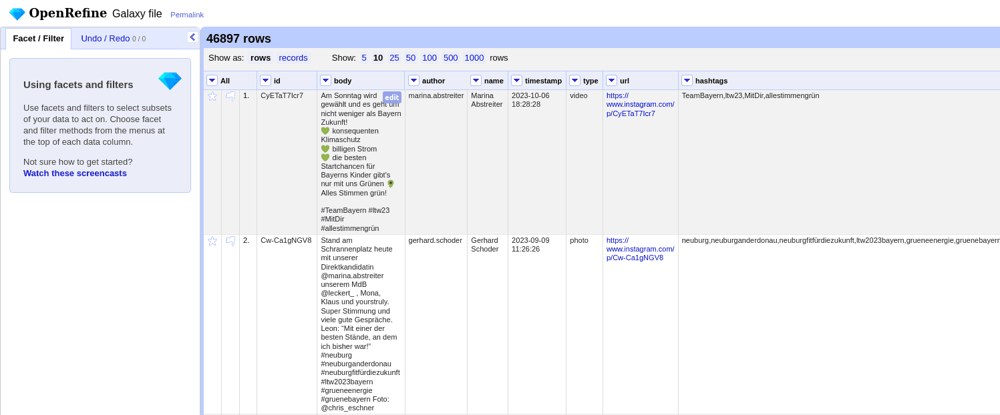
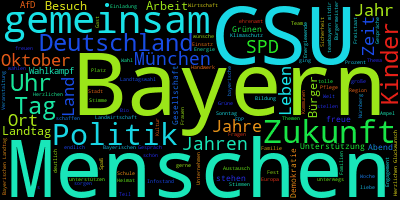
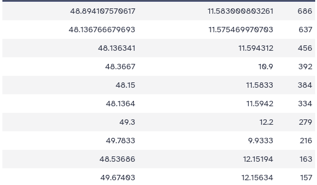
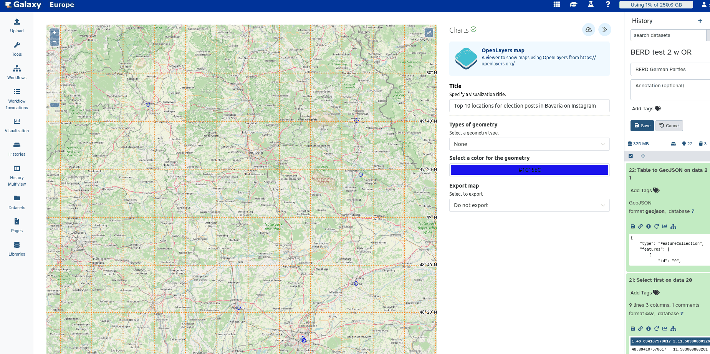
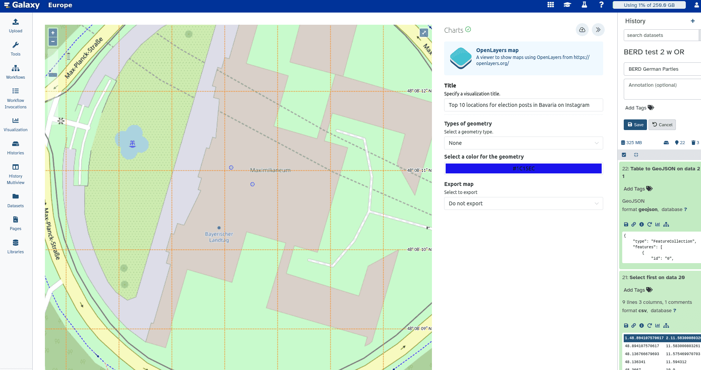

In April, we included the [Berd4NFDI](https://www.berd-nfdi.de/about/) data portal in [Galaxy](https://galaxyproject.org/news/2025-04-09-berd-integration/). 
BERD is a NFDI consortium working towards a platform for collecting, (pre-)processing, analysing and preserving Business, Economic and Related Data. 
Their data portal is a hub for sharing suitable datasets. 
In this post, we showcase how you can make use of the content in Galaxy. 
We will demonstrate how to import data from BERD, do some data cleaning and wrangling and plot a word cloud and a geo map to see what content featured prominently and what popular locations of posts were.

## Getting started in Galaxy

To analyse BERD data directly in Galaxy, go to the [European Galaxy server](https://usegalaxy.eu/). 
On the left pane, click on the "Upload" button. In the new window, click on the button 'Choose from repository'. 
In the opening window, insert "BERD" in the search bar. Now you can click on the folder "BERD@NFDI Repository". 
The datasets from BERD's portal show up here. You can select any folder to see its content. 
To choose one, click on the item or items you want to work with and click on the 'Select' button in the corner. Click on 'Start' and close this window.
We worked with "Instagram Posts from German Parties" imported the CSV file to Galaxy.

## Example Analysis

The [dataset](https://berd-platform.de/records/nghbn-9gx74) "Instagram Posts from German Parties" is particularly insightful as the file contains posts from 632 of the 1134 people standing for election in the Bavarian state election.  
Since the data is messy, we first open it in the interactive environment of Open Refine, directly from Galaxy. 

You can adapt the data in OpenRefine according to your needs. In the next step, we export the file out of the interactive environment, back to the Galaxy platform.
There, you can add further analysis, like removing line breaks with Regular Expressions. 
In this example, we were interested in two things: the most prevalent themes of the posts and where they originated.
Therefore, we first cut out only the posts from the table, cleaned the content from stopwords and made a word cloud.

### Visualising the posts

As expected, the first glimpse suggests "Bayern" (Bavaria) and the CSU, the ruling party in Bavaria, feature as prominent topics. 
Furthermore, the posts often contain "zusammen" (together), signalling a need for unity as well as "Menschen" (humans), the main target group - the population of Bavaria.
Other parties appear smaller on the word cloud. SPD (the social democratic party) appeared more often than AfD (right-wing party) and Grüne, the green party.

### Where did the posts originate?

Another question we had was, where did those posts originate? Some posts featured information on latitude and longitude. With the help of Galaxy, we selected column 13, which contains this info, split and processed it so that it becomes two separate columns. We select only the rows containing proper location information. With the help of [Datamash](https://usegalaxy.eu/root?tool_id=toolshed.g2.bx.psu.edu/repos/iuc/datamash_ops/datamash_ops/1.8+galaxy0), a tool in Galaxy, we can sum up the most prominent locations indicated in those posts.
The over 200.000 posts originated from more than 6.000 locations. Those are, however, unequally spread. 

The most prominent location, according to the dataset, was used to send 686 posts. 157 posts were sent from the 10th most prominent location.

Converted into a GeoJSON, Galaxy is able to visualise the data within the platform.
Interestingly, not all 10 locations correspond to the biggest cities in Bavaria. Also, smaller locations posted very actively during the election campaign.
Regensburg, Nürnberg and Erlangen are, for example, not among the top 10 locations where most posts originated. 
Meanwhile, Landshut and Weiden in der Oberpfalz featured prominently, as the map shows.

The map shows blue circles, indicating those locations. 
Some, as in the case of Munich, are overlapping here. 

Zooming in further shows that several different locations within Munich had very strong social media activity.
For example, Munich's Maximilianeum has two particularly active locations within a short distance, as the zoomed-in map shows.

Seeing that Maximilianeum currently hosts the Bavarian State Parliament, this comes as little surprise. 
It seems many politicians posted their Instagram stories directly from the Parliament, as Galaxy's quick analysis of the dataset shows.

## Conclusion
With the integration of BERD Data portal in Galaxy, we can easily access datasets directly in the platform. Due to Galaxy's modular build, you can adapt the analysis according to your research questions and needs.
We wanted to gain insights into the rough topics of the posts and their origin. But also, many different tasks are possible. You can use Natural Language Processing, refine your data further with OpenRefine or try something completely different. Why not give it a try with your dataset?

