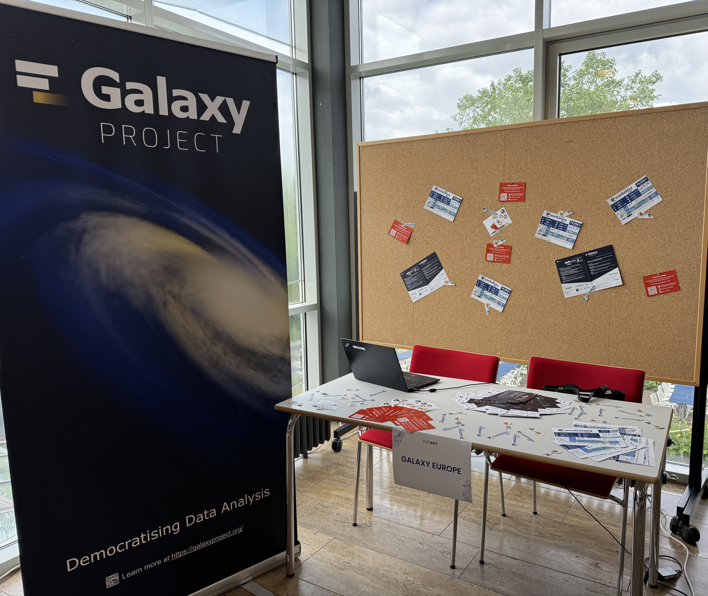

The Galaxy Europe team participated in [the Women's Careers and Networks (WoCaNet) Symposium](https://www.uni-goettingen.de/en/203891.html), held on June 4–5, 2025 at [the Max Planck Institute for Multidisciplinary Science](https://www.mpinat.mpg.de/en), Faßberg Campus, Göttingen, Germany. WoCaNet is a vibrant, student-organized event that brings together a diverse community of researchers, students, and professionals across academia and industry to explore career paths, foster mentorship, and promote gender equality in science.

## Day 1: Workshops and Empowerment and Career Development

The first day was dedicated to a series of inspiring workshops on topics such as women’s empowerment, unconscious bias, and healthy time and energy management. The Galaxy team joined these sessions and took part in valuable discussions that encouraged personal reflection, built awareness around workplace dynamics, and offered strategies for creating a more inclusive research environment.

Galaxy’s presence on Day 1 emphasized our commitment to our mission of empowering researchers through open, inclusive, and accessible scientific infrastructure, as well as our support for gender equality.

## Day 2: Galaxy at the WoCaNet Career Fair

On the second day, Galaxy Europe hosted a stand during the Career Fair, connecting directly with attendees who were curious about integrating data science into their research. We had engaging conversations about:

- **How Galaxy supports researchers from many disciplines in their data analysis**
- **The role of Galaxy in promoting FAIR, open, and reproducible science** 
- **Accessing publicly available tools and workflows for biological data analysis**
- **Opportunities to join the Galaxy community, contribute, and build skills**
- **Resources such as the [Galaxy Training Network (GTN)](https://training.galaxyproject.org/)**

The feedback was fantastic—many attendees shared their curiosity about learning bioinformatics and were excited to discover how Galaxy makes that accessible. We also handed out flyers and demoed some training resources available through the [Galaxy Training Network (GTN)](https://training.galaxyproject.org/).

## Community, Connection, and Collaboration

WoCaNet 2025 created a unique space for reflection, motivation, and connection. We were inspired by the participants’ openness and drive, and it was an honor to contribute to a program that celebrates and supports women in STEM.

We thank the incredible student organizing team behind [WoCaNet 2025](https://www.uni-goettingen.de/en/203891.html).
