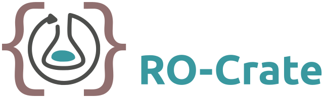
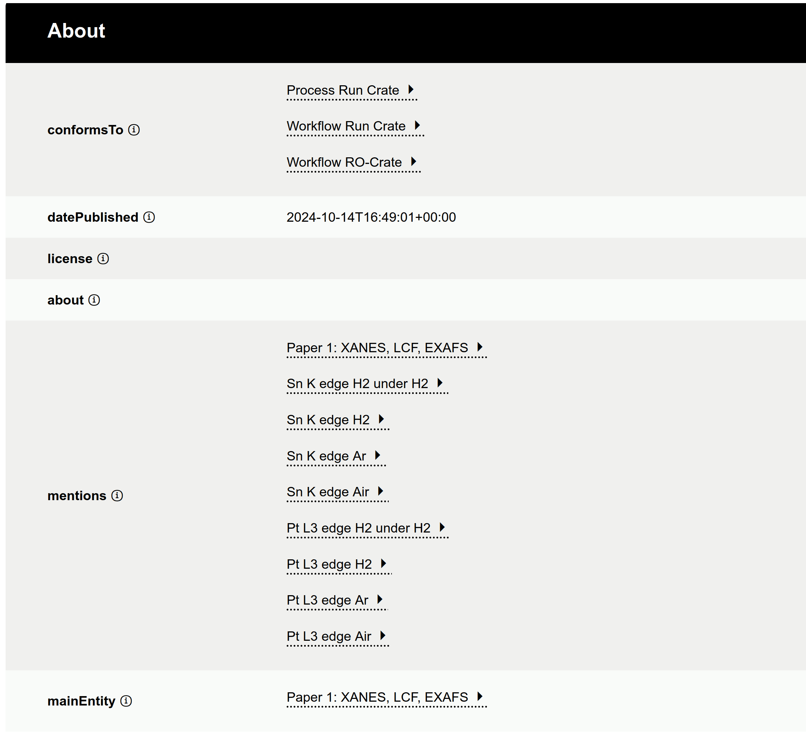

[Research Object Crate](https://www.researchobject.org/ro-crate/) specification [RO-Crate version 1.2](https://w3id.org/ro/crate/1.2) has been released.

This release (<https://w3id.org/ro/crate/1.2>) marks the culmination of a large collaborative effort by the [RO-Crate community](https://www.researchobject.org/ro-crate/community), working closely with the Galaxy community through the projects [EuroScienceGateway](https://galaxyproject.org/projects/esg/) and [FAIR-EASE](https://fairease.eu/about), and multiple international collaborators.

## Release highlights

* Backwards-compatible, most metadata files can simply upgrade their version declaration from RO-Crate 1.1
* Formalisation of [profile crate](https://www.researchobject.org/ro-crate/specification/1.2/profiles), a mechanism for specialising the core RO-Crate profile
* New option of [detached crate](https://www.researchobject.org/ro-crate/specification/1.2/structure#types-of-ro-crate) for RO-Crate metadata files outside of a folder-like structure (e.g. as part of an API)
* Specified how to [reference other RO-Crates](https://www.researchobject.org/ro-crate/specification/1.2/data-entities#referencing-other-ro-crates), including their profile
* Specified how to [retrieve an RO-Crate](https://www.researchobject.org/ro-crate/specification/1.2/data-entities#retrieving-an-ro-crate), using [FAIR Signposting](https://signposting.org/FAIR/) ("Webby FDO")
* Editorial changes throughout with clarifications, improved language and examples

RO-Crate 1.2 constitutes a stable _long-term release_.
For a full list of updates, see the [changelog](https://www.researchobject.org/ro-crate/specification/1.2/appendix/changelog.html).

## RO-Crate governance

The release was approved by the recently formed [RO-Crate Steering Committee](https://github.com/ResearchObject/governance/blob/main/org-docs/STEERING-COMMITTEE.md), who follow the [Minimal Viable Governance](https://github.com/ResearchObject/governance) model, with a  mission to write, maintain and release versions of the RO-Crate specification and associated website, as well as advocating RO-Crate use.

The RO-Crate community is open for all to [contribute](https://github.com/ResearchObject/ro-crate/issues/1) or to join a [regional drop-in calls](https://www.researchobject.org/ro-crate/community#meetings) for any questions.

## About RO-Crate

Research Object Crate ([RO-Crate](https://www.researchobject.org/ro-crate/)) is a community effort to establish a lightweight approach to packaging research data with their metadata.

The RO-Crate specification defines a method of aggregating and describing data for distribution, re-use, publishing, preservation and archiving. RO-Crates aggregate data into a Dataset, and may describe any resource including files, URI-addressable resources, or use other addressing schemes to locate digital or physical data.

Describing resources includes technical metadata such as file sizes and types as well as contextual information including how and where datasets and files were created, how they were collated and collected, who was involved in the process, what equipment and software was used, who funded the work, how to cite it, and crucially, how it may be reused, and by whom.

The core of RO-Crate is a machine-readable linked-data document in JSON-LD format known as an RO-Crate Metadata Document. RO-Crate metadata documents can, to a large extent, be created and processed just like any other JSON: knowledge of JSON-LD is not needed, unless extending RO-Crate with additional concepts or combining RO-Crate with other Linked Data technologies.

## RO-Crate profiles in Galaxy

RO-Crate can be used for packaging any kind of dataset, but can also be used for workflow definitions and executions. RO-Crate 1.2 defines the concept of a [profile](https://www.researchobject.org/ro-crate/specification/1.2/profiles.html) to explicitly indicate the kind of content to be expected in a subset of RO-Crates.

Galaxy supports RO-Crate as an [export](https://galaxyproject.org/news/2023-02-23-structured-data-exports-ro-bco/) format for workflow runs and histories, which can then be published in repositories like [Zenodo](https://doi.org/10.5281/zenodo.13940793), and later imported into other Galaxy instances and used with [RO-Crate tooling](https://www.researchobject.org/ro-crate/tools) or combined in knowledge graphs. [WorkflowHub](https://workflowhub.eu/), supported by EuroScienceGateway, stores published workflows as RO-Crate.

These specialisations of RO-Crate can be formalised using the new profile mechanism, as already demonstrated for [Workflow Run RO-Crate](https://www.researchobject.org/workflow-run-crate/profiles/workflow_run_crate/), shown in Figure 1:

_**Figure 1**: Preview of Galaxy RO-Crate [Pt3Sn nanoparticle electrocatalysts](https://doi.org/10.5281/zenodo.13940793), HTML generated using [RO-Crate Playground](https://ro-crate.ldaca.edu.au/). `conformsTo` indicates the implemented RO-Crate profiles ([Process Run Crate](https://w3id.org/ro/wfrun/process/0.5), [Workflow Run Crate](https://w3id.org/ro/wfrun/workflow/0.5), [Workflow RO-Crate]https://w3id.org/workflowhub/workflow-ro-crate/1.0)), these profiles indicate expected metadata descriptions and file content, and are defined further with the Profile Crate mechanism now formalised by RO-Crate 1.2._

[Training material for RO-Crate](https://training.galaxyproject.org/training-material/topics/fair/) is provided as part of the Galaxy Training Network. Domain-specific training by FAIR-EASE is also available for [Earth-system RO-Crate](https://gxy.io/GTN:S00127) and as [webinar](https://www.youtube.com/watch?v=fxF6AJDXxGc). For [catalysis researchers](https://galaxyproject.org/news/2025-03-25-catalysis-reproduction-paper/), EuroScienceGateway and the [UK Catalysis Hub](https://ukcatalysishub.co.uk/) has created a [tutorial for importing RO-Crate](https://xerte.cardiff.ac.uk/play_22519) in the STFC Materials Galaxy instance.

## Community

Thanks to the [RO-Crate community](https://www.researchobject.org/ro-crate/community)!

Peter Sefton, Eoghan Ó Carragáin, Stian Soiland-Reyes, Oscar Corcho, Daniel Garijo, Raul Palma, Frederik Coppens, Carole Goble, José María Fernández, Kyle Chard, Jose Manuel Gomez-Perez, Michael R Crusoe, Ignacio Eguinoa, Nick Juty, Kristi Holmes, Jason A. Clark, Salvador Capella-Gutierrez, Alasdair J. G. Gray, Stuart Owen, Alan R Williams, Giacomo Tartari, Finn Bacall, Thomas Thelen, Hervé Ménager, Laura Rodríguez Navas, Paul Walk, brandon whitehead, Mark Wilkinson, Paul Groth, Erich Bremer, LJ Garcia Castro, Karl Sebby, Alexander Kanitz, Ana Trisovic, Gavin Kennedy, Mark Graves, Jasper Koehorst, Simone Leo, Marc Portier, Paul Brack, Milan Ojsteršek, Bert Droesbeke, Chenxu Niu, Kosuke Tanabe, Tomasz Miksa, Marco La Rosa, Cedric Decruw, Andreas Czerniak, Jeremy Jay, Sergio Serra, Ronald Siebes, Shaun de Witt, Shady El Damaty, Douglas Lowe, Xuanqi Li, Sveinung Gundersen, Muhammad Radifar, Rudolf Wittner, Oliver Woolland, Paul De Geest, Douglas Fils, Florian Wetzels, Raül Sirvent, Abigail Miller, Jake Emerson, Davide Fucci, Bruno P. Kinoshita, Maciek Bąk, Jens Hollunder, Martin Weise, Vartika Bisht, Toshiyuki Nishiyama Hiraki, Bram Ulrichts, Michael Falk, Eli Chadwick, Daniel Bauer, James Love, Eleni Adamidi, Josh Moore, Lars Schöbitz, Andreas Meier, Juan Fuentes, Edan Bainglass, Balazs E. Pataki, Joe Heffer, Pascal Su, Andrea Davanzo, Meznah Aloqalaa, Pierre-Marie Allard.

The RO-Crate community hosts regular community calls and drop-in sessions, and
provide support on Slack.  The community is open for anyone to join!  

## References

* RO-Crate 1.2 release <https://doi.org/10.5281/zenodo.13751027>
* Packaging research artefacts with RO-Crate <https://doi.org/10.3233/DS-210053>
* Practical webby FDOs With RO-Crate and FAIR Signposting <https://doi.org/10.52825/ocp.v5i.1273>
* Recording provenance of workflow runs with RO-Crate <https://doi.org/10.1371/journal.pone.0309210>
* WorkflowHub: a registry for computational workflows <https://doi.org/10.1038/s41597-025-04786-3>
* Enhancing RDM in Galaxy by integrating RO-Crate <https://doi.org/10.3897/rio.8.e95164>
* Facilitating Reproducibility in Catalysis Research with Managed Workflows and RO-Crates: A Galaxy Case Study <https://doi.org/10.1002/cctc.202401676>