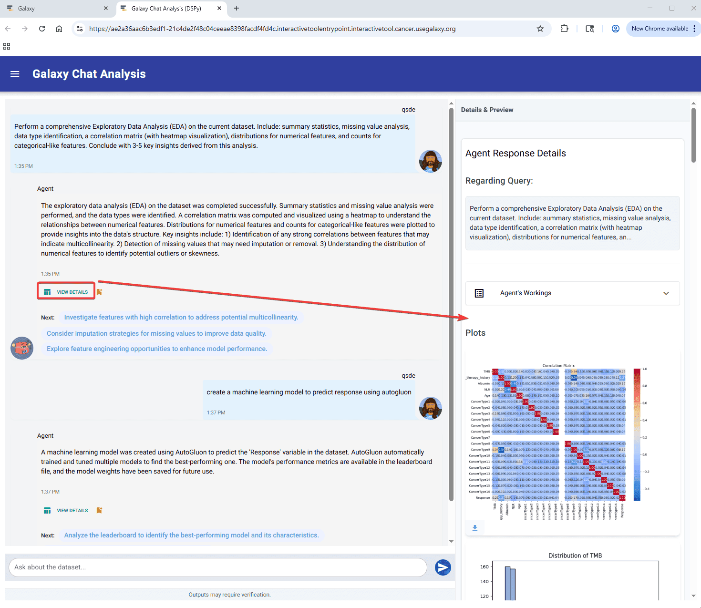
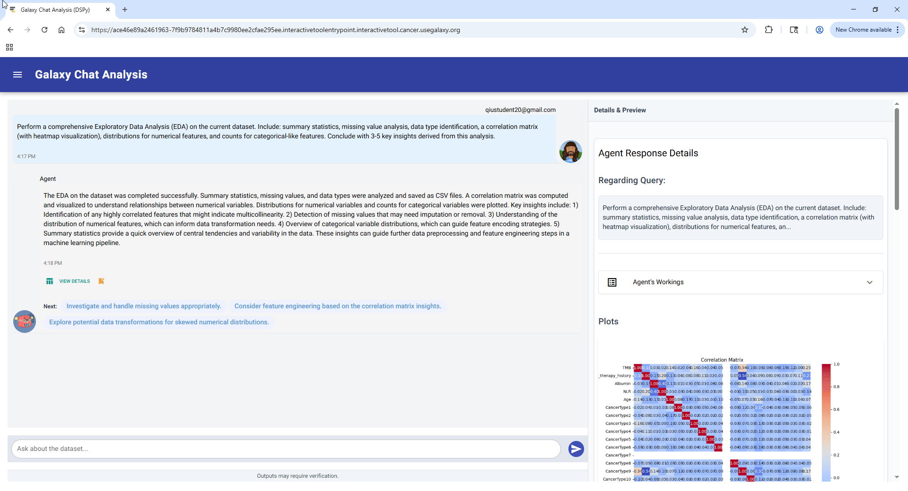

### AI-augmented data analysis in Galaxy

We’re thrilled to announce the launch of the Galaxy Data Analysis Agent, a powerful new Galaxy interactive tool where natural language can be used to perform data analyses. The Data Analysis Agent uses Large Language Models (LLMs) like ChatGPT and DeepSeek together with a customized user interface to enable scientists to perform sophisticated data analyses of Galaxy datasets using ordinary language—no coding required. This agent data analyses significantly, allowing for fast, flexible, robust, and no-code data analyses for many different file types.

[The tool is available now at usegalaxy.org](https://usegalaxy.org/root?tool_id=toolshed.g2.bx.psu.edu/repos/goeckslab/chatanalysis/interactive_tool_chat_analysis/0.3.0)

### What Can You Do With the Galaxy Data Analysis Agent?

- Describe analyses intuitively with simple natural language queries such as:
  - “Perform a comprehensive exploratory data analysis on the current dataset”
  - “Create a machine learning model to predict response using the autogluon library”
  - “Run a t-SNE”
- Baesed on the request, the agent will perform multiple analysis steps and create detailed visualizations, generated code, and clear explanations.

### Technical Evolution of the Galaxy Data Analysis Agent

We developed several versions of the Data Analysis Agent using different software libraries. Here's what we did and the strengths and limitations of each approach:

#### Version 0.1
- Utilized [pandas-ai](https://pandas-ai.com/)
- Strengths: basic context-awareness and tabular data processing using multiple LLMs
- Limitations: complex reasoning and output generation

#### Version 0.2
- Adopted [SmolAgents](https://github.com/huggingface/smolagents) and introduced ReAct (Reasoning and Acting) logic into the agent
- Strengths: enabled diverse analyses of many different file formats and generated detailed intermediate steps
- Weaknesses: limited capability for multiple plots and outputs per query

#### Version 0.3 – The Latest Version
- Powered by [DSPy](https://dspy.ai/) with bootstrap few-shot learning
- Improved user interface and faster responses
- Strengths: enhanced machine learning analysis performance and novel split user interface to preserve analysis plots and tables
- Weaknesses: may make mistakes in complex analyses and omit critical plots

### How to Get Started

- Obtain an API key from OpenAI or Groq (we plan to support additional LLMs) and configure it in [User Preferences](https://usegalaxy.org/user) or immediately after launching the Data Analysis Agent.
- Start and open the Data Analysis Agent using its [tool form](https://usegalaxy.org/root?tool_id=toolshed.g2.bx.psu.edu/repos/goeckslab/chatanalysis/interactive_tool_chat_analysis/0.3.0) and your Galaxy datasets.
- Start working with the agent to analyze your Galaxy datasets! Based on the text that you enter describing your target analyses, the agent compiles dynamic prompts from your provided examples and generates executable code. The agent then runs the code and returns visualizations, intermediate steps, and detailed explanations.

### Future Developments

We are continually enhancing the Data Analysis Agent. The following features are prioritized for development in the next version of the agent:

- Analyze multiple datasets at the same time.
- Analyze additional datatypes, such as common single-cell and imaging datasets.
- Select additional datasets from user histories in real time.
- Write analysis outputs back into user histories in real time.

### 2025 Galaxy and Bioconductor Conference Presentation

We will be presenting the Data Analysis Agent at the [2025 Galaxy & Bioconductor Community Conference](https://gbcc2025.bioconductor.org/). We will also provide a link to the slides from this presentation in the coming days.

### Acknowledgments

This work was made possible by support from the Moffitt Cancer Center and NIH grants U24CA284167, U24CA231877, U41HG006620, and U24HG010263.