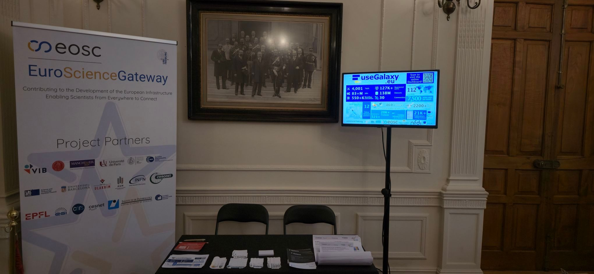
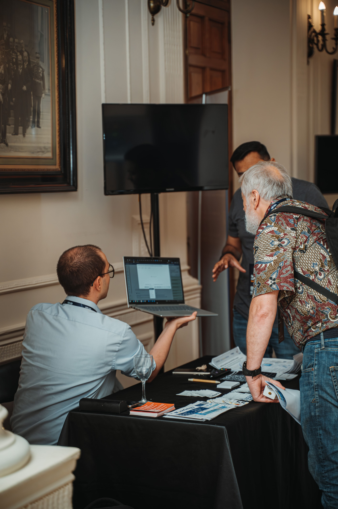
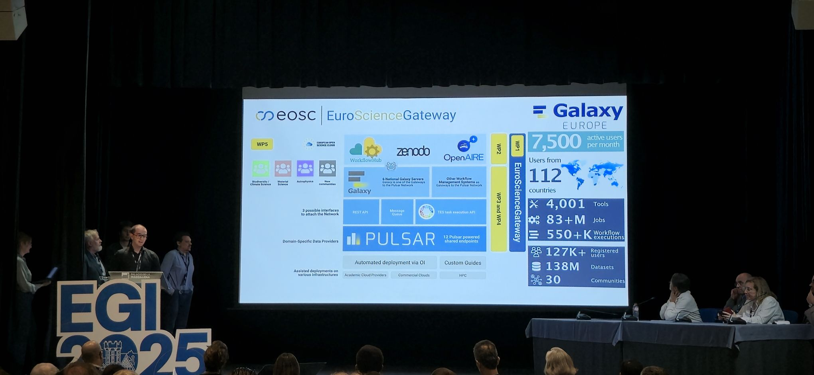
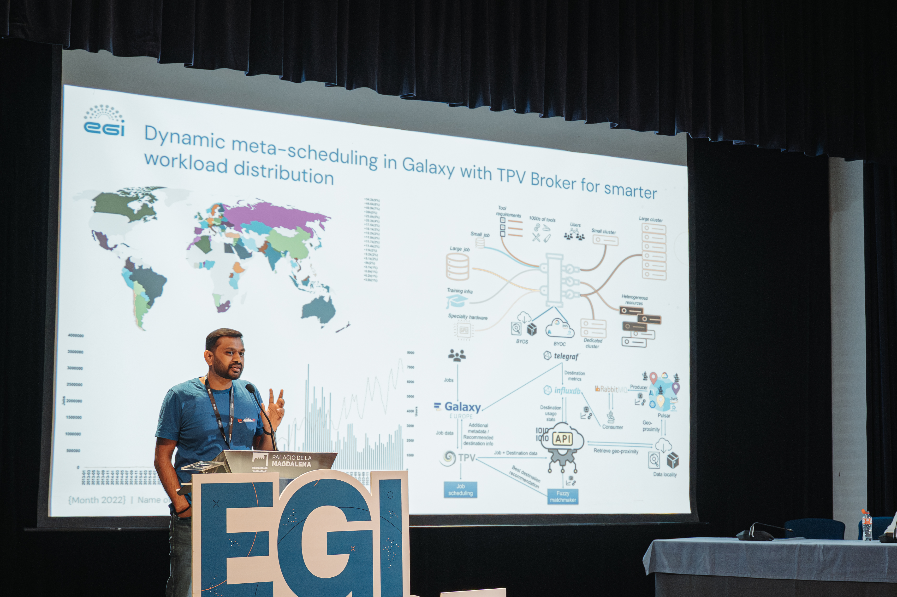
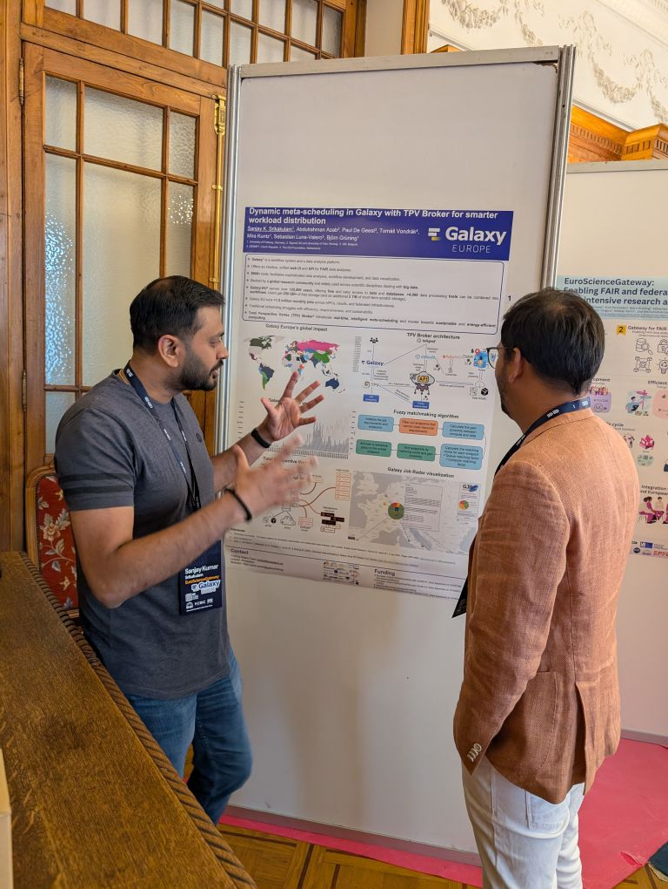
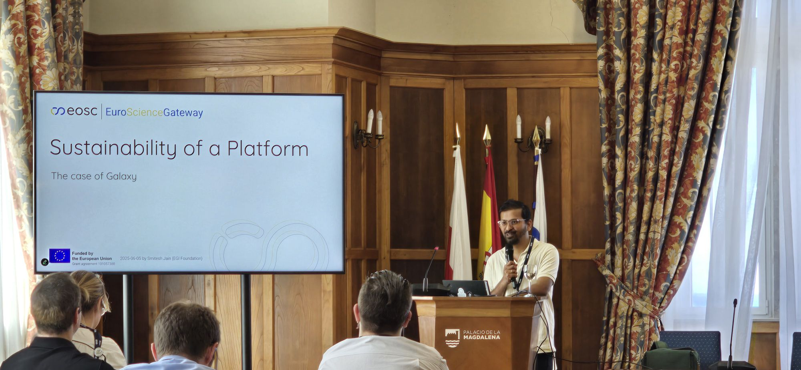
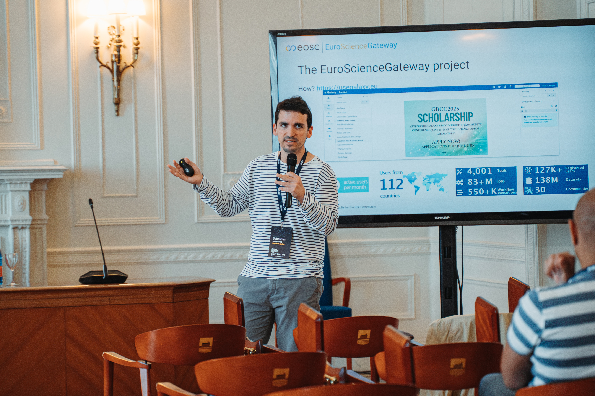
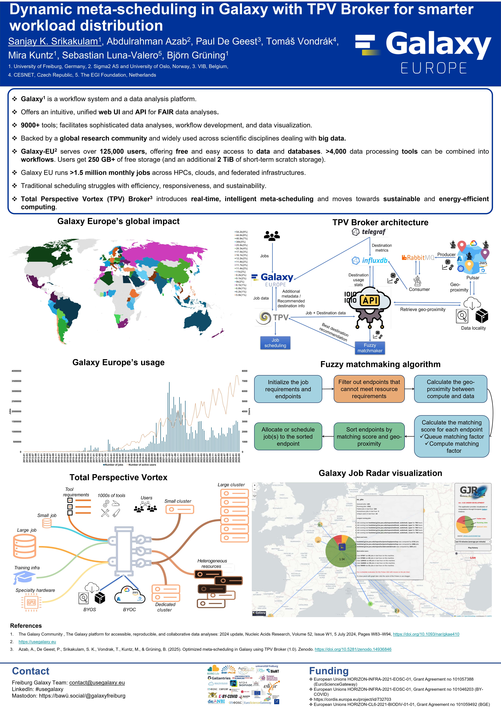
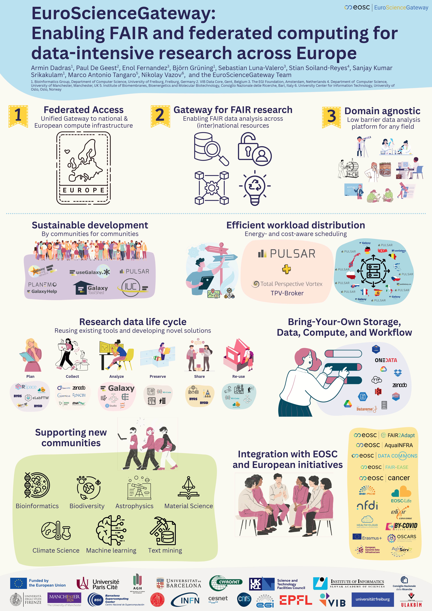

From June 3rd to 6th, [the European Galaxy Team](https://usegalaxy-eu.github.io/people) actively participated in the [EGI2025 conference](https://www.egi.eu/event/egi2025/), continuing its strong presence with engaging sessions, posters, and an exhibition booth. Armin Dadras and Sanjay Kumar Srikakulam from the European Galaxy Team travelled to Santander, Spain, to join the [EGI2025 conference](https://www.egi.eu/event/egi2025/) to present the [EuroScienceGateway project](https://galaxyproject.org/projects/esg/) along with collaborators -  [Sebastián Luna-Valero](https://www.egi.eu/people/sebastian-luna-valero/), [Enol Fernández](https://www.egi.eu/people/enol-fernandez/), and [Smitesh Jain](https://www.egi.eu/people/smitesh-jain/) (EGI/NL), [Łukasz Opioła](https://www.egi.eu/people/lukasz-opiola/) (ACC Cyfronet AGH  University of Krakow), [Michal Orzechowski](https://scholar.google.com/citations?user=jn8uxWEAAAAJ&hl=en) (AGH University of Krakow), and [Hakan Bayındır](https://scholar.google.com/citations?user=l0IjsVcAAAAJ&hl=de) (ULAKBIM/TR).

# Day 1, 3rd June: Exhibition and Booth Pitch

The [EuroScienceGateway (ESG)](https://galaxyproject.org/projects/esg/) booth returned as a central hub for discussion, collaboration, and dissemination of recent scientific advancements. The booth was pitched on the conference's first day during the opening plenary, drawing attention from attendees and sparking insightful conversations.

*EuroScienceGateway Booth setup*

*Presenting the Galaxy platform at the EuroScienceGateway Booth. Source: https://www.egi.eu/*

*Armin pitched EuroScienceGateway's booth. Source: https://www.egi.eu/*

*Sanjay pitched TPV Broker poster. Source: https://www.egi.eu/*

# Day 2, 4th June: Scientific Posters

The team showcased two impactful posters:

- [Dynamic Meta-Scheduling in Galaxy with TPV Broker for Smarter Workload Distribution](https://whova.com/embedded/artifacts/ZGH8rnyRQnkZwKPbmChIIdGWFP0jKyO%40yuMuhHyYJLw%3D/artifact/124459/?refer=undefined), presented by Sanjay Kumar Srikakulam.

- [EuroScienceGateway: Enabling FAIR and Federated Computing for Data-Intensive Research Across Europe](https://whova.com/embedded/artifacts/ZGH8rnyRQnkZwKPbmChIIdGWFP0jKyO%40yuMuhHyYJLw%3D/artifact/124461/?refer=undefined), presented by Armin Dadras.

*Sanjay presenting "Dynamic Meta-Scheduling in Galaxy with TPV Broker for Smarter Workload Distribution" poster.*

# Day 3, 5th June: Sessions

| Presenters | Title | Links |
|------------------------|--------------------------------------------------------------------|--------|
| Smitesh Jain | Sustainability of a Platform - The Case of Galaxy (EuroScienceGateway) | [Slides](https://docs.google.com/presentation/d/18ScV0pZQKA0JIReMhYNskQHJUvVGEx1s/edit?usp=drive_web&ouid=102909301222954869170&rtpof=true) |
| Smitesh Jain | Assessment of Impact across Projects | [Slides](https://docs.google.com/presentation/d/1ynX0md7wbIHM4ce19JlNmDowH6Un7g8Q/edit?usp=drive_web&ouid=102909301222954869170&rtpof=true) |
| Sebastian Luna-Valero  | EuroScienceGateway: Reusable results for the EGI Community | [Slides](https://docs.google.com/presentation/d/1yXZ3QheC2dkfUmmGwgI-72KX9ftlDppY/) |

Smitesh Jain led an insightful session titled "[Sustainability of a Platform - The Case of Galaxy (EuroScienceGateway)](https://indico.egi.eu/event/6638/sessions/5409/#20250605)", exploring critical factors for sustaining open-source software platforms. Smitesh addressed operational and financial sustainability, community engagement, governance frameworks, and quality of training and documentation. He also shared the [EuroScienceGateway](https://galaxyproject.org/projects/esg/) framework, providing a valuable model for similar initiatives seeking sustainable paths forward.

*Smitesh Jain presenting "Sustainability of a Platform - The Case of Galaxy (EuroScienceGateway)".*

Additionally, Smitesh contributed to the "[Assessment of Impact across Projects](https://indico.egi.eu/event/6638/sessions/5415/#20250605)" session. He presented methodologies and practices for assessing the broader socio-economic impacts of research initiatives, highlighting the work done during [EuroscienceGateway](https://galaxyproject.org/projects/esg/) to understand the impact of Galaxy.

On the other hand, in a session titled “[Collaboration at Scale: How Platforms and Gateways Transform Scientific Ecosystems](https://indico.egi.eu/event/6638/contributions/20546/)” Sebastián Luna-Valero presented an overview of the [EuroScienceGateway project](https://galaxyproject.org/projects/esg/), highlighting the main results that are ready to be exploited beyond the lifespan of the project: tools to import and export FAIR and reproducible workflows with [RO-crate](https://www.researchobject.org/ro-crate/) and [WorkflowHub](https://workflowhub.eu/) and the “Bring your Own Infrastructure” paradigm enabled by the project to allow researchers to connect Galaxy with user-owned computing and storage allocations which are externally managed.

*Sebastián Luna-Valero presenting "Collaboration at Scale: How Platforms and Gateways Transform Scientific Ecosystems". Source: https://www.egi.eu/*

**Thank You!**

EGI2025 provided another excellent opportunity for [EuroScienceGateway](https://galaxyproject.org/projects/esg/) to share advancements, promote collaboration, and make significant contributions to FAIR computing and sustainability discussions. The European Galaxy team would like to thank the Galaxy community, members of the ESG, for their contributions, and EGI for the fantastic organisation of this meeting.

*EGI2025 Group photo. Source: https://www.egi.eu/*

# Posters

 

