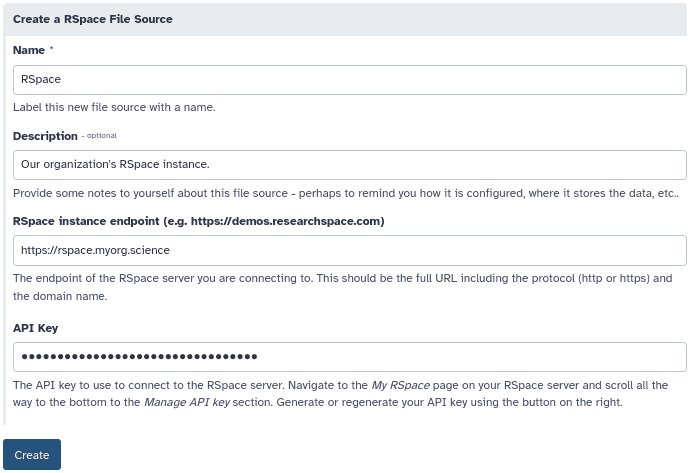
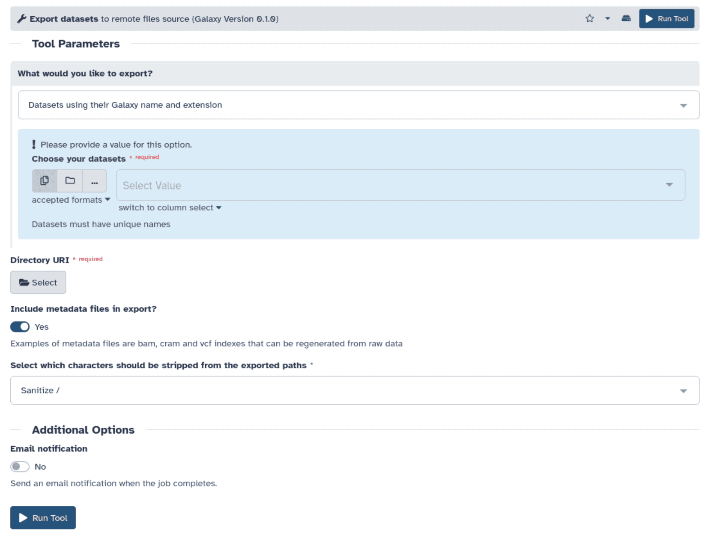

[RSpace](https://www.researchspace.com/) is an open-source research data management system (RDM) and electronic lab
notebook (ELN) providing inventory and sample management systems and featuring
[a wide collection of integrations with other services](https://www.researchspace.com/integrations). Thanks to our
[joint meeting on February](/news/2025-02-27-rspace-talk/), our collaboration has just been kickstarted
integrating Galaxy with the [RSpace Gallery](https://documentation.researchspace.com/article/sl6mo1i9do-the-gallery) as
a repository! This means that files from the RSpace Gallery can be easily imported to Galaxy histories. After the
analysis is complete, datasets and even whole histories can be exported back to the Gallery.

## Getting started

The feature is available in Galaxy 25.0 and later. Before it can be used, the feature _must be enabled by a Galaxy
administrator_. That makes it available to all users of the Galaxy server.

On Galaxy, configure a new RSpace repository under user preferences _Manage Your Repositories_ > _Create_ > _RSpace_.

Assign a name to your RSpace repository, enter the URL to your RSpace instance, and enter your RSpace API key (if you
do not have an API key yet,
[follow the official instructions to generate one](https://documentation.researchspace.com/article/v0dxtfvj7u-rspace-api-introduction#obtaining_your_api_key)).
Click _Create_.

## Importing files to a Galaxy history

To import files from RSpace to a Galaxy history, click _Upload_ on the sidebar and then _Choose remote files_. 

After selecting _RSpace_, Galaxy shows one folder for each category of the RSpace Gallery.

Each category further contains folders and files just like a regular filesystem. Choose the file you would like to
import.

## Exporting histories to RSpace

Clicking _Export History to File_ under _History options_ opens the history export screen. There, select _to remote 
file_, choose a name, and finally use the box _Click to select directory_ to open the remote repository browser. The
same screen displayed when importing files will be shown, from where you can select a target category of the RSpace
Gallery or a folder within it.

Keep in mind that categories and their subfolders can only contain files of certain types (e.g. jpeg, bmp, png, etc. for
the Images category). History exports have the extension _rocrate.zip_, and thus are only allowed in the Miscellaneous
category. Attempting to export a history to any other category will result in an error.

## Exporting datasets to RSpace

Individual datasets may also be exported with the help of the
[dataset export](https://usegalaxy.eu/?tool_id=export_remote&version=latest) tool. First, choose the datasets to export
under the _What would you like to export?_ section. Then click _Select_ under _Directory URI_ to open the remote file
source browser, which allows to select the target category and folder.

Again, be mindful that categories and their subfolders can only contain files of certain types. Galaxy datasets can be
assigned any name and most likely you will have to export them with a different name so that their extension matches one
of the allowed in the category (to do so, choose _Datasets specifying their names_ under _What would you like to
export?_).

