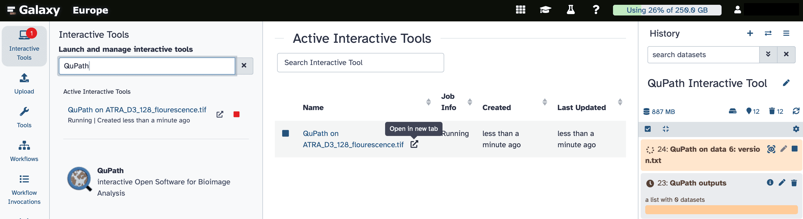
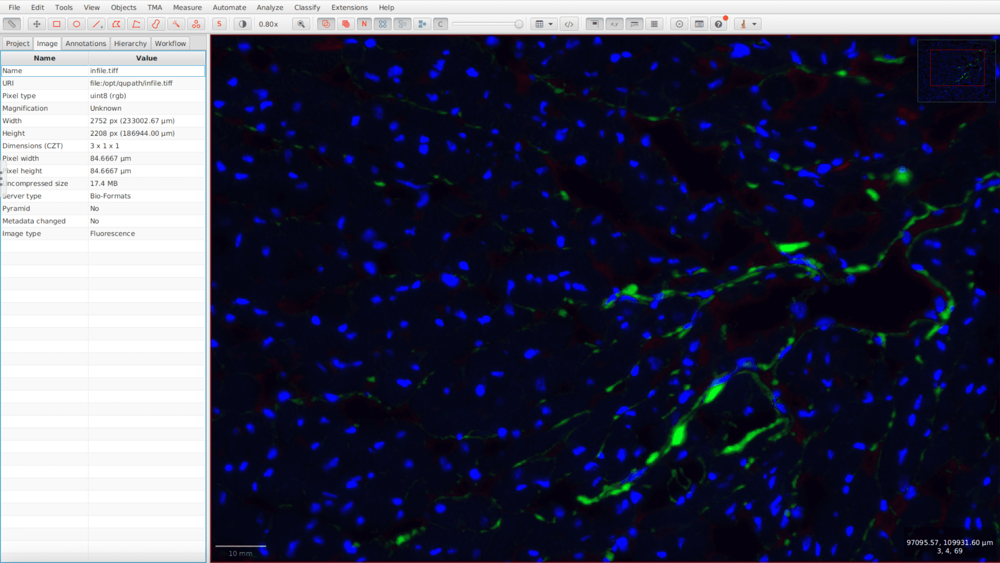

[QuPath](https://qupath.github.io) is a powerful, open-source software application for bioimage analysis, designed especially for whole slide images and digital pathology.

**QuPath-Galaxy** integrates this functionality into Galaxy as an **interactive tool**, enabling users to run complex image analysis directly from their browser — no installation needed.

With QuPath-Galaxy, users can explore large histological images, draw regions of interest, detect and classify cells, and run advanced tissue analysis workflows, all in an interactive, user-friendly environment.

+ Based on the official [QuPath application](https://github.com/qupath/qupath), ensuring full compatibility with existing workflows and features.  
+ Packaged in a [Docker container](https://github.com/usegalaxy-eu/docker-qupath) maintained by the Galaxy Europe team for reproducible and portable deployment.  
+ Fully integrated into Galaxy’s ecosystem of tools, histories, and data management.

  

In this example, a cardiac tissue section stained by immunofluorescence is visualized using QuPath-Galaxy. **DAPI** (blue) highlights the nuclei, while **F-CHP** (green, 5-FAM conjugate) reveals areas of **denatured collagen**.

  

*A cardiac tissue section stained with DAPI (blue) and F-CHP (green), visualized in the QuPath-Galaxy interactive tool.*

  Try it out on <strong>Galaxy</strong> and bring your bioimage analysis into Galaxy 🔬!

  <a href="https://usegalaxy.eu/?tool_id=interactive_tool_qupath&version=latest">
    <button type="button" class="btn btn-primary btn-lg">Launch QuPath-Galaxy</button>
  </a>

