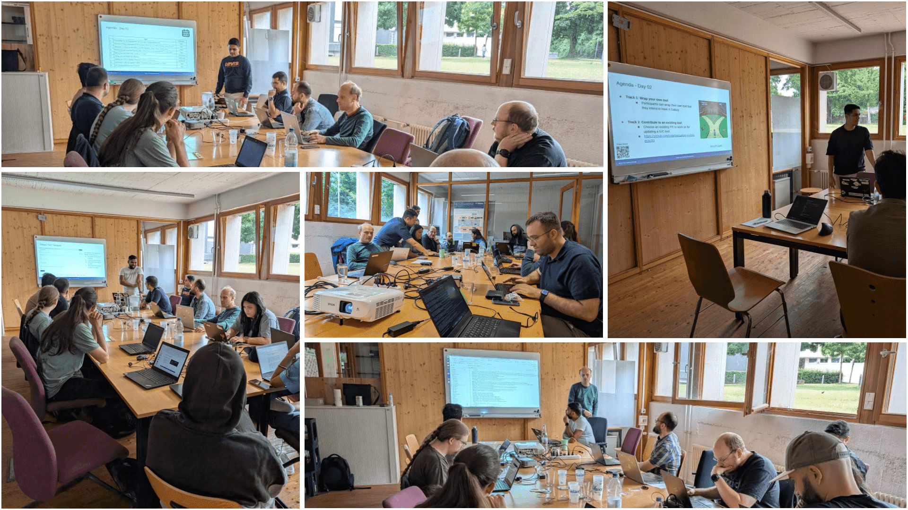

## Freiburg Galaxy Team’s Internal Tool Development Workshop

On July 8-9, 2025, the Freiburg Galaxy Team hosted an internal Galaxy Tool Development Workshop (12 participants) at the University of Freiburg, Germany. This intensive two-day internal event was designed exclusively for the Freiburg Galaxy team to introduce them to the Galaxy tool development and enhance their expertise in building and integrating tools for the Galaxy platform. The workshop sharpened the team’s technical skills, streamlined development process, and inspired meaningful contributions to the global Galaxy ecosystem.

The first day of the workshop was kicked off by introducing participants about setting up Galaxy development environments with [Planemo](http://planemo.readthedocs.io/en/latest/), [VS Code Galaxy Language Server](https://github.com/galaxyproject/galaxy-language-server), and [Docker](https://docs.docker.com/), and explored Conda and [bio.tools](https://bio.tools/) for managing dependencies and registering tools. The team got hands-on with[ Galaxy’s XML structure](https://docs.galaxyproject.org/en/latest/dev/schema.html), crafting and testing their first tools using [Planemo](https://planemo.readthedocs.io/en/latest/). The team also learned how to deploy tools to [usegalaxy.eu](https://usegalaxy.eu/) and [usegalaxy.org](https://usegalaxy.org/), wrapping up with insights into the [Intergalactic Utilities Commission (IUC)](https://galaxyproject.org/iuc/) and its [best practices](https://galaxy-iuc-standards.readthedocs.io/en/latest/) for creating high quality and reliable tools.

  

  

  

On the second day, the team dove into hands-on tool development with two engaging tracks tailored to the team’s diverse skills and interests. In Track 1: Wrap Your Own Tool, team members brought their own to wrap within Galaxy, crafting seamless integrations with expert guidance. Meanwhile, Track 2: Contribute to Existing Tools saw collaborative efforts to enhance IUC tools by [tackling open pull requests from the tools-iuc Github repository](https://github.com/galaxyproject/tools-iuc/pulls). By the session’s close, 12 pull requests were ready for merge, marking a meaningful step in our team’s impact on the global Galaxy community. Special thanks go to our dedicated team, helpers, and instructors Saim Momin, Pavan Videm, Amirhossein Nilchi, David Lopez, Rand Zoabi, and Wolfgang Maier for their efforts in organizing and leading the workshop. 

Looking Ahead: Inspired by the success of our internal workshop, we’re exploring ways to share our expertise with the broader Galaxy community through future workshops. For more information, stay tuned with us for updates on how we plan to organize tool development trainings for researchers and developers worldwide!

