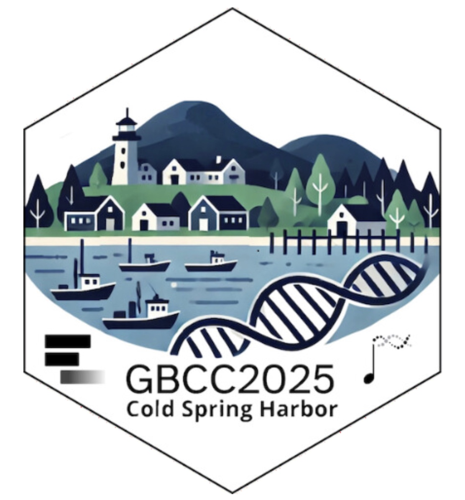
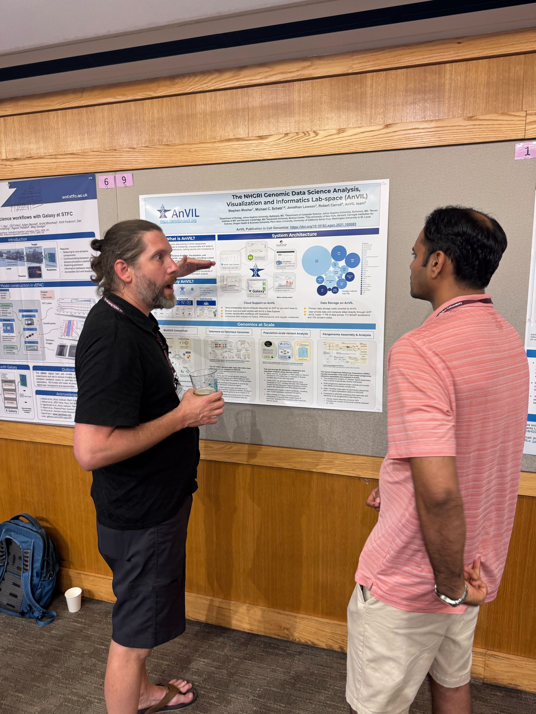
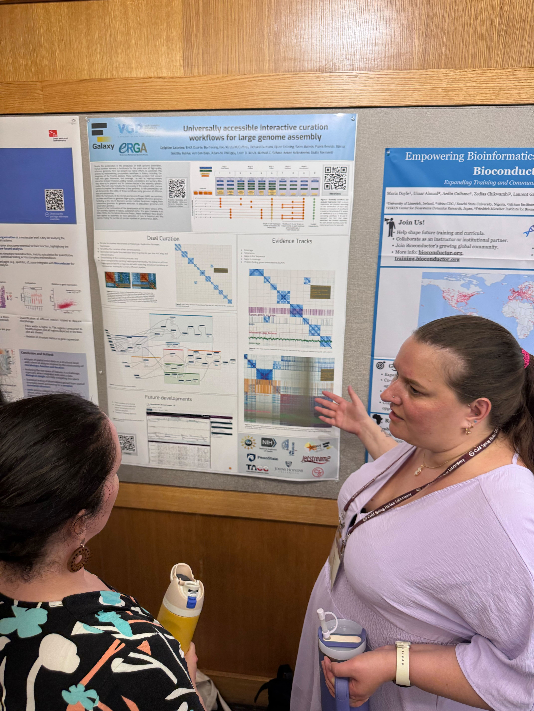
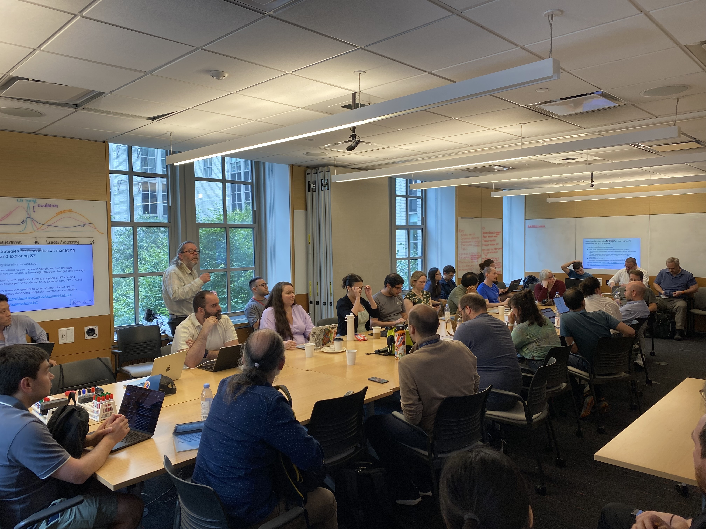

<h1 align="center">Galaxy and Bioconductor Community Conference 2025
    

  

## Meeting Overview

The first-ever [Galaxy and Bioconductor Community Conference (GBCC2025)](https://www.google.com/url?q=https://gbcc2025.org/&sa=D&source=docs&ust=1751512397354592&usg=AOvVaw37w9XXIrmRcXavS_TmjkPE) took place from June 23 to 26, 2025, at the iconic Cold Spring Harbor Laboratory in New York, bringing together two powerhouse communities in bioinformatics for their first-ever joint conference. Over four packed days, participants engaged in keynote talks, oral and lightning presentations, hands-on training, poster sessions, and Birds of a Feather (BoF) discussions. The event culminated in a two-day collaborative CoFest (CollaborationFest), where attendees worked side by side on code, documentation, training materials, and infrastructure to advance open science.  

## Fellowship Recipients

GBCC2025 proudly welcomed a cohort of exceptional early-career researchers and students supported by two community-driven initiatives: the [James P. Taylor Foundation for Open Science (JXTX)](https://www.google.com/url?q=https://jxtxfoundation.org&sa=D&source=docs&ust=1751512397354722&usg=AOvVaw2GE7AxQ2JXR1lPmP5yvJpO) and the [JJ Travel Fellowship Fund](https://www.google.com/url?q=https://jxtxfoundation.org/scholarships/jj-fund/&sa=D&source=docs&ust=1751512397354888&usg=AOvVaw3fFtjII8-LB_rzf1krZXEh). These fellowships aim to lower barriers to participation, foster mentorship, and cultivate a more inclusive and representative scientific community.

### James P. Taylor Foundation for Open Science

The JXTX Foundation honors the legacy of Dr. James P. Taylor, who championed mentorship and diversity in the field of computational biology. The foundation supports students and early-career researchers through conference scholarships, mentorship programming, and outreach to underrepresented groups. JXTX aims to carry forward Dr. Taylor’s vision of open, collaborative science that empowers the next generation of researchers.

#### JXTX Scholarship Recipients

Six outstanding scholars were selected for the 2025 GBCC JXTX Scholarship, representing a global spectrum of talent and research interests:

**Sudipta Kumar Hazra**  
*Teagasc & University College Cork, Ireland*  
Focus: Proteomic data analysis and AI-integrated workflows for understanding the link between animal stress and meat quality.

**Grace Kenney**  
*University of North Carolina at Chapel Hill, USA*  
Focus: Software development for interpreting genetic variation and epigenetic mechanisms in genome regulation.

**Negin Kafee Hernashki**  
*University of Milan, Italy*  
Focus: AI-based predictive models for disease prevention; former national team fencer for Iran.

**Mirela Minkova**  
*Utrecht University, Netherlands*  
Focus: Galaxy workflow development for cardiomyopathy and pediatric brain cancer analysis; active in national infrastructure projects.

**Nitin Narwade**  
*Institute of Neurosciences, Alicante, Spain*  
Focus: EMT in cancer progression and stromal-tumor cell interactions in metastasis.

**Arish Shahab**  
*McMaster University, Canada*  
Focus: Biomedical engineering, neurotechnology, and real-time communication tools using EEG and visual tracking.

### JJ Fund

The JJ Fund was established in memory of James Johnson, one of Galaxy’s earliest developers and a devoted mentor. JJ believed deeply in building community through training and support. These fellowships help bring new voices into the Galaxy ecosystem, especially those from underrepresented backgrounds, while continuing his legacy of mentorship and service.

#### JJ Travel Fellowship Recipients

**Pariksheet Nanda**  
*University of Pittsburgh, USA*  
Focus: Pathogen-host interactions and computational immunology using open-source network biology tools.

**Papawee Sutthirat**  
*University of Minnesota; Rochester & Mayo Clinic, USA*  
Focus: Single-cell and spatial transcriptomics for studying liver disease; passionate about bridging computational and experimental biology.

### NIH: National Human Genome Research Institute

Thanks to funding from the NHGRI, GBCC2025 was able to support the attendance of more than 30 community members from around the world. This support helped bring together students, early-career researchers, and contributors from a wide range of backgrounds, many of whom were attending a Galaxy or Bioconductor conference for the first time.

By reducing financial barriers, this funding played a key role in expanding access and fostering an inclusive and globally connected community. We are grateful to the NHGRI for their support in helping make GBCC2025 more accessible and impactful for all.

## Keynote Speakers

GBCC2025 featured three outstanding keynote speakers whose work exemplifies the core values of the Galaxy and Bioconductor communities: open science, innovation in data analysis, and a commitment to mentorship and education. Each speaker brought a unique perspective, from statistical methods in proteomics to viral evolution to global training infrastructure, sparking rich discussions throughout the conference.

### Charlotte Soneson

*Research Associate, Computational Biology Platform, Friedrich Miescher Institute for Biomedical Research* 

Charlotte Soneson’s keynote talk blended technical depth with community spirit, reflecting her longstanding involvement in Bioconductor. A computational biologist with a background in engineering physics and mathematics, Charlotte has held roles at the SIB Swiss Institute of Bioinformatics and the University of Zurich, and currently contributes to the Computational Biology Platform at the Friedrich Miescher Institute in Basel.

Charlotte was recognized with the Bioconductor Award (2021) and Ruth Chiquet Prize (2023) for her development of einprot, a powerful tool for the statistical analysis of proteomics data. Her keynote explored the principles of open-source tool development, data reproducibility, and lessons learned from bridging computational rigor with accessibility in biomedical research.

  

### Sergei L. Kosakovsky Pond

*Professor, Department of Biology, Temple University* 

A leader in viral evolution and computational biology, Dr. Sergei Pond delivered a keynote that underscored the role of open-source modeling and scalable analytics in infectious disease research. As Director of the Center for Viral Evolution and Associate Dean for Research and Innovation at Temple University, Dr. Pond’s work has transformed our understanding of HIV/SIV evolution, immune repertoire dynamics, and real-time pathogen surveillance.

He is the developer of widely used tools such as HyPhy and co-leads BRC-Analytics, a national NIH Bioinformatics Resource Center. With over 40,000 citations and an h-index of 81, Dr. Pond’s keynote emphasized the need for robust, interpretable models in the era of high-throughput sequence data, especially in the context of public health.

  

### Jason Williams

*Assistant Director for External Collaborations, Cold Spring Harbor Laboratory* 

Jason Williams closed the keynote series with a passionate call for inclusivity, access, and community-driven training. As the Assistant Director for Diversity and Research Readiness at the CSHL DNA Learning Center, Jason leads national biology education programs. He coordinates training initiatives for CyVerse, the U.S. cyberinfrastructure for life sciences.

Jason is also the founder of LifeSciTrainers.org, a global initiative that supports short-format life science training for professionals. His keynote emphasized building equity-centered training ecosystems, encouraging participants to engage not just as users and developers but as educators and mentors committed to breaking down systemic barriers in science.

  

## GBCC Live\! Session

In the spirit of innovation, we introduced “GBCC Live\!” — a thrilling, real-time showcase at this year’s conference. This session walked attendees through the entire journey a researcher takes, from raw data to a manuscript draft, all within an hour and entirely live on stage.

We kicked off with a cutting-edge multiplex tissue image (MTI) analysis pipeline for tissue microarray (TMA) data, recognized by Nature as the 2024 Method of the Year. After exploring cancer datasets, we launched into live analysis, seamlessly importing a peer-reviewed Galaxy workflow and executing it with just a few clicks. Thanks to Galaxy’s new job caching feature, what typically takes 2.5 hours ran in mere seconds.

Next, we dove into interactive results exploration using RStudio and a Shiny app. We demonstrated Galaxy’s upcoming user-defined tools feature, which will soon let users write and reuse custom tools directly within Galaxy workflows.

Taking things further, we showcased running the same workflow entirely from the command line on an HPC system, highlighting Galaxy’s flexibility beyond the GUI for scalable, automated analysis.

Finally, we closed with a groundbreaking demonstration: drafting a manuscript live using Galaxy’s new Model-View-Controller protocol (MCP) paired with an AI chat assistant. By instructing Claude to review our Galaxy history, it generated a draft methods section with tool references in seconds, a glimpse into the future of AI-assisted publishing.

GBCC Live\! powerfully illustrated how Galaxy and Bioconductor seamlessly integrate to support rapid, reproducible research — all in a high-energy, real-world scenario.

## Talk Sessions

Across five curated sessions, GBCC2025 featured over 50 oral presentations showcasing cutting-edge research, novel tools, and impactful community projects. The talks covered a range of topics, including workflow automation and visualization, large-scale data integration, machine learning, and cloud-based analysis.

* **Session 1** opened the conference with a focus on infrastructure innovation and tool integration. Speakers introduced GAIA, a natural language-driven agent for Galaxy analysis, and GalaxyMCP, a novel protocol enabling AI assistants to interact directly with Galaxy servers. Talks continued with new approaches for automatically integrating Bioconductor packages into Galaxy, a user-friendly YAML tool authoring system, and a modern visualization framework designed for seamless deployment. Presenters also showcased use cases in materials science and a new language-agnostic approach for representing genomic data.  
    
* **Session 2** ran as two parallel tracks, offering a rich mix of technical deep dives and domain-specific applications. 

  * **Track 2A** focused on enhancing the Galaxy platform’s power and flexibility. Talks addressed unified interfaces for launching workflows, more intuitive dataset collection tools, and the integration of deep learning for biomedical data science. Presenters also explored quantum machine learning, the use of Galaxy in neutron scattering data visualization, and automation pipelines for tool integration. Novel strategies for workload distribution and a case study on cardiomyocyte gene expression in atrial fibrillation rounded out the session.

  * In **Track 2B**, the spotlight shifted toward Bioconductor applications and genomic medicine. Presentations covered ancestry inference using RAIDS, metaimmunopeptidomics pipelines for immunotherapy, and allele-specific methylation analysis via Oxford Nanopore sequencing. Other talks delved into gene expression signature comparisons across transcriptomic modalities, transcription factor binding predictions, orthology detection, and spatial transcriptomics analysis of lung adenocarcinoma. The track closed with insights into rare variant analysis in biobank-scale datasets and innovative tools for visualizing transcript usage and metagenomic profiling.

* **Session 3** highlighted efforts to integrate imaging and omics data across platforms. Talks included updates from the Intergalactic Workflow Commission on workflow standardization, a Bioconductor-based framework for histopathology integration, and tools for spatial transcriptomics and digital pathology. The session concluded with presentations on a new framework for analyzing anatomical structures and interactive workflows to support large-scale genome assembly.  
    
* **Session 4** brought a global and educational perspective to the forefront. Speakers shared projects building training infrastructure in Africa, scaling Galaxy in Canada, and developing modular training for mass spectrometry and cloud-based data science. Talks also highlighted regional empowerment through Galaxy in Brazil and the democratization of access to the Human Cell Atlas using Bioconductor.  
    
* **Session 5** closed the program with an eye toward sustainable infrastructure, secure access, and advanced statistical modeling. Topics included the development of tidy-style interfaces for SummarizedExperiment objects, Bioconductor tools for microbiome analysis, and reflections on interpreting data in the age of machine learning. Presenters also shared work on credential security in Galaxy, Earth system science workflows through FAIR-EASE, and ecology-oriented extensions to the Galaxy platform.

Together, the talk sessions illustrated the incredible range and collaborative strength of the GBCC community, united by a shared mission to advance open, reproducible, and accessible science.

### Lightning Talks

The GBCC2025 Lightning Talk session provided a fast-paced and high-energy snapshot of community projects and new tools. This year’s lineup included 11 speakers, each given just a few minutes to present their work, making the session a favorite among attendees for its diversity, momentum, and fresh insights.

Talks touched on key areas of bioinformatics, from novel R packages and Galaxy-powered infrastructure to transcriptomics and tool interoperability. **Ali Imami** (University of Toledo) kicked off the session with a presentation on demystifying kinome analysis through a streamlined R package designed for functional proteomics. **James Eapen** (Van Andel Institute) introduced iscream, a tool for fast and efficient BED file queries built with Rcpp and htslib.

**Sunita Sharma** (University of Georgia) presented work on gene expression regulation of ciliary length in Chlamydomonas reinhardtii, while **Charles D’Harrington**, an independent researcher, showcased a web-based platform for guided planning and management of NGS projects. **Stefano Mangiola** (Adelaide University) demonstrated how Tidyomics accelerates omics analyses using tidyverse principles.

The session also featured **Alexandru Mahmoud** (Bioconductor Core Team), who offered reflections on the path to open science through Galaxy and Bioconductor; **Papawee Sutthirat** (Mayo Clinic and University of Minnesota), who explored endothelial cell responses in liver disease using spatial transcriptomics; and **Laura Leroi** (IFREMER), who highlighted the coordination efforts of the French Galaxy Network.

**Robert Castelo** (Pompeu Fabra University) introduced atena, a Bioconductor package for analyzing transposable elements, while **Daniel Guevara Diaz** and **Daniel Garbozo** (Bioinformatics Group in Munich) presented transcriptomic profiling studies focused on early biomarkers for Chagas cardiomyopathy and novel insights into tuberculosis, respectively.

## Poster Sessions

The GBCC2025 poster session featured over 50 presentations spanning a broad range of topics in bioinformatics, tool development, and community infrastructure. The session provided an opportunity for in-depth discussion and exchange around both published tools and works in progress.

Several posters expanded on topics introduced in the oral sessions, offering technical details and use-case demonstrations. Notable contributions included GAIA and GalaxyMCP, which explored natural language processing and AI integration in Galaxy, as well as HiFi-MAG, a pipeline for high-fidelity metagenomics. Meta-iPep highlighted immunopeptidomics workflows implemented in Galaxy, and several posters addressed reproducible visualization, including Galaxy’s new JavaScript-based framework. Bioconductor-focused posters included a standardized framework for integrating histopathological imaging with omics data, the “HowTo” educational series, and tools for analyzing spatial and single-cell datasets. Infrastructure efforts were also well represented, with posters on secure Galaxy instances, metadata harmonization, and Earth system science workflows.

The poster session served as a technical complement to the oral program, providing space for detailed conversation, community feedback, and collaboration across the Galaxy and Bioconductor ecosystems. 

  
  
  
  

## Training Sessions

The GBCC2025 training program featured ten hands-on sessions covering a wide range of topics across Galaxy and Bioconductor. These workshops provided attendees with practical skills in workflow development, tool integration, AI interpretation, spatial omics, and more.

Training Sessions:

1. *Exploring Galaxy Workflows* – Marius van den Beek  
2. *Inference Challenges and Corrections for AI-Predicted Outcomes* – Stephen Salerno  
3. *Galaxy Backend Architecture and Software Development* – John Davis and Ahmed Awan  
4. *Deploying Autonomous Galaxy Workflows for Materials Laboratories* – Greg Watson  
5. *Making Space Count: Strategies for Analysing Spatial Omics Data* – Ellis Patrick  
6. *Streamlining Bioinformatics: Adding Bioconductor Tools in Galaxy* – Daniel Blankenberg  
7. *Orchestrating Microbiome Analysis with Bioconductor* – Tuomas Borman  
8. *Immunopeptidogenomics Pipeline in Galaxy for MHC-Bound Neoantigens* – Pratik Jagtap  
9. *AnVIL: Secure, scalable computing for controlled access data* – Frederick Tan  
10. *Galaxy History-Based Alignment Comparison in IGB* – Ann Loraine

Each session offered focused instruction and live demonstrations, helping participants build confidence in using and contributing to open-source bioinformatics platforms. Whether new to Galaxy or deepening expertise in Bioconductor, attendees left with practical knowledge they could apply to their research.

## Birds of a Feather

The Birds of a Feather sessions at GBCC2025 provided informal, participant-driven spaces for focused discussion, knowledge sharing, and community building. Held across multiple days, these sessions brought together attendees with shared interests to connect on technical challenges, user needs, project updates, and future collaborations.

Topics ranged from Galaxy training infrastructure and FAIR workflows to software development practices, visualization tools, and community coordination across regions and platforms. The flexible, discussion-based format enabled real-time problem-solving, brainstorming, and collaboration among developers, researchers, and educators.

## CoFest

The final two days of GBCC2025 were dedicated to CoFest, a collaborative sprint where community members came together to contribute to open-source projects across Galaxy and Bioconductor. This event encouraged hands-on work in tool development, documentation, updating training materials, and technical integration between platforms.

Participants also worked on outreach and onboarding resources to support new users and contributors, aligning with GBCC’s commitment to accessibility and community growth. A highlight was the joint effort to integrate Bioconductor tools into Galaxy, as captured in the blog post *"Bringing Bioconductor to Galaxy: A CoFest Collaboration*," which shares training materials, tool wrapping progress, and next steps for integration.

Whether refining software, building training content, or improving documentation, CoFest exemplified the collaborative energy that defines both the Galaxy and Bioconductor communities. It was a productive and inclusive close to the week’s events, translating shared goals into real progress. 

  
  

## Celebrating 20 years of Galaxy

2025 marked a major milestone for the Galaxy community: 20 years of accessible, reproducible, and collaborative science. Since its launch in 2005, Galaxy has evolved into a global platform that supports thousands of tools, powers research across disciplines, and brings together a diverse and active community of users, developers, and educators.

At GBCC2025, this anniversary was more than just a moment of reflection; it was a celebration. The milestone was acknowledged in opening remarks and throughout the week’s sessions, many of which highlighted how Galaxy has helped transform open science over the past two decades. The celebration culminated in a DJ party on Wednesday evening, where attendees gathered to mark the occasion with music and community connection.

From infrastructure innovation to international collaboration, Galaxy’s first 20 years have laid the groundwork for what’s next. As the platform enters its third decade, the commitment to openness, community leadership, and reproducibility remains stronger than ever.

## Recognition

### Sponsors

**Silver Sponsors**  
[Chan Zuckerberg Initiative](https://chanzuckerberg.com/)  
[Bristol Myers Squibb](https://www.bms.com/)

**Bronze Sponsors**  
[Limagrain](https://www.limagrain.com/en)  
[GalaxyWorks](https://galaxyworks.io/)  
[R Consortium](https://www.r-consortium.org/)

**Friends of GBCC**  
[GigaScience](https://academic.oup.com/gigascience)  
[ELIXIR](https://elixir-europe.org/)

**Other Partners**  
[National Human Genome Research Institute](https://www.genome.gov/)

### Organizing Committee

Alex Mahmoud, *Harvard Medical School*  
Andres Wokaty, *CUNY ISPH*  
Charlotte Soneson, *Friedrich Miescher Institute for Biomedical Research*  
Enis Afgan, *Johns Hopkins University*  
Erica Feick, *Dana-Farber Cancer Institute*  
Jennifer Vessio, *Johns Hopkins University*  
Jenny Drnevich, *University of Illinois at Urbana-Champaign*  
Lori Shepherd, *Roswell Park Comprehensive Cancer Center*  
Maria Doyle, *University of Limerick*  
Mikhail Dozmorov, *Virginia Commonwealth University*  
Natalie Whitaker-Allen, *Johns Hopkins University*  
Tim Triche, *Van Andel Institute*  
Tyler Collins, *Johns Hopkins University*  
Wes Wilson, *University of Pennsylvania*

### Scientific Program Members

**Chairs**  
Enis Afgan, *Johns Hopkins University*  
Jenny Drnevich, *University of Illinois at Urbana-Champaign*

**Members**  
Anil Thanki, *EMBL-EBI*  
Chinenyenwa Fortune Chukwuneme, *Vaal University of Technology*  
Damitha Liyanaarachchi, *University of Colombo School of Computing*  
Juan Martinez Villalobos, *Yale University*  
Katarina Flöer, *Smith College and Mass General Hospital*  
Maria Chavero, *Barcelona Supercomputing Center*  
Miguel Camacho, *Johannes Gutenberg University*  
Mikhail Dozmorov, *Virginia Commonwealth University*  
Mohammad Saeed Tajdary, *Shahid Beheshti University*  
Oriana Barros, *University of Aveiro*  
Pedro Madrigal, *EMBL-EBI*  
Pratik Jagtap, *University of Minnesota*  
Sudhanshu Shekhar, *University of North Carolina*  
Tim Triche, *Van Andel Institute*  
Charlotte Soneson, *Friedrich Miescher Institute for Biomedical Research*  
Gareth Price, *Galaxy Australia*  
Hans-Rudolf Hotz, *Friedrich Miescher Institute for Biomedical Research*
