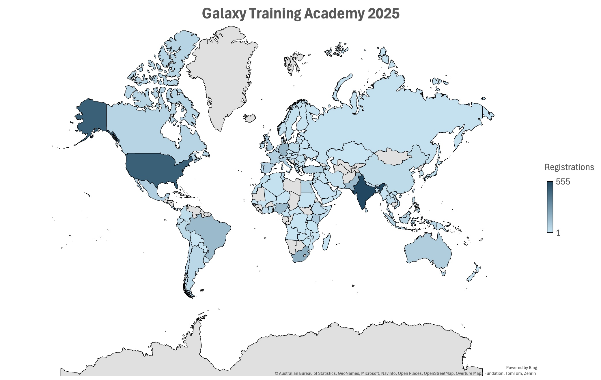
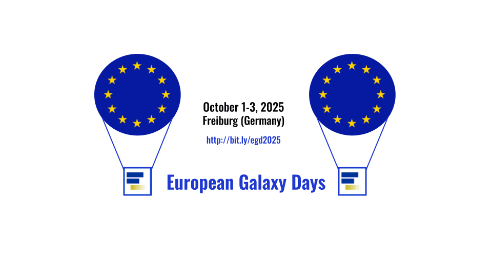

July 2025  

Hello, Galaxy Community!

We’re halfway through 2025, and what a year it’s been so far\! From the excitement of GBCC2025 to the global success of this year’s Galaxy Training Academy, it’s clear that the Galaxy community continues to grow, evolve, and inspire. We’ve celebrated big milestones, like Galaxy turning 20 and Galaxy Australia running its 11 millionth job, and released Galaxy 25.0, packed with features designed to make research even more intuitive and reproducible. In this newsletter, you’ll find highlights from recent events, updates on what’s new in the platform, a spotlight on how Galaxy is powering cutting-edge research, and a look ahead to what’s coming next. 

Whether you’ve been part of Galaxy from the beginning or just joined us this year, we’re so glad you’re here. Let’s dive in!  

---

# **Recap: Galaxy and Bioconductor Community Conference 2025**

  

The first-ever [Galaxy and Bioconductor Community Conference (GBCC2025)](https://gbcc2025.bioconductor.org/) took place June 23–26 at the iconic Cold Spring Harbor Laboratory, bringing together two leading open-source communities in bioinformatics for a historic joint event. With over 300 attendees from around the world, GBCC2025 featured four packed days of keynote talks, oral and lightning presentations, hands-on trainings, Birds of a Feather sessions, and vibrant poster discussions. The main meeting was followed by a two-day CollaborationFest (CoFest) that channeled all that energy into real-time contributions to tools, documentation, training materials, and infrastructure.

This year’s keynotes reflected the conference's spirit of openness, education, and innovation, with talks from Charlotte Soneson, Sergei L. Kosakovsky Pond, and Jason Williams. A standout moment was the debut of GBCC Live\!, a high-energy, real-time demonstration that walked attendees through a full research analysis, from data to draft manuscript, using Galaxy and Bioconductor tools.

Training was central to the week, with ten hands-on sessions led by experts on topics including spatial omics, immunopeptidogenomics, microbiome analysis, secure cloud computing, and Galaxy tool development. Lightning talks and over 50 posters showcased cutting-edge tools, pipelines, and research spanning imaging, metagenomics, transcriptomics, and more.

GBCC2025 was proud to welcome [JXTX](https://jxtxfoundation.org/) and [JJ](https://jxtxfoundation.org/scholarships/jj-fund) Fellowship recipients, alongside over 30 community members supported by NIH funding, helping reduce barriers to participation and strengthening the global, inclusive community that defines Galaxy and Bioconductor.

CoFest closed out the week with collaborative sprints focused on training infrastructure, tool wrapping, and platform integration—embodying the conference’s open science ethos. And this year also marked Galaxy’s 20th anniversary, a milestone celebrated throughout the week and capped with a community DJ party on Wednesday evening.

You can [read more about GBCC2025 in our full meeting report](https://galaxyproject.org/news/2025-07-11-june2025-newsletter/). Thank you to everyone, speakers, organizers, volunteers, and attendees, for making this inaugural joint conference such a success.

**Looking ahead to 2026**

Planning is already underway for next year’s Galaxy Community Conference, which will return to Europe in 2026! We can’t wait to share more details soon, so stay tuned to Galaxy channels for the official announcement, and start getting ready to join us for another unforgettable week of open science, community connection, and Galaxy-powered discovery.

---

# **20th Anniversary of Galaxy**

This year marks a significant milestone: Galaxy turns 20\!

Since its launch in 2005, Galaxy has evolved into a global platform that supports thousands of tools, powers research across disciplines, and connects a vibrant, international community of scientists, developers, educators, and open science advocates.

Over two decades, Galaxy has:

* Enabled millions of analyses through public servers and local deployments  
* Championed reproducible science with shareable histories and workflows  
* Fostered a thriving network of usegalaxy.\* servers and contributors  
* Supported researchers across fields, from biomedicine to ecology, epidemiology to education

We celebrated this milestone at GBCC2025 with reflections, community highlights, and (of course) a DJ dance party\!

Whether you’ve used Galaxy once or every day for the past decade, thank you for being part of this community. Here’s to the next 20 years of accessible, collaborative, and reproducible science\!  

---

# **Galaxy Training Academy 2025: A Global Week of Learning**

The [Galaxy Training Academy (GTA)](https://training.galaxyproject.org/training-material/events/2025-05-12-galaxy-academy-2025.html) 2025 took place May 13–17, bringing together thousands of participants from around the world for a week of free, virtual, hands-on bioinformatics training. This year’s GTA surpassed our expectations, with over 3,700 registrations representing 122 countries; a testament to the global reach and collaborative spirit of the Galaxy community.

Each day featured expert-developed training sessions on topics including:

* Introduction to Galaxy  
* Proteomics
* Assembly
* Transcriptomics  
* Single-cell
* Microbiome
* Climate
* Machine Learning
* From Zero to Hero with Python
* Variant Analysis
* FAIR Training

Sessions were fully virtual and supported by live chat moderators, allowing participants to ask questions, troubleshoot, and connect with instructors and fellow attendees in real time. Whether new to Galaxy or looking to deepen their skills, attendees left with practical knowledge and confidence to apply these tools to their own research.

Huge thanks to all our instructors, moderators, and attendees for making GTA2025 a truly global success. Missed the academy this year? Don’t worry; we’ll be back\! In the meantime, catch up with all the latest Galaxy trainings on the [Galaxy Training Network](https://training.galaxyproject.org/training-material/).  

---

# **Galaxy 25.0 Release**

The latest Galaxy update, version 25.0, launched in June 2025 and introduces a suite of polished improvements designed to enhance usability, reproducibility, and productivity for all users. Key highlights include:

**Streamlined Workflow Run Form**

* Unified one-page interface: Upload inputs, build collections, configure parameters, and view a live-updating workflow graph, all in a single, integrated form.   
* Visual input indicators: Easily see which inputs are ready and which need attention without leaving the page. 

**Effortless Workflow Reruns**  
The one-click "Rerun" button enables users to re-execute workflows using the same inputs and parameters as before. Prompts appear when any inputs have changed, improving reproducibility and error checking. 

**Rich README Support**  
Authors can now embed Markdown-formatted READMEs directly into workflows. Users can view these from the run form to better understand workflow context and usage. 

**Improved Workflow Management**

* Bulk workflow actions: Select multiple workflows to delete, restore, or apply tags at once.  
* Enhanced tagging tool helps keep your workflow library organized. 

**Redesigned File Source UI**  
Remote file sources and storage locations now feature a modern card layout, searchable/filterable listings, and breadcrumb navigation for easier browsing. 

**Subworkflow Cloning**  
In the Workflow Editor, subworkflows can now be duplicated with a single click, making it more straightforward to reuse or test downstream processes. 

To explore all the updates and see these new features in action, check out the [25.0 Galaxy Release User Release Notes](https://docs.galaxyproject.org/en/master/releases/25.0_announce_user.html).

---

# **Galaxy Australia Hits 11 Millionth Job Milestone**

Cheers to Galaxy Australia on achieving a monumental milestone: on June 23, 2025, plant bacteriologist Dr Toni Chapman submitted the platform’s 11 millionth data analysis job, a standout achievement for our Australia-based hub.

Dr. Chapman, a Senior Research Scientist with NSW Department of Primary Industries and Regional Development, has been using Galaxy Australia for open-access genome assembly of bacterial pathogens affecting crops. After initially attending a training workshop, she’s now independently running full genome assemblies, significantly advancing national efforts in plant pathogen surveillance.

Her accomplishment underscores two major strengths of the platform:

* **Training impact:** sufficient confidence-building that biotech researchers can run complex workflows on their own.  
* **Real-world use:** practical contributions to Australia’s biosecurity and agricultural research through genomic pathogen analysis.

Congratulations to Dr. Chapman, Galaxy Australia, and the broader community for empowering researchers. And thanks to Australian BioCommons, Bioplatforms Australia, and NCRIS for supporting this impactful infrastructure. [Read more here\!](https://www.biocommons.org.au/news/galaxy-au-chapman)

---

# **Galaxy in Research**

Galaxy continues to support cutting-edge science worldwide, from cancer research to conservation genomics. In this quarter’s roundup, we’re highlighting how researchers are using Galaxy to analyze RNA-seq data, explore environmental microbiomes, streamline reproducible workflows, and unlock massive public datasets. Whether powering core analysis pipelines or enabling global access to FAIR tools, Galaxy is playing a central role in making open, collaborative science a reality.

* [**Database resources of the National Center for Biotechnology Information in 2025**](https://pmc.ncbi.nlm.nih.gov/articles/PMC11701734/)

*Sayers et al., 2024*

This annual update provides a comprehensive overview of NCBI’s databases and tools, including new features in GenBank, BLAST, dbGaP, and more. The paper also highlights recent integrations and user-driven improvements that support modern genomic workflows.

**Galaxy’s role:** Galaxy’s built-in tools like BLAST, SRA import, and public data integration empower users to plug NCBI’s rich resources directly into custom workflows; no coding required, just science\! It's a shining example of how Galaxy democratizes access to massive datasets.

* [**Identification of FLYWCH1 as a regulator of platinum-resistance in epithelial ovarian cancer**](https://academic.oup.com/narcancer/article/7/2/zcaf012/8106440)

*Fullstone et al., 2025*

This study used transcriptomics and CRISPR screening to identify FLYWCH1 as a novel gene regulating platinum-resistance in ovarian cancer cells. Knockout experiments showed that loss of FLYWCH1 enhanced DNA repair pathways and reduced chemotherapy effectiveness.

**Galaxy’s role:** The team utilized Galaxy workflows for RNA-seq and differential expression analysis, ensuring seamless and reproducible data processing from raw reads to biological insights, ideal for complex and translational research.

* [**Environmental context as a key driver of Pseudomonas’ biocontrol activity against *Salmonella***](https://www.biorxiv.org/content/10.1101/2025.06.23.661019v1)

*Vimont et al., 2025*

By combining metagenomics, transcriptomics, and environmental sampling, this study showed that the efficacy of Pseudomonas strains in controlling Salmonella is heavily shaped by soil conditions. This has implications for microbiome-based biocontrol strategies in agriculture.

**Galaxy’s role:** Galaxy Europe powered the metagenomic quality control and transcriptome profiling, enabling streamlined analysis of diverse environmental samples and revealing ecology-dependent biocontrol mechanisms.

* [**Biodiversity Genomics Research Practices Require Harmonising to Meet Stakeholder Needs in Conservation**](https://pubmed.ncbi.nlm.nih.gov/40574266/)

*Buzan et al., 2025*

This paper outlines the challenges in aligning biodiversity genomics research with conservation goals, including data sharing, metadata standards, and equitable access to sequencing technologies. It calls for harmonized workflows and infrastructure to support long-term impact.

**Galaxy’s role:** The authors specifically cite Galaxy as a platform for constructing FAIR-aligned, standardized, and transparent workflows that are reproducible and accessible—whether you're generating reference genomes, analyzing genetic diversity, or sharing results with stakeholders.

---

# **Save the Date: European Galaxy Days 2025**  

  

European Galaxy Days (EGD2025) is coming this October\! Join us October 1–3, 2025, in Freiburg, Germany, for three days of talks, workshops, and networking with the vibrant European Galaxy community.

Hosted by Galaxy Europe and the de.NBI, this event will bring together developers, users, and trainers to share updates, ideas, and challenges around Galaxy’s use in research and infrastructure. Whether you're new to Galaxy or deeply embedded in its ecosystem, EGD2025 is an excellent opportunity to connect and contribute.

Event details:

* **Where:** Freiburg, Germany  
* **When:** October 1–3, 2025  
* **Who should attend:** Researchers, developers, Galaxy admins, trainers, and all open science enthusiasts

[See here for more info and registration.](https://galaxyproject.org/events/2025-10-01-egd2025/) We hope to see you there\!  

---

# **Upcoming Events**

| DATE | EVENT | VENUE/LOCATION |
| :---- | :---- | :---- |
| 5 August 2025 | [BRC Measles Bioinformatic Analysis Webinar](https://galaxyproject.org/events/2025-08-05-brc-measles-webinar/) | Online |
| 19–21 August 2025 | [2025 NCI Informatics Technology for Cancer Research (ITCR) Annual Meeting](https://events.cancer.gov/nci/itcr-meeting) | Rockville, MD, USA |
| 26 August 2025 | [Galaxy @ CoRDI 2025](https://galaxyproject.org/events/2025-08-26-cordi/) | Aachen, Germany |
| 3–5 September 2025 | [AnVIL Community Conference 2025](https://anvilproject.org/events/anvil2025-community-conference) | Nashville, TN, USA |
| 17 September 2025 | [Galaxy: The Open Source Platform as an entry point to Digital Humanities and Research Data Management](https://digigw.hypotheses.org/6292) | Bonn, Germany |
| 30 September – 1 October 2025 | [Vertebrate Genomes Project (VGP) In-Person Conference](https://galaxyproject.org/events/2025-09-30-vgp-conference/) | New York, NY, USA |
| 1–3 October 2025 | [European Galaxy Days](https://galaxyproject.org/events/2025-10-01-egd2025/) | Freiburg, Germany |
| 6 October 2025 | [FAIRyMAGs Hybrid Hackathon 2025: Optimising Metagenomics Assembled Genomes building](https://galaxyproject.org/events/2025-10-06-fairy-ma-gs-hackathon/) | Freiburg, Germany |
| 14–18 October 2025 | [ASHG 2025 Annual Meeting](https://www.ashg.org/meetings/2025meeting/) | Boston, MA, USA |
| 28–30 October 2025 | [Science Gateways 2025](https://sciencegateways.org/gateways2025) | Green Bay, WI, USA |
| 5–8 November 2025 | [Genome Informatics](https://meetings.cshl.edu/meetings.aspx?meet=INFO) | Cold Spring Harbor, NY, USA |
| 9–14 January 2026 | [PAG 33 Plant and Animal Genome Conference](https://intlpag.org/PAG33/) | San Diego, CA, USA |
| 11–14 October 2026 | [ASM Conference on Rapid Applied Microbial NGS and Bioinformatic Pipelines](https://asm.org/events/asm-ngs/home) | Washington, DC, USA |

---

*Thank you for being a part of Galaxy\!*

**Get more timely info by following us on [Mastodon](https://mastodon.social/@galaxyproject@mstdn.science), [Bluesky](https://bsky.app/profile/galaxyproject.bsky.social), and [LinkedIn](https://www.linkedin.com/company/galaxy-project)\!** 

