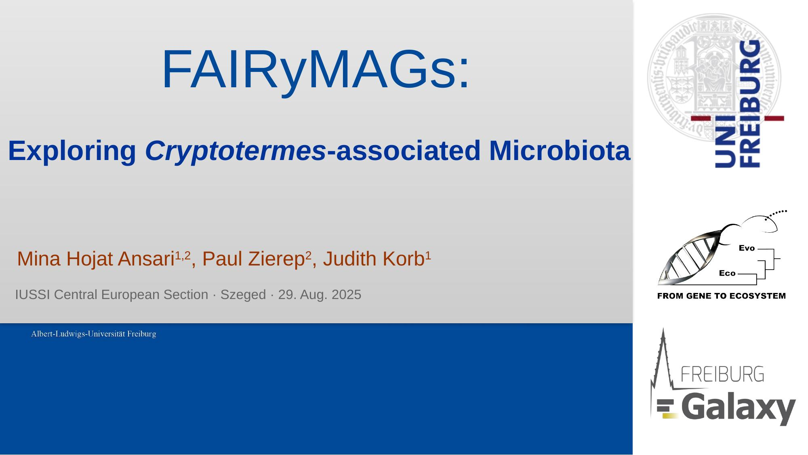
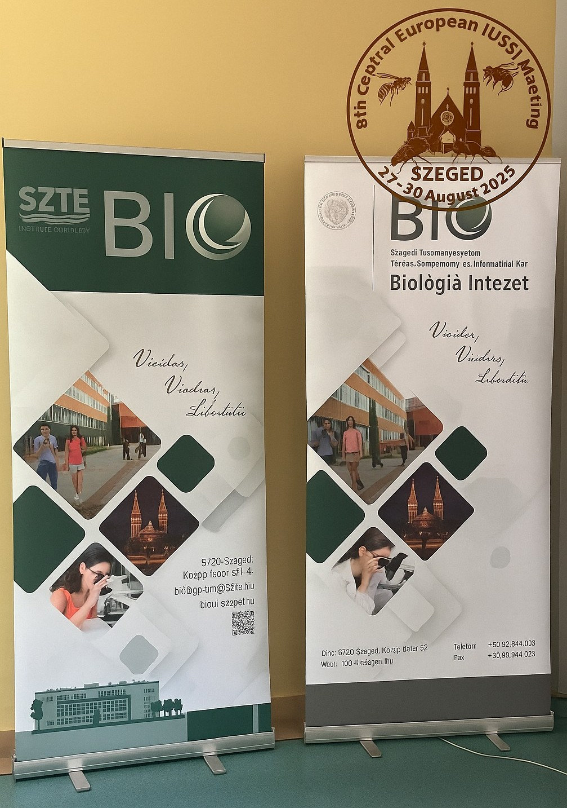

The **Freiburg Galaxy Team** participated in the [Central European Section Meeting of the International Union for the Study of Social Insects (CE-IUSSI 2025)](http://ce-iussi-meeting-szeged2025.iussi.de/), held in Szeged, Hungary, from August 27–30, 2025.  
On August 29, team member **Mina H. Ansari** presented innovative work on termite microbiota *beyond the gut* using **FAIRyMAGs**, the Galaxy workflow that makes complex microbiome research FAIR, reproducible, and accessible.

  

## Beyond the Gut: Microbiomes in New Niches

Microbiome studies often focus on the gut, but what if the **termite head microbiome** reveals hidden roles in behavior, communication, or defense?

Using the **FAIRyMAGs workflow in Galaxy**, we reconstructed metagenome-assembled genomes (MAGs) from two wood-feeding termite species, *Cryptotermes secundus* and *C. domesticus*, collected in Darwin, Australia.  
The results highlighted a **distinct microbial signature**, different from gut-derived data, suggesting new, unexplored microbial diversity and functions.

This wasn’t just termite ecology, it was **FAIR science in action with Galaxy**, showing how fundamental ecological and evolutionary questions can be tackled with accessible, reproducible tools. Galaxy’s graphical, shareable workflows empower anyone, anywhere, to replicate, modify, or extend the analysis.

## FAIRyMAGs in Action

- **Accessible**: Researchers can run the full FAIRyMAGs workflow through Galaxy’s web interface, end-to-end, no coding required.  
- **Reproducible**: Every step, parameter, and dataset is captured; results can be reproduced or audited later.  
- **FAIR-Compliant**: Metadata and outputs align with FAIR principles, promoting findability, interoperability, and reuse.  
- **Outreach**: Our presence in Szeged highlighted how Galaxy enables ecological and evolutionary biology researchers to bring FAIR principles to their work.  

## Community Impact and Next Steps

The CE-IUSSI meeting generated vibrant exchanges across behavioral ecology and microbiome research communities.  
The Freiburg Galaxy Team’s presence sparked discussions around expanding FAIRyMAGs to other social insects and integrating microbiome profiles with behavioral and ecological data.

We thank the CE-IUSSI organizers for a fantastic meeting and look forward to future collaborations with IUSSI.  

  
