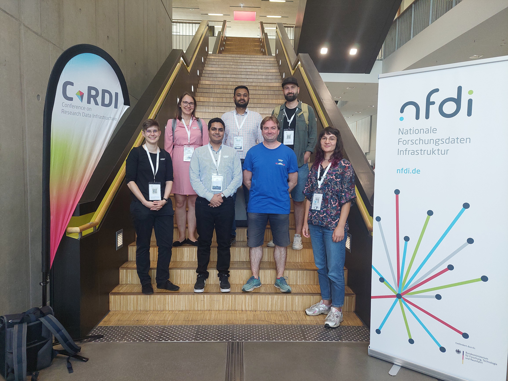

# The Freiburg Galaxy team participated in CoRDI

The [CoRDI](https://www.nfdi.de/cordi-2025/) took place in Aachen from August 25-29, 2025. 
The conference provided a fertile ground for exploring the latest advancements in data management and the ever-growing influence of digital tools in research. 
Our team engaged in several key discussions centred on the open-source platform, Galaxy, and its role in the national research data infrastructure (NFDI).

Education in research data management (RDM) was the focal point in the session "Educating RDM: Novel Approaches for Training & Education in RDM."
Here, the talk on "RDM Education with the Galaxy Training Network (GTN) – FAIR and Scalable RDM Training with Galaxy, GTN, and TIaaS" introduced the GTN, how the GTN ensures the fairness of their training materials, and illustrated how Galaxy and the GTN help to facilitate scalable and fair RDM education.

In efforts towards reproducibility, the "ONE Galaxy" session provided insights into workflow updates that streamline RDM infrastructures, showcasing improved methodologies for ensuring research integrity.

In the session titled "Humanities and Social Sciences - Workflows and Cross-Domain Tools," we delved into "The Open Source Platform Galaxy: A Gateway to Digital Humanities and Research Data Management." 
This talk introduced Galaxy for users in the Digital Humanities and Social Sciences.

Finally, the "Marketplace for FAIR Data in the Life Sciences: National and International Initiatives and Technical Solutions" session spotlighted how Galaxy advances interdisciplinary research. 
In this marketplace, Galaxy's adaptability was highlighted, further cementing its status as a key player in fostering collaboration and innovation.

In the meeting on base4NFDI, which followed the official conference....

Additionally, we participated in many other formats and enjoyed the possibility to get in touch with many international researchers and RDM-experts and learn from their experience.
We thank the orga-team for all their effort to make the conference a success and promote research data management worldwide. We are looking for the next CoRDI already.
