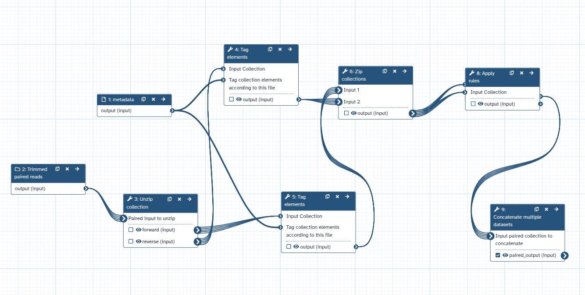

Metagenome assembly can be performed on individual samples or by pooling reads from several samples (co-assembly). Both strategies have advantages and drawbacks. To provide a balanced option, we have developed a **Group Assignment for Co-Assembly workflow** in Galaxy.  

This standalone workflow lets users define groups of samples based on metadata such as population, caste, disease status, or sampling location. It then produces group-specific datasets that can be used directly in downstream workflows like **FAIRyMAGs** for assembly, binning, MAG recovery, and annotation.

## Why Co-Assembly, and the Challenge with “All-in Co-Assembly”

Co-assembly can improve recovery of low-abundance genomes and often results in larger, less fragmented assemblies. However, pooling *all* samples together can quickly become problematic. Large co-assemblies require heavy computational resources, and combining very different communities may produce fragmented or misleading results. Rare genomes can also be lost in the background of dominant species.

## Group-Based Co-Assembly: The Middle Ground

The new workflow addresses these challenges by enabling **metadata-driven grouping**. Instead of co-assembling all samples, users can organize them into meaningful groups (for example, by study design or sampling condition) and run co-assemblies within each group.  

This makes it easier to balance sequencing depth with variation, improves recovery of low-abundance MAGs, and retains flexibility by generating both individual and group assemblies within the same workflow.

## The Workflow in Galaxy

**Workflow steps:**
1. Takes in paired-end reads and a metadata file.  
2. Tags and organizes samples according to metadata-defined groups.  
3. Concatenates reads for each group into new paired-end collections.  
4. Outputs group-specific datasets ready for assembly tools.  

## Example Use Cases

- **Termite microbiomes**: In our work with *Cryptotermes* termites, we grouped samples by colony and caste within and across species. This enabled recovery of MAGs representing rare head-associated microbes.  
- **Human studies**: Group co-assembly can be applied to cohorts such as healthy controls vs. Alzheimer’s patients, to disease stages (early vs. late), or demographic factors (age, sex). This links MAG recovery to biologically meaningful traits.

