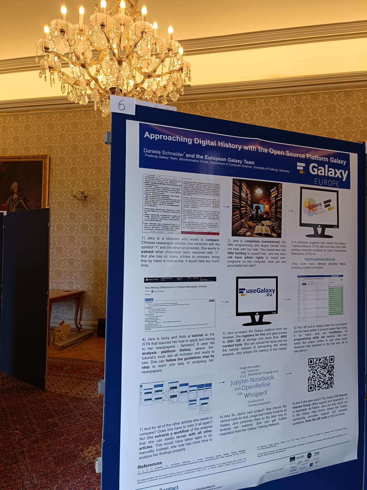

# The Freiburg Galaxy team participated in the German Historikertag

The 55. [Historikertag](https://www.historikertag.de/Bonn2025/en/) took place in Bonn from September 16-19, 2025.
It is the largest platform for German-speaking historians, dating back to the 19th century.
This year, the Freiburg Galaxy team joined for the first time.
Starting a new project in Digital History can be overwhelming. Where can I start? How can I access tools to analyse my texts, images or other data without knowing how to program? 
This is where Galaxy can help.

Our [poster "Approaching Digital History with the Open Source Platform Galaxy"](https://zenodo.org/records/17016028) was a conversation starter for all of the above challenges.
It explains what resources the platform offers and how the Open Educational Resources from the [Galaxy Training Network](https://training.galaxyproject.org/training-material/topics/digital-humanities/) help guide researchers' first steps.
Set in the old Senate's room, this definitely ranks among the most historic setups of our team's poster presentations to date.

Our [workshop](https://digigw.hypotheses.org/6292), organised by the working group Digitale Geschichtswissenschaft, allowed us to explore the Galaxy platform and introduce the new users to the environment and options in Galaxy. The unfolding discussions about further tools and development were very productive, as were the other sessions from the Historikertag's rich program. A promising first Historikertag!
