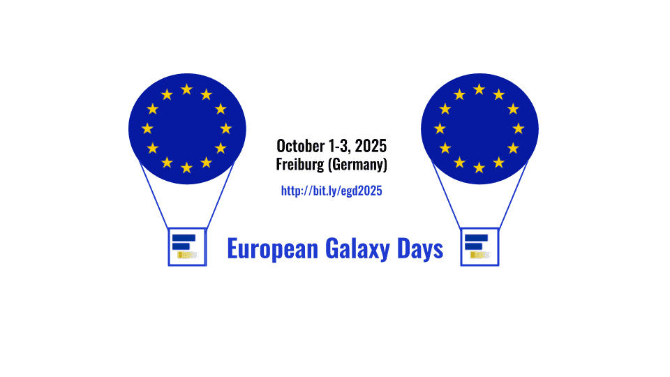

# September 2025 Galaxy Newsletter

  

Hello Galaxy Community,

We’re diving into fall with a newsletter packed full of events, breakthroughs, and training opportunities from across the Galaxy ecosystem. From hands-on workshops like the Galaxy Admin Training in Brno to the collaborative energy of European Galaxy Days, there’s something for everyone: admins, developers, researchers, and newcomers alike. This issue also highlights some of the incredible research Galaxy is powering, from public-health pathogen surveillance in Belgium to evolutionary insights into hedgehogs, shrews, moles, and turtles. And if you’re looking to sharpen your skills, don’t miss our Galaxy Training Network picks, tutorials and pathways that can take you from data management to RNA-Seq analysis and beyond. Scroll on to explore what’s happening, get inspired by the science, and find new ways to be part of the Galaxy community\!

---

## **European Galaxy Days (Oct 1–3, 2025, Freiburg, Germany)**  

We’re pleased to share that European Galaxy Days (EGD) 2025 will take place from October 1 to 3, 2025, in Freiburg im Breisgau, Germany. This gathering is for everyone in the Galaxy community (users, developers, admins, etc.), anyone interested in where Galaxy is and where it’s going\!

  

**What to expect**

**Talks, Demonstrations, and BoFs:** The first two days will feature presentations on the latest developments, hands-on demos, and Birds of a Feather sessions where you can engage in smaller topic-focused discussions.  
**CoFest Day:** The third day is for deeper collaboration: coding, hacking, planning, and more time to connect with community members.  
**Co-Location with Related Events:** EGD will be held in the same week as the ELIXIR Galaxy Community Face-to-Face meeting and the EuroScienceGateway Final Conference, making this an especially rich opportunity for networking across European Galaxy-related initiatives.

**Why attend**

Joining EGD is a chance to:

* Stay up-to-date with the roadmap and innovations across the Galaxy ecosystem.  
* Exchange ideas in person (or virtually) with people working on similar challenges.  
* Get hands-on time during the CoFest and BoFs, whether through code, workflows, or outreach.

**Key Practical Info**

* **Location:** Albert-Ludwigs-University Freiburg, Institute for Informatics, Georges-Köhler-Allee 101, Freiburg im Breisgau, Germany.  
* **Registration:** Free. We encourage you to register early to secure your spot and help the organisers plan effectively.   
* **Travel & Local Access:** Freiburg is well connected by train (including via Frankfurt, Karlsruhe, Basel), and local transport options (tram, buses) are convenient for reaching the venue.

[Learn more about the event!](https://galaxyproject.org/events/2025-10-01-egd2025/)

---

## **Galaxy Admin Training (November 24–28, 2028, Brno, Czechia)**

We’re excited to announce that the Galaxy Admin Training will take place November 24–28, 2025, in Brno, Czechia, at the CESNET offices. This hands-on workshop is designed to help system administrators and power users gain the skills needed to deploy, configure, and maintain a production Galaxy server.

**What to expect**

Over five days, participants will learn best practices for installing and managing Galaxy, configuring tools and authentication, working with storage and compute services, and optimizing performance for multi-user environments.

You’ll leave the workshop being more confident in:

* Installing, configuring, customizing, and extending Galaxy for your site/community.  
* Managing tools, authentication, and users.  
* Working with heterogeneous storage and compute services.   
* Performance tuning and best practices for multi-user setups.

**Who should attend**

This training is ideal for people already comfortable with the Linux/Unix command line and basic system administration tasks. Familiarity with text editors and package management is helpful.

**Event Details**

* **No registration fee** (participants cover their own travel and meals).  
* **Location:** CESNET offices, Brno city centre.  
* **Accommodation:** Plenty of nearby hotels; no group booking.  
* **Travel:** Easily reached by train or from nearby airports in Prague and Vienna.

Space is limited, so [register now](https://galaxyproject.org/events/2025-admin-training-brno/) on the event page to secure your spot and find complete details about prerequisites, daily schedules, and logistics.  

---

## **Galaxy in Research**

We love highlighting some of the incredible research and work being done using Galaxy. Check out these four recent journal articles that show Galaxy’s reach, versatility, and impact in research.

### **Pathogen Surveillance Made Easy with Galaxy @ Sciensano** 

*Galaxy @Sciensano: a comprehensive bioinformatics portal for genomics-based microbial typing, characterization, and outbreak detection (Bogaerts et al., 2025\)*

This paper introduces Galaxy @ Sciensano, a highly tailored Galaxy instance built for public-health and clinical settings in Belgium. It offers over 50 custom tools plus hundreds of community tools, ‘push-button’ pipelines (QC → de novo assembly → typing → antimicrobial resistance prediction) and interactive HTML reports that make sequence data interpretation accessible even for non-specialists. It tracks tool versions and parameters rigorously, supports both internal and external users, and is oriented toward actionable outputs for outbreak detection and surveillance. This is exactly the kind of real-world implementation that reflects Galaxy: reproducibility, traceability, stable tool infrastructures, and making powerful genomics workflows accessible to broader user communities.

[Read the full paper.](https://bmcgenomics.biomedcentral.com/articles/10.1186/s12864-024-11182-5)

### **Hedgehogs, Shrews, and Moles — Oh My\! Galaxy Illuminates Hibernation Genetics**

*Comparative mitogenomics of the eulipotyphlan species (Mammalia, Eulipotyphla) provides novel insights into the molecular evolution of hibernation (Chen, Yang, and Chai, 2025\)*

  

This study compared mitochondrial genomes across hedgehogs, shrews, and moles to investigate how mitochondrial gene evolution relates to hibernation. The authors examined sequence variation, annotated mitochondrial genes, constructed phylogenies, and tested for adaptive evolution, uncovering evidence that shifts in energy-metabolism genes may underlie hibernation strategies. They used the MITOS tool on the Galaxy platform to annotate mitochondrial genes, ensuring consistent, reproducible analysis across species and making their comparative pipeline transparent and shareable, a strong example of Galaxy enabling high-quality evolutionary genomics research.

[Read the full paper.](https://www.tandfonline.com/doi/full/10.1080/24701394.2025.2558619)

### **From Ice Ages to Genomes: Galaxy Guides Turtle Conservation** 

*Quaternary Habitat Fluctuations and Demographic Dynamics in Turtles Inferred From Environmental Niche Modelling and Whole Genome Data (Sozzoni et al., 2025\)*

This study combines climate history and cutting-edge genomics to uncover how habitat shifts over the last 2.5 million years shaped turtle populations. To build a high-quality reference genome for their focal species, the team turned to Galaxy Europe, running a full Vertebrate Genomes Project pipeline with HiFi and Hi-C reads. Using Galaxy-packaged tools like GenomeScope2, Cutadapt, Hifiasm, BUSCO, Bionano Hybrid Scaffolds, and SALSA, they generated a chromosome-level assembly that underpins their demographic and niche-modelling analyses. By using Galaxy, the researchers kept every step transparent, versioned, and reproducible, turning a complex genome build into a workflow anyone can follow, and showing how Galaxy can power major biodiversity and conservation studies

[Read the full paper.](https://onlinelibrary.wiley.com/doi/10.1111/1755-0998.70040)

---

## **Highlights from the Galaxy Training Network** 

Looking for something new (or rediscovering a classic) to expand your Galaxy skills? Here are five GTN gems worth checking out, each one showing how versatile and creative the Galaxy ecosystem can be\!

### **Build a Data Management Plan: *Peatland Research Edition***  
Data management plans (DMPs) are a cornerstone of reproducible science. This hands-on tutorial walks you through building a live DMP tailored to peatland research, but the principles apply to any project. You’ll learn how to outline data collection, storage, metadata, and sharing strategies, all within the Galaxy framework. Short and practical (about 30 minutes), it’s a great entry point into FAIR data practices with immediate real-world relevance.  
[Explore the tutorial here.](https://training.galaxyproject.org/training-material/topics/fair/tutorials/data-management-peatlands/tutorial.html?utm_source=chatgpt.com)

### **Digital Humanities and Galaxy**  
Galaxy isn’t just for life sciences\! This creative tutorial introduces digital humanities methods,  comparing texts, running command-line tools on literary corpora, and generating reports, all inside Galaxy. See how researchers use the same reproducible workflows for poetry analysis, historical documents, or any text-based dataset. It’s a great way to think differently about what “data” can be.  
[Explore the tutorial here.](https://training.galaxyproject.org/training-material/topics/digital-humanities/tutorials/introduction_to_dh/tutorial.html?utm_source=chatgpt.com)

### **A Galaxy Classic: RNA-Seq Reference-Based Workflow**  
This foundational tutorial remains one of the most popular on the GTN, guiding you step by step through a complete reference-based RNA-Seq analysis. Learn how to align reads, quantify expression, perform differential expression analysis, and interpret results with gene ontology and visualization. Whether you’re new to RNA-Seq or want to refresh your skills, this workflow is a solid reference point.  
[Explore the tutorial here.](https://training.galaxyproject.org/training-material/topics/transcriptomics/tutorials/ref-based/tutorial.html?utm_source=chatgpt.com)

### **Learning Pathway Highlight: FAIR Data Management**  
Want to make your research data well-organized, shareable, and reusable? This learning pathway walks you step by step through the FAIR principles (Findable, Accessible, Interoperable, Reusable) and how to apply them in your own work. Start with the quick “FAIR in a Nutshell” intro, then dive deeper into data stewardship, metadata, identifiers, and reproducibility practices, all with hands-on Galaxy tutorials. It’s a low-barrier, high-impact way to level up your data management skills across any discipline.  
[Explore the learning pathway.](https://training.galaxyproject.org/training-material/learning-pathways/fair-training.html?utm_source=chatgpt.com)

---

## **Upcoming Events**

| Date | Event | Venue / Location |
| ----- | ----- | ----- |
| 30 September 2025 | [Vertebrate Genomes Project (VGP) In-Person Conference](https://galaxyproject.org/events/2025-09-30-vgp-conference/) | New York, NY, USA  |
| 1 October 2025 | [European Galaxy Days (EGD)](https://galaxyproject.org/events/2025-10-01-egd2025/) | Freiburg, Germany  |
| 6 October 2025 | [FAIRyMAGs Hybrid Hackathon 2025: Optimising Metagenomics Assembled Genomes building](https://galaxyproject.org/events/2025-10-06-fairy-ma-gs-hackathon/) | Freiburg, Germany  |
| 7 October 2025 | [Single-cell & sPatial Omics Community Meeting: SPOC](https://galaxyproject.org/events/2025-10-07-spoc-meet/) | Online, Global  |
| 14 October 2025 | [ASHG 2025 Annual Meeting](https://meetings.ashg.org/event/ASHG25/home/) | Boston, MA, USA  |
| 28 October 2025 | [Science Gateways 2025](https://sciencegateways.org/gateways2025) | Green Bay, WI, USA |
| 4 November 2025 | [Single-cell & sPatial Omics Community Meeting: SPOC](https://galaxyproject.org/events/2025-11-04-spoc-meet/) | Online, Global  |
| 5 November 2025 | [Genome Informatics (CSHL Genome Informatics Conference)](https://meetings.cshl.edu/meetings.aspx?meet=INFO) | Cold Spring Harbor, NY, USA  |
| 13 November 2025 | [Galaxy Community Board Meeting: GCB](https://galaxyproject.org/events/2025-11-13-gcb-meet/) | Online, Global |
| 24 November 2025 | [2025 Galaxy Admin Training](https://galaxyproject.org/events/2025-admin-training-brno/) | Brno, Czechia |
| 3 December 2025 | [Introduction to Galaxy, the Open-Source Platform for FAIR Data Analysis (in German)](https://dataschool.hefdi.de/module/galaxy-europe/) | Online  |
| 4 December 2025 | [Single-cell & sPatial Omics Community Meeting: SPOC](https://galaxyproject.org/events/2025-12-04-spoc-meet/) | Online, Global |
| 9 January 2026 | [PAG 33 Plant and Animal Genome Conference](https://intlpag.org/PAG33/) | San Diego, CA, USA |
| 11 October 2026 | [ASM Conference on Rapid Applied Microbial NGS and Bioinformatic Pipelines](https://asm.org/events/asm-big/home) | Washington, DC, USA |

---

*Thank you for being a part of the Galaxy Community\!* 

**Stay updated with the latest news by following us on [Mastodon](https://mastodon.social/@galaxyproject@mstdn.science), [Bluesky](https://bsky.app/profile/galaxyproject.bsky.social), and [LinkedIn](https://www.linkedin.com/company/galaxy-project)\!**
