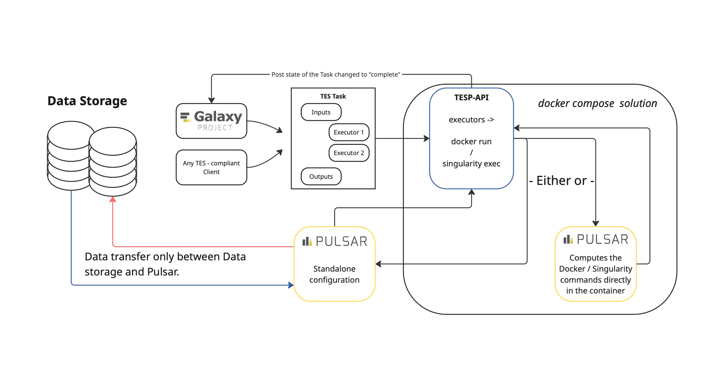

The Galaxy Project thrives on interoperability — connecting tools, data, and compute resources seamlessly. To extend this philosophy to broader research infrastructures, we’ve been developing TESP-API, a service that implements the [GA4GH Task Execution Service (TES)](https://www.ga4gh.org/product/task-execution-service-tes/) standard and acts as a bridge between Galaxy, Pulsar, and the wider TES ecosystem.

My name is Boris Jurič, and I’ve been working on TESP-API at CESNET as part of our ongoing effort to enhance Galaxy’s integration with national and international compute infrastructures. The project is available at [github.com/CESNET/tesp-api](https://github.com/CESNET/tesp-api).

## What is TESP-API?

TESP is a lightweight microservice that translates TES-compliant job submissions into Pulsar tasks. It exposes a REST API following the GA4GH TES specification, allowing Galaxy and other TES clients to submit jobs to remote compute resources in a standardized way.  

A key feature of TESP is direct data staging — input and output files move end-to-end between storage and compute nodes, bypassing intermediaries like Galaxy, TESP, or Pulsar itself. This design minimizes data transfers, improves performance, and aligns with Galaxy’s distributed compute model. TESP currently supports HTTP, FTP, and S3 data transfers.

## Deployment and Integration

TESP can be deployed via Docker Compose in two modes:
- *Embedded mode* – runs both TESP and a Pulsar instance, suitable for local testing and development.  
- *Standalone mode* – connects to an existing Pulsar service, ideal for production or hybrid setups.

At [usegalaxy.cz](https://usegalaxy.cz), operated by CESNET, TESP is already running in proof-of-concept conditions. Galaxy submits TES jobs to TESP, which manages their execution through Pulsar. Although it currently handles selected workloads, TESP is being actively optimized toward full production integration.

## Outlook

TESP-API is a practical bridge that enables another set of real scientific workloads on Galaxy–Pulsar infrastructures. It helps Galaxy to be a more connected and interoperable platform — one step closer to a unified compute ecosystem across research infrastructures. You can follow the project or contribute at [github.com/CESNET/tesp-api](https://github.com/CESNET/tesp-api).
