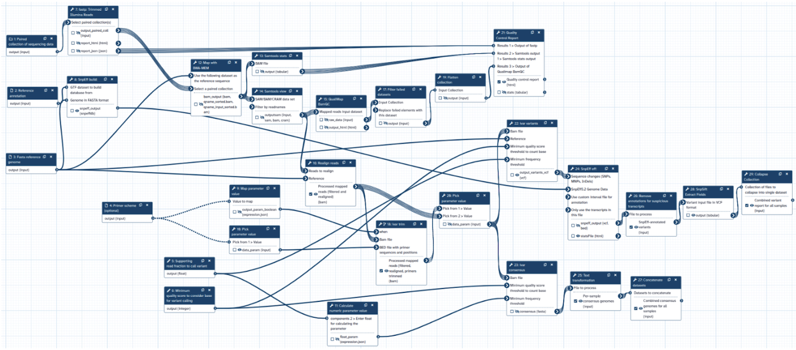
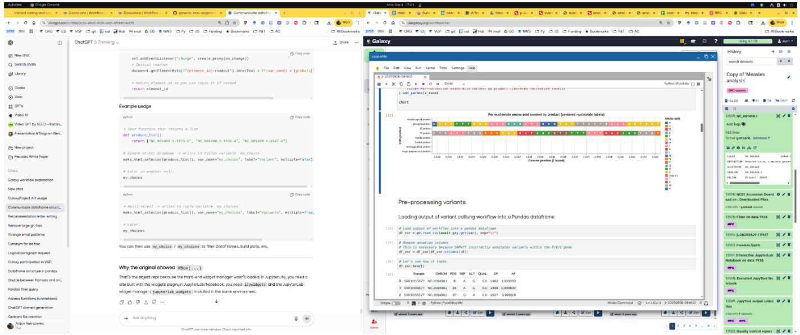

Anton Nekrutenko1, Danielle Callan2, Marius Van Den Beek1, Dannon Baker3, David Rogers4, Wolfgang Maier5, Aysam Guerler3,  Hiram Clawson6, Scott Cain1, Michael Schatz3, Kelsey Beavers7, Maximilah Haeussler6, Bjorn Gruning5, and Sergei Kosakowsky Pond2

1 Dept. of Biochemistry and Molecular Biology, The Pennsylvania State University, University Park, PA, USA  
2 Dept. of Biology, Temple University, Philadelphia, PA, USA  
3 Dept. of Biology, Johns Hopkins University, Baltimore, MD, USA  
4 Clever Canary, LLC, Santa Cruz, CA, USA  
5 Dept. of Bioinformatics, Albert-Ludwigs-University Freiburg, Freiburg, Baden-Württemberg, Germany  
6 Baskin School of Engineering, University of California, Santa Cruz, USA  
7 Texas Advanced Computing Center, The University of Texas, Austin, TX, USA 

  ❗ This is a pre-release of the first publication of the <b>BRC-analytics white papers</b> series. An interactive version will be available on <a href="https://brc-analytics.org">https://brc-analytics.org</a>.

# Abstract

The analytical landscape of pathogen research is often fragmented, hindering transparency and reproducibility due to diverse genomic data sources, numerous analysis tools, and suboptimal integration methods. This manuscript introduces [BRC-analytics](https://brc-analytics.org), a novel browser-based environment that unifies authoritative sources of genomic data with community-curated best analysis practices on a freely accessible public computational infrastructure. We demonstrate its capabilities by analyzing the evolutionary dynamics within the P/V/C locus of the measles virus, a complex system involving overlapping coding regions and RNA editing. Our analysis, conducted entirely within [BRC-analytics](https://brc-analytics.org), reveals asymmetric evolution of the locus's reading frames under distinct selective pressures. [BRC-analytics](https://brc-analytics.org) streamlines the entire research process—from data collection and primary analysis (e.g., variant calling) to interpretation (e.g., using integrated JupyterLite notebooks and LLMs) and publication—into a single web browser session. This eliminates the need for local installations and manual data transfers, implicitly tracking provenance and ensuring reproducibility. The platform's ultimate goal is to provide true data-to-publication functionality, making advanced pathogen genomics accessible to a broader research community regardless of their computational expertise or infrastructure access.

# Introduction

Every research study, from data collection to publication, involves four fundamental steps:
 
 1. **Data Collection**: Necessary datasets, including reference genomes, annotations, and sequencing reads, are typically found in standard repositories like NCBI or EBI. However, these datasets often require downloading before use.
 1. **Primary Analysis**: This stage involves processing sequencing reads to generate outputs such as variant lists and transcript counts, using various standard tools and pipelines. A significant challenge for many researchers is determining the appropriate tool combinations for their data and experimental design, as well as the complexities of installation, configuration, and execution environments. While LLM chatbots can assist with installation and configuration, they do not inherently improve analysis reproducibility. Furthermore, while modern laptops and desktops can carry out  many analyses locally, large-scale studies with thousands of samples demand substantial computational resources.
 1. **Interpretation**: This phase often lacks dedicated tools, relying instead on general utilities like spreadsheets or custom code in computational notebooks. A major drawback is that custom code is rarely versioned or documented, making these analyses difficult for external researchers to reproduce.
 1. **Publication**: The final step where findings are disseminated.
[BRC-analytics](https://brc-analytics.org) uniquely integrates all these steps into a single web browser session, streamlining the entire research process. It directly accesses reference genomes and annotations as well as all publicly available data from the sequence read archive (SRA) and combines it with community-curated best-practice analysis workflows and tools. BRC-analytics runs on free public computational resources, requiring no additional investment from the user. 

To highlight the functionality of BRC-analytics we picked one the task of genomic pathogen surveillance. In this analysis, data from multiple spatially and temporally distributed samples are processed to identify and classify sequence variants. This is done by aligning reads against a reference genome, calling variants and generating variant lists: locations and identities of nucleotide changes found in each sample. These variants are further processed to uncover underlying patterns such as dynamics of variants in space and time and ultimately estimate their potential effects on the fitness of the pathogen. Before moving to practicalities let us deconstruct this analysis into data collection, primary analysis, interpretation, and publication strategies mentioned earlier (Table 1).

**Table 1.** The four stages of a biomedical research project: a pathogen surveillance example.

| **Stage** | **Action** | **Standardization / Reproducibility potential** | **Outcome** |
| :---- | :---- | :---- | :---- |
| Data collection | Specimen collection and sequencing  | \- | Sequencing data (fastq files) |
| Primary analysis  | Use of standard tools for QC, Read mapping, variant calling, filtering, etc.  | High | Variant lists (VCF, TSC, CSV, etc.) |
| Interpretation  | Custom scripts for tracing variants through samples, times, or locations. Analysis of variant effects on pathogen biology.  | Low | Spreadsheets, notebooks, figures |
| Reporting  | Generation of final tables, figures, reports | Low | Reports, dashboards, preprints, publications |

Outside of [BRC-analytics](https://brc-analytics.org) all of these steps are performed separately. Suppose a student in a lab performs re-analysis of published surveillance datasets. These datasets—fastq files from the sequence read archive (SRA) such as NCBI or EBI—are first downloaded onto local infrastructure. Next, these data need to be mapped against a reference genome for the pathogen in question. For this the reference also needs to be located and downloaded. At this point using a combination of tools or workflows, read data is reduced to a list of variants. Depending on how (individual tool or Snakemake, Nextflow, or Galaxy workflows) and where (one’s laptop, an institutional cluster, a cloud, a Galaxy instance) this is done, the results may be more or less reproducible. The interpretation stage involves filtering, reshaping and summarizing the list of variants. It is done using “analytical frameworks” such as spreadsheets applications or notebooks (Jupyter, RStudio). This is the least reproducible stage of the analysis because spreadsheet formulas and/or custom code created in notebooks is rarely versioned or documented. The entire process is usually condensed into a sentence “_...analyzed using a collection of custom Python scripts_” found in too many methods sections of numerous manuscripts. Because [BRC-analytics](https://brc-analytics.org) integrates all these steps into a single environment it tracks provenance implicitly saving all parameters, intermediate datasets, or code snippets in notebooks addressing most reproducibility concerns. 

> **Figure 1.** Schematic representation of overlapping reading frames within the P/V/C locus of measles virus (upper pane). C (middle pane) and V (lower pane) are shifted +1 and +2 relative to the P frame, respectively. The P protein is translated from the primary mRNA transcript, while the V and C proteins are produced from the same locus through different mechanisms. The C protein, a small basic protein, is expressed by an alternative translational initiation mechanism. It is translated from an overlapping open reading frame (in +1 phase relative to P) that begins 19 nucleotides downstream of the P/V start codon. This strategy allows for the independent expression of the C protein from the same mRNA transcript that codes for P and V.  The V protein is produced through cotranscriptional RNA editing. This process involves the viral polymerase inserting a non-templated G residue at a specific site within the P/V mRNA transcript. This pseudo-templated insertion triggers a +2 ribosomal frameshift, leading to the translation of a new V ORF. The mechanism, often referred to as "polymerase stuttering," occurs when the vRdRp repeatedly reads a single template cytosine within a short G run that is part of a larger polypurine tract.  

As a biological system for highlighting [BRC-analytics](https://brc-analytics.org) functionality we selected the measles virus for two reasons. First, there are a number of recent surveillance datasets available for this pathogen. These datasets are not very large mimicking output of a typical small-to-medium research lab, which represents the majority of single PI groups in the US (based on the analysis of R01-equivalent awards for 2024 found at [`[1]`](https://reporter.nih.gov/). RO1-equivalent are DP1, DP2, DP5, R01, R37, R56, RF1, RL1, U01, R35). Thus we can show how [BRC-analytics](https://brc-analytics.org) benefits the majority of biomedical researchers. Second, measles virus contains the P/V/C-locus with two sets of overlapping reading frames (Fig. 1). Analysis of genetic variants within overlapping coding regions is challenging in practice and allows us to highlight impromptu analytical capabilities of the [BRC-analytics](https://brc-analytics.org) environment. A mutation occurring in protein coding regions changes the nucleotide sequence of underlying codons. Due to redundancy of the genetic code such change may or may not alter the amino acid encoded by the codon. If a mutation does change amino acid, such mutation is called non-synonymous. Conversely, a mutation that does not lead to amino acid change is called synonymous. But what if a given gene codes for multiple proteins via overlapping reading frames (Fig. 2)? In this case the concept of “synonymous” or “non-synonymous” becomes relative to a frame [`[2]`](https://pubmed.ncbi.nlm.nih.gov/17511511/) [`[3]`](https://pubmed.ncbi.nlm.nih.gov/17652172/). For example, due to the organization of the standard genetic code most changes in the third codon position are synonymous. However, a third codon position corresponds to the second codon position in +1 overlap and any change in the second codon position is always nonsynonymous. In other words a synonymous change in one frame will most often be non-synonymous in the other creating interesting scenarios for the evolution of proteins encoded by overlapping reading frames. 

>**Figure 2**. Correspondence of codon positions in +1 and +2 overlaps 

In this manuscript we demonstrate how a routine surveillance analysis can be performed entirely using the [BRC-analytics](https://brc-analytics.org)environment. We begin by obtaining all necessary data and applying a best-practice variant analysis workflow to create the initials list of variants. We then demonstrate how [BRC-analytics](https://brc-analytics.org) allows custom analyses using a built-in JupyterLite functionality to perform non-standard analyses of overlapping coding regions and tracing evolutionary dynamics of nucleotide substitutions. This approach ensures transparency and reproducibility by implicitly tracking provenance, ultimately enabling researchers to conduct sophisticated evolutionary and functional analyses without local installations or manual data transfers.

# **Results and Discussion**

## **What is [BRC-analytics](https://brc-analytics.org)?**

[BRC-analytics](https://brc-analytics.org) is a browser-based analysis environment developed within the NIAID-funded Bioinformatics Resource Centers (BRCs) program to enable comprehensive, reproducible genomic and metagenomic analyses of infectious disease agents entirely online. Powered by the Galaxy workflow system, it integrates reference data from NCBI Datasets and curated community workflows for quality control, read mapping, variant identification, and annotation. Users can start with raw sequencing reads and obtain publication-ready results without installing software or transferring data between tools. By combining cloud-based computation, versioned workflows, and interactive visualizations, [BRC-analytics](https://brc-analytics.org) provides a seamless interface that unites the data and analytical capabilities making advanced pathogen genomics accessible to the wider research community. A schematic overview of [BRC-analytics](https://brc-analytics.org) architecture is shown in Fig. 3. For data it relies on three key resources. [BRC-analytics](https://brc-analytics.org) list of organisms and assemblies is populated from NCBI Datasets that are used as the source of “truth” for reference data. At the moment of writing [BRC-analytics](https://brc-analytics.org) listed 1,601 genome assemblies corresponding to 1,149 distinct pathogen, host, and vector taxa. Our plan is to steadily increase the number of species until all NCBI Datasets taxa are included. We use UCSC Genome Browser platform as a source of genome annotations (coordinates of genes, regulatory element, etc). This involves ensuring that for each NCBI genome assembly we have a corresponding UCSC Genome Browser instance populated with annotations. Using UCSC Genome Browser as a distribution platform for genome annotation allows us to be more flexible and include community annotations in addition to reference tracks provided by NCBI datasets. Finally, for accessing all public sequence read archive (SRA) data we rely on EBI ENA by locally caching all SRA metadata for quick search and accessing read-level data via ENA API. Best practice workflows are retrieved from the community curated Galaxy’s IWC consortium repository. [BRC-analytics](https://brc-analytics.org) uses Galaxy for launching and running workflows as well as individual analysis tools. Galaxy is also used as an environment for interpretive analyses by relying on its interactive environment and visualization functionality powered by Jupyter, RStudio, and JupyterLite. The substantial computational and storage capacities required to make this system work and scale are provided by the ACCESS-CI [`[4]`](https://access-ci.org/) infrastructure in the US. [BRC-analytics](https://brc-analytics.org) and Galaxy are hosted on servers provided by the Texas Advanced Computing Center (TACC)—an integral part of ACCESS-CI. 

>**Figure 3.** Main components of [BRC-analytics](https://brc-analytics.org). 

## **Selecting genome: Using NCBI Datasets for reference data ([Video 1](https://youtu.be/24xJmywy_Nk))**

The analysis begins at [https://brc-analytics.org](https://brc-analytics.org) where we search for *Morbillivirus hominis*—a binary name for measles virus (a new standard for official scientific names implemented by the international committee on taxonomy of viruses; https://ictv.global/). The search yields a single assembly, GCF_000854845.1, corresponding to the only RefSeq genome for measles. In the remainder of this document we refer to the measles virus as MeV.

## **Replicating this analysis**

Everything described in this manuscript can be re-examined and replicated. Table 2 below provides links and description to key artifacts of this analysis:

**Table 2.** Links and description for key artifacts of this study. 

| **Artifact** | **Link** | **Description** |
| :---- | :---- | :---- |
| Analysis history | https://usegalaxy.org/u/cartman/h/overlaps-in-measels-1 | Galaxy history is the workspace in which the analysis is conducted. It contains all inputs, intermediate datasets and outputs. JupyterLite notebooks used in the analysis can also be found there.  |
| Workflow | https://doi.org/10.5281/zenodo.16896089 | Variants calling workflow used to generate variant lists for this analysis. The history above contains data generated by this workflow.  |
| Videos | https://gxy.io/brc-whitepaper-videos | Videos describing each stage of this study.  |

Clicking the history link will allow you to import that history in your own workspace and re-examine or re-run every step. 

## **Selecting analysis: Using community-curated workflows ([Video 1](https://youtu.be/24xJmywy_Nk?si=lX71_uw7DdQ6JrE-&t=66))**

Our goal is to perform a variant identification analysis: sequence data (reads) are mapped against a reference genome and mismatches between the reads and the genome are evaluated to identify likely changes. Such an analysis requires multiple tools for evaluation of data quality, read mapping, and variant identification along with auxiliary utilities. The most optimal way to run an analysis like this is to assemble tools into a workflow. There are already community developed and maintained collections of workflows covering the absolute majority of sequence analysis scenarios. [BRC-analytics](https://brc-analytics.org) tries to match an assembly to a list of potential workflows that are applicable to it. For example, in the case of the measles virus [BRC-analytics](https://brc-analytics.org) offers two variant calling workflows. For this study we are using a workflow called “Variant calling and consensus construction from paired end short read data of non-segmented viral genomes” (Fig. 4). This workflow was specifically designed for non-segmented viruses with a low-to-medium evolutionary rate such as MeV. Detailed information about the workflow can be found at [IWC](https://iwc.galaxyproject.org/workflow/generic-non-segmented-viral-variant-calling-main/)—Galaxy’s workflow repository and at [Dockstore](https://dockstore.org/workflows/github.com/iwc-workflows/generic-non-segmented-viral-variant-calling/main:main?tab=info). The workflow produces several types of outputs: a summary of variants found in each sample, consensus sequence for each sample as well as auxiliary outputs such as QC summary for all samples (see *Making sense of variants* section below). 

> **Figure 4.** Schematics of the variant calling workflow used in this study (the workflow is available from [IWC](https://iwc.galaxyproject.org/workflow/generic-non-segmented-viral-variant-calling-main/)). 

For a detailed workflow description see Methods. Briefly, the workflow processes paired-end short-read sequencing data from viral samples using a provided reference genome (FASTA) and annotation (GenBank/GFF), optionally incorporating an amplicon primer BED file. Reads are first quality- and adapter-trimmed with fastp, and primer sequences are removed with iVar trim when applicable. Cleaned reads are aligned to the reference using BWA-MEM, with BAM filtering, statistics, and alignment quality assessment performed via samtools and QualiMap BamQC. Alignments are realigned around indels using the LoFreq Viterbi realigner to improve variant detection. Variants are then called with iVar variants under user-defined thresholds for base quality and allele frequency, and consensus genomes are generated with iVar consensus, introducing IUPAC ambiguity codes where mixed alleles occur. Variants are functionally annotated with SnpEff using a database built from the supplied reference, and results are parsed into tabular form with SnpSift. Quality metrics from all stages are summarized with MultiQC, while standard Galaxy collection and text utilities handle dataset organization and parameter mapping. The workflow outputs include trimmed reads, mapped and realigned BAMs, annotated VCFs with summary tables, per-sample consensus FASTA files, and integrated QC reports.

## **Selecting SRA data and launching workflow (Video [1](https://youtu.be/24xJmywy_Nk?si=tadOGwVwK3L1l_1t&t=144) & [2](https://youtu.be/xdmyzoXTGkc))**

After selecting the reference genome and workflow for variant identification analysis, we chose public surveillance data for the virus. [BRC-analytics](https://brc-analytics.org)' SRA search wizard initially showed 466 individual datasets. These were automatically pre-filtered to 225 samples across nine studies, based on the workflow's requirements for "paired end" (Illumina or Element) and "WGS" (whole genome sequencing) data; these filters can be adjusted as needed. Among these nine studies were the three largest measles surveillance datasets (Table 3), which we selected to launch the previously described workflow.

**Table 3.** Three MeV surveillance datasets selected for this study. 

| Study | Description | \# samples | Reference |
| :---- | :---- | ----- | :---- |
| PRJNA1145141 | Analysis of measles outbreak in Romania. | 124 | [`[5]`](https://pubmed.ncbi.nlm.nih.gov/39813269/) |
| PRJNA1017431 | Canadian measles surveillance data. | 61 | [`[6]`](https://pubmed.ncbi.nlm.nih.gov/38038439/) |
| PRJNA869081 | Measles virus transmission patterns and public health responses during Operation Allies Welcome. | 42 | [`[7]`](https://pubmed.ncbi.nlm.nih.gov/37516478/) |

The workflow outputs two datasets that would help us gain insights into the evolution of overlapping coding regions in the measles virus. The first dataset provides information about each variant within each sample: it shows its position, alternative allele frequency, strand-specific read counts, functional impact and other data (Supplementary Table 1). The second dataset contains consensus sequences produced for each sample by incorporating all variants present in that sample. We will use it to assess adaptive significance of substitutions.

> **Figure 5**. Analysis setup for post-processing of variant calls.  

## **Making sense of variants: Combining LLMs and JupyterLite ([Video 3](https://youtu.be/plwNw_PcUgE?si=mMe4IpCFIG9_WYkZ))**

The workflow described above produced a list of variants observed in each sample. Such a list by itself does not provide any valuable biological insights. It needs to be reshaped, summarized, and visualized to give us any ideas on the biological significance of variants we just identified. Additional complication is that there are no “off-the-shelf” tools for analysis of genetic variants in overlapping coding regions. Fortunately, [BRC-analytics](https://brc-analytics.org) and Galaxy it utilizes as the analysis platform (Fig. 5) provide ability to construct analyses in an *ad-hoc* way. For this we will use an environment called JupyterLite that is integrated into the Galaxy platform. The entire analysis including the notebook can be accessed as described in Methods (also see the [Video 3](https://youtu.be/plwNw_PcUgE?si=mMe4IpCFIG9_WYkZ)). Below we go through major stages of this analysis. All steps of this analysis described in the notebook were generated with the help of ChatGPT using a setup shown in Fig. 5 in which we used two open browser windows: one with Galaxy workspace and another with ChatGPT, Microsoft CoPilot, Claude, or any other LLM agent capable of writing python code (the [Video 3](https://youtu.be/plwNw_PcUgE?si=mMe4IpCFIG9_WYkZ) also details safety checks we used when using LLM-generated code—such code should ALWAYS be treated with extreme caution and made publicly available). 

## **P reading frame is more permissive than C and V ([Video 3](https://youtu.be/plwNw_PcUgE?si=oQtcBzj13rnXRbAK&t=514))**

First we looked for general patterns of substitutions within P/C and P/V overlaps by simply plotting aggregate data for each substitutions (e.g., the number of samples a substitution occurs at, median, min, and max alternative allele frequencies and its effect, synonymous or non-synonymous, on each reading frame). This is presented in Fig. 5. One can see that in both cases the P reading frame appears to be more permissive—most substitutions are non-synonymous (“red”)  in P and synonymous (“green”) in C or V. 

<vega-embed spec="https://gist.githubusercontent.com/nekrut/604d0886724301acaa0c96c0df00f7a3/raw/7e5227634895bbaea6dd781a024a7b2bb518aaae/vars.json" />

<!--  -->

 >**Figure 6.** Nucleotide changes within P/C (top) and P/V (bottom) overlaps. Each substitution is represented by two ticks corresponding to each reading frame. Green = synonymous for that frame; Red = non-synonymous for that frame; length of each tick represents the alternative allele frequency spread = the difference between min and max values. The opacity is the number of samples (from min = 2 to max = 225) the change is found in. 

<!--
 

  👉  You can view the interactive view of the above image <a href="https://usegalaxy.org/visualizations/display?visualization=jupyterlite&dataset_id=f9cad7b01a47213516812bfc3ef85974" target="_blank">here</a>. (You will need to scroll down).

-->

Nucleotide substitutions in the C-protein and the V-protein region downstream of the editing site appear to affect C and V protein function less than they affect protein P (Table 4). Variants in the C–P overlap (nucleotides ~1,836–2,370) are mostly synonymous in C but nonsynonymous in P. This suggests strong purifying selection on C (which contains nuclear localization, export, and SHCBP1-binding signals), while P tolerates or favors amino-acid changes in this region, indicating adaptive fine-tuning of P’s polymerase cofactor and regulatory functions while C’s integrity is maintained. Substitutions in the P–V overlap (nucleotides ~2,514–2,704) frequently show synonymous changes in V but nonsynonymous in P, again pointing to P-directed adaptation. However, some sites (e.g., 2514-A, 2580-G) show the opposite pattern (nonsynonymous in V, synonymous in P), possibly corresponding to residues within or adjacent to V/P amino-acid positions 100–120, a region known to mediate STAT1 and Jak1 binding [`[8]`](https://pubmed.ncbi.nlm.nih.gov/18385234/) [`[9]`](https://pubmed.ncbi.nlm.nih.gov/20980517/). These variants could represent V-specific adaptive evolution affecting interferon antagonism, while the broader pattern reflects the evolutionary compromise needed to maintain two overlapping reading frames with distinct but interdependent functions (see more on this in the evolutionary analysis section below).

**Table 4.** Nucleotide substitutions within P/C and P/V overlaps. Samples = number of samples this variant is observed in

| **Site ID** | **Products** | **Effect** | **Ref codons** | **Alt codons** | **Samples** |
| ----- | :---: | :---: | :---: | :---: | :---: |
| 1836-G | C protein, phosphoprotein | nonsynonymous, synonymous | AAA, AAA | AGA, AAG | 16 |
| 1847-G | C protein, phosphoprotein | nonsynonymous, nonsynonymous | AAT, GAA | GAT, GGA | 6 |
| 1866-A | C protein, phosphoprotein | nonsynonymous, synonymous | AGG, AAG | AAG, AAA | 53 |
| 1882-C | C protein, phosphoprotein | synonymous, nonsynonymous | GCT, TCA | GCC, CCA | 53 |
| 1891-A | C protein, phosphoprotein | synonymous, nonsynonymous | CCG, GTC | CCA, ATC | 53 |
| 1902-T | C protein, phosphoprotein | nonsynonymous, synonymous | CCA, GCC | CTA, GCT | 10 |
| 1907-A | C protein, phosphoprotein | nonsynonymous, nonsynonymous | CAG, GCA | AAG, GAA | 6 |
| 1921-G | C protein, phosphoprotein | synonymous, nonsynonymous | AAA, ATA | AAG, GTA | 30 |
| 1941-C | C protein, phosphoprotein | nonsynonymous, nonsynonymous | AGG, CAG | ACG, CAC | 6 |
| 1944-G | C protein, phosphoprotein | nonsynonymous, nonsynonymous | ACC, GAC | AGC, GAG | 53 |
| 1960-A | C protein, phosphoprotein | synonymous, nonsynonymous | AGG, GAA | AGA, AAA | 53 |
| 1966-A | C protein, phosphoprotein | synonymous, nonsynonymous | AGG, GAG | AGA, AAG | 216 |
| 2026-A | C protein, phosphoprotein | synonymous, nonsynonymous | GCG, GGT | GCA, AGT | 52 |
| 2061-G | C protein, phosphoprotein | nonsynonymous, synonymous | AAA, GAA | AGA, GAG | 206 |
| 2079-G | C protein, phosphoprotein | nonsynonymous, synonymous | AAA, GAA | AGA, GAG | 2 |
| 2080-G | C protein, phosphoprotein | synonymous, nonsynonymous | AAA, ACT | AAG, GCT | 152 |
| 2089-G | C protein, phosphoprotein | synonymous, nonsynonymous | GAA, ATC | GAG, GTC | 52 |
| 2090-C | C protein, phosphoprotein | nonsynonymous, nonsynonymous | TCC, ATC | CCC, ACC | 52 |
| 2098-G | C protein, phosphoprotein | synonymous, nonsynonymous | CAA, AGA | CAG, GGA | 52 |
| 2119-G | C protein, phosphoprotein | synonymous, nonsynonymous | GCA, ACT | GCG, GCT | 63 |
| 2125-C | C protein, phosphoprotein | synonymous, synonymous | GGT, TTA | GGC, CTA | 3 |
| 2131-C | C protein, phosphoprotein | synonymous, nonsynonymous | AGT, TGT | AGC, CGT | 52 |
| 2137-T | C protein, phosphoprotein | synonymous, nonsynonymous | ATC, CAT | ATT, TAT | 44 |
| 2164-A | C protein, phosphoprotein | synonymous, nonsynonymous | CGG, GTT | CGA, ATT | 52 |
| 2203-C | C protein, phosphoprotein | synonymous, nonsynonymous | AAT, TCA | AAC, CCA | 2 |
| 2214-A | C protein, phosphoprotein | nonsynonymous, nonsynonymous | ATG, GAT | AAG, GAA | 52 |
| 2233-A | C protein, phosphoprotein | synonymous, nonsynonymous | CAG, GGA | CAA, AGA | 103 |
| 2242-A | C protein, phosphoprotein | synonymous, nonsynonymous | ACG, GAT | ACA, AAT | 52 |
| 2256-T | C protein, phosphoprotein | nonsynonymous, synonymous | ACA, AAC | ATA, AAT | 29 |
| 2293-C | C protein, phosphoprotein | synonymous, nonsynonymous | GAT, TAT | GAC, CAT | 3 |
| 2297-T | C protein, phosphoprotein | synonymous, nonsynonymous | CTA, GCT | TTA, GTT | 28 |
| 2340-A | C protein, phosphoprotein | nonsynonymous, synonymous | GGG, AGG | GAG, AGA | 52 |
| 2370-T | C protein, phosphoprotein | nonsynonymous, synonymous | GGG, GGG | GTG, GGT | 151 |
| 2514-A | V protein, phosphoprotein | nonsynonymous, synonymous | GGC, TTG | AGC, TTA | 203 |
| 2537-A | V protein, phosphoprotein | synonymous, nonsynonymous | CGC, GCG | CGA, GAG | 7 |
| 2538-A | V protein, phosphoprotein | nonsynonymous, synonymous | GTC, GCG | ATC, GCA | 11 |
| 2576-G | V protein, phosphoprotein | synonymous, nonsynonymous | AAA, AAG | AAG, AGG | 5 |
| 2580-G | V protein, phosphoprotein | nonsynonymous, synonymous | ACC, TCA | GCC, TCG | 52 |
| 2594-T | V protein, phosphoprotein | synonymous, nonsynonymous | ATC, TCA | ATT, TTA | 136 |
| 2612-T | V protein, phosphoprotein | synonymous, nonsynonymous | TGC, GCG | TGT, GTG | 202 |
| 2615-A | V protein, phosphoprotein | synonymous, nonsynonymous | GGG, GGG | GGA, GAG | 13 |
| 2624-T | V protein, phosphoprotein | synonymous, nonsynonymous | CCC, CCC | CCT, CTC | 33 |
| 2651-C | V protein, phosphoprotein | synonymous, nonsynonymous | GAT, ATA | GAC, ACA | 155 |
| 2654-C | V protein, phosphoprotein | synonymous, nonsynonymous | ACA, CAG | ACC, CCG | 51 |
| 2683-G | V protein, phosphoprotein | nonsynonymous, nonsynonymous | AAT, ATC | AGT, GTC | 5 |
| 2693-T | V protein, phosphoprotein | nonsynonymous, nonsynonymous | GAG, AGA | GAT, ATA | 3 |
| 2704-G | V protein, phosphoprotein | synonymous, nonsynonymous | TAA, AAT | TGA, GAT | 1 |

## **Substitutions have distinct geographic and temporal patterns ([Video 3](https://youtu.be/plwNw_PcUgE?si=gq2w5QJriFkz2O0h&t=748))**

Next we analyzed the substitution patterns in the context of sampling locations and collection times. For this we had to rely on the sample metadata downloaded from SRA. Results of this analysis are shown in Fig. 6. While most samples show strain-specific patterns there is a number if interesting sites such as, for example linked co-occurring substitutions at position 2,576 and 2,683 within five US samples (SRR25426258, SRR25426259, SRR25426260, SRR25426262, SRR25426264). These two sites are within the P/V overlap. The first change is non-synonomous in P and synonymous in V, while the second is non-synonymous for both reading frames.  

## **Comparative analysis of substitution effects ([Video 4](https://youtu.be/opPVkPxU25c))**

Our final analysis aimed to identify potentially adaptive substitutions, particularly within the P/C and P/V overlaps. Traditional codon-based models, which assume a constant nonsynonymous to synonymous substitution rate (ω = dN/dS) across all lineages at a given site, are not well-suited for detecting transient or lineage-specific instances of positive selection. To address this limitation, we employed the Mixed Effects Model of Evolution (MEME) method [`[10]`](https://pubmed.ncbi.nlm.nih.gov/22807683/). MEME is specifically designed to detect episodic diversifying selection at individual sites within a multiple sequence alignment. It achieves this by integrating fixed effects (allowing ω to vary across sites) with random effects (allowing ω to vary across branches). For each site, MEME fits a mixture model. This model accounts for the possibility that some branches may be subject to purifying or neutral selection (ω ≤ 1), while others may experience positive selection (ω > 1). The probabilities of these scenarios are estimated using maximum likelihood. This approach enables MEME to pinpoint sites where positive selection has occurred in only a subset of lineages, rather than uniformly across the entire phylogeny. 

<!--  -->

<vega-embed spec="https://gist.githubusercontent.com/nekrut/fc1fd9503ead5f36d3e2a903bab794c7/raw/4f282c46386d7f37691eb948429211254b882acf/dist.json" />

> **Figure 7.** Substitutions within P/V/C locus in each sample. Samples (X-axis) are sorted by collection time from 01/22/2018 (left) to 05/07/2024 (right). The rightmost blue sample had no collection date associated with it. Genomic coordinates of variants are on the Y-axis. Blue = Canada; Red = USA; Orange = Romania. Size of this circle is proportional for alternative allele frequency at that site.  

<!--

  👉  You can view the interactive view of the above image <a href="https://usegalaxy.org/visualizations/display?visualization=jupyterlite&dataset_id=f9cad7b01a47213516812bfc3ef85974" target="_blank">here</a>. (You will need to scroll down).

-->

To apply MEME directly to the output of our workflow we will use consensus sequences generated by the variant caller for each processed sample. These sequences can be used as an input to the MEME tool that already exists in the Galaxy platform. However, MEME requires exact codon alignments of the coding sequences to perform the detection of sites under selection. Thus before we can use MEME we need to post-process sequences generated by the workflow. Specifically, we need extract regions corresponding to P, V, and C proteins. For this we would use a new JupyterLite notebook ([Video 4](https://youtu.be/opPVkPxU25c)). Similarly to the previous analysis this notebook was generated entirely using ChatGPT LLM. It takes two files from Galaxy history: the GenBank annotation for measles and consensus sequences generated by the variant calling workflow. The notebook first filters out sequences that differ in length from the MeV genome. Next, it reads the coordinates of CDS annotations from the GenBank file and uses these coordinates to slice consensus sequences into CDS blocks serving each separately. We then save consensus sequences corresponding to CDS for P, V, and C proteins back to the Galaxy. We then use Rapid Neighbour-Joining tool [`[11]`](https://link.springer.com/chapter/10.1007/978-3-540-87361-7_10) in Galaxy to compute phylogenetic trees for each set of sequences to compute MEME estimates. To eliminate potential artifacts this analysis was performed exclusively using ancestral states reconstructed for the internal nodes of the tree [`[12]`](https://doi.org/10.1038/nature16933).

Two sites stand out as potentially showing evidence of diversifying selection: codons 105 and 111 of the P/V proteins (corresponding to codons 97 and 103 of the C proteins). These are located before the RNA editing site within the P/V reading frame and have identical effects on the P and V products. Both substitutions are non-synonymous on the P/V frame and synonymous in the C-frame.

> **Figure 8.** Tracing substitutions within codons 105 (left) and 111 (right) of the P/V reading frames through the phylogenetic tree of the analyzed samples. Derived states at internal nodes are also shown. The number of samples shown here is smaller than the total number of samples in our analysis because identical sequences were excluded from the analysis. Sequences with an excessive number of N-characters were also excluded. 

Both sites are within the V/P “anti-STAT1” hot zone (codons 110 - 115; [`[8]`](https://pubmed.ncbi.nlm.nih.gov/18385234/)). Residue 105 lies upstream of that motif in the same PNT (P-N-terminal) domain that mediates interactions with STAT1/Jak1. Changes here could allosterically affect the 110–120 epitope (local secondary structure/loop positioning) and thus tune antagonism strength—similar in principle to the well-characterized Y110H loss-of-function effect [`[12]`](https://pubmed.ncbi.nlm.nih.gov/18562542/) [`[13]`](https://pubmed.ncbi.nlm.nih.gov/19007958/) [`[14]`](https://pubmed.ncbi.nlm.nih.gov/19007958/). Residue 111 is embedded in the P/V common N-terminal STAT1-binding segment (~110–120 aa). This segment contains the proven triad Y110, V112, H115—mutating any of those disrupts STAT1 antagonism and attenuates virus in vivo. Variation at 111 is immediately adjacent to V112 and within the same interface; it could modulate binding geometry/affinity to STAT1 (and also Jak1), shifting the potency of IFN-α/β and IFN-γ blockade [`[9]`](https://pubmed.ncbi.nlm.nih.gov/20980517/) [`[14]`](https://pubmed.ncbi.nlm.nih.gov/17686504/) [`[15]`](https://pubmed.ncbi.nlm.nih.gov/17112561/). In addition, position 111 is located within an experimentally confirmed T-cell epitope [`[17]`](https://pubmed.ncbi.nlm.nih.gov/39979288/), where the Y to H mutation (found in the D8 MeV genotype) reduces the potency of T-cell response compared to the wildtype (and the vaccine strain).
Two residues under episodic diversifying selection (positions 105 and 111) fall within the shared N-terminal region of the measles virus V protein, adjacent to the experimentally validated STAT1-binding triad (Y110, V112, H115 [`[8]`](https://pmc.ncbi.nlm.nih.gov/articles/PMC2395192/)). Given the essential role of this motif in interferon antagonism, variation at 105 and 111 could adaptive modulation of host–virus interactions rather than neutral drift. These sites may fine-tune V’s capacity to sequester STAT1 or balance replication efficiency with innate immune evasion, consistent with prior observations that alterations in this region modulate viral attenuation and immune suppression.

### **Summary**

[BRC-analytics](https://brc-analytics.org) offers a complete, browser-based solution for reproducible genomic analysis of infectious diseases. In this example analysis, we showed how it allows users to select the Morbillivirus hominis reference genome, apply community-curated workflows for variant calling and query NCBI SRA for 225 surveillance samples. The platform integrates JupyterLite notebooks, assisted by large language models (LLMs), to facilitate rapid visualization and interpretation of substitution patterns. This reveals distinct geographic and temporal clustering, and shows a lesser functional impact for C and V protein substitutions compared to P protein. Comparative evolutionary analysis using the Mixed Effects Model of Evolution (MEME) method, identified two sites (codons 105 and 111) in the V/P overlap region that are under episodic diversifying selection. These sites are adjacent to the STAT1-binding motif, suggesting an adaptive role in host-virus interactions, and have also been characterized as belonging to a CTL-epitope with one mutation (Y111H) showing an experimental reduction in T-cell response.
By unifying reference selection, workflow execution, data retrieval, and post-analysis within a single browser session, [BRC-analytics](https://brc-analytics.org) eliminates the need for local installations and manual data transfers, ensuring reproducible and interactive evolutionary and functional analyses.

# **Methods**

### **Viral variant calling and consensus construction**

All analyses were performed within the Galaxy platform ([https://usegalaxy.org](https://usegalaxy.org/)) using the publicly available workflow Variant calling and consensus construction from paired-end short-read data of non-segmented viral genomes. This workflow automates read quality control, alignment, variant detection, consensus genome reconstruction, and annotation in a fully reproducible environment.

Paired-end Illumina reads were first quality-filtered and adapter-trimmed with fastp v1.0.1 [`[18]`](https://pubmed.ncbi.nlm.nih.gov/30423086/) using default parameters. When an amplicon primer scheme was provided, primer sequences were removed with iVar trim v1.4.4 [`[19]`](https://pubmed.ncbi.nlm.nih.gov/30621750/). Filtered reads were aligned to the appropriate reference genome with BWA-MEM v0.7.19 [`[20]`](https://arxiv.org/abs/1303.3997), and alignment quality was assessed using samtools stats v2.0.7 and QualiMap BamQC v2.3 [`[21]`](https://pubmed.ncbi.nlm.nih.gov/26428292/).

To improve indel representation before variant calling, alignments were realigned with the LoFreq Viterbi realigner v2.1.5 [`[22]`](https://pubmed.ncbi.nlm.nih.gov/23066108/).  Variants were then identified using iVar variants v1.4.4, requiring a minimum base quality of 20 and an alternate-allele frequency ≥ 0.25 by default.  Per-sample consensus genomes were generated with iVar consensus v1.4.4, inserting IUPAC ambiguity codes at positions where minor variants exceeded the user-defined threshold (typically 25%).

Functional annotation of single-nucleotide variants was performed using SnpEff v5.2[`[23]`](https://pubmed.ncbi.nlm.nih.gov/22728672/) (Note that these were not used in the analysis. Instead annotation was re-done in JupyterLite to account for overlapping reading frames). Annotated variants were extracted into tabular form via SnpSift ExtractFields v5.2 [`[24]`](https://pubmed.ncbi.nlm.nih.gov/22435069/). Summary quality metrics from fastp, samtools, and QualiMap were collated into a unified interactive report using MultiQC v1.24.1 [`[25]`](https://pubmed.ncbi.nlm.nih.gov/27312411/).

All dataset handling (collection flattening, parameter mapping, concatenation, and filtering) was executed using standard Galaxy collection and text-manipulation utilities, ensuring full provenance capture. The workflow yields cleaned reads, alignment files (BAM), variant calls (VCF), annotated variant tables, consensus FASTA sequences, and a comprehensive MultiQC report for each batch of samples.

# **Acknowledgements**

We also would like to express our immense gratitude to Dan Stanzione and David Hancock for essential computational resources provided by the Advanced Cyberinfrastructure Coordination Ecosystem (ACCESS-CI), Texas Advanced Computing Center, and the JetStream2 scientific cloud. This work is funded by the NIH Grant U24AI183870. 

