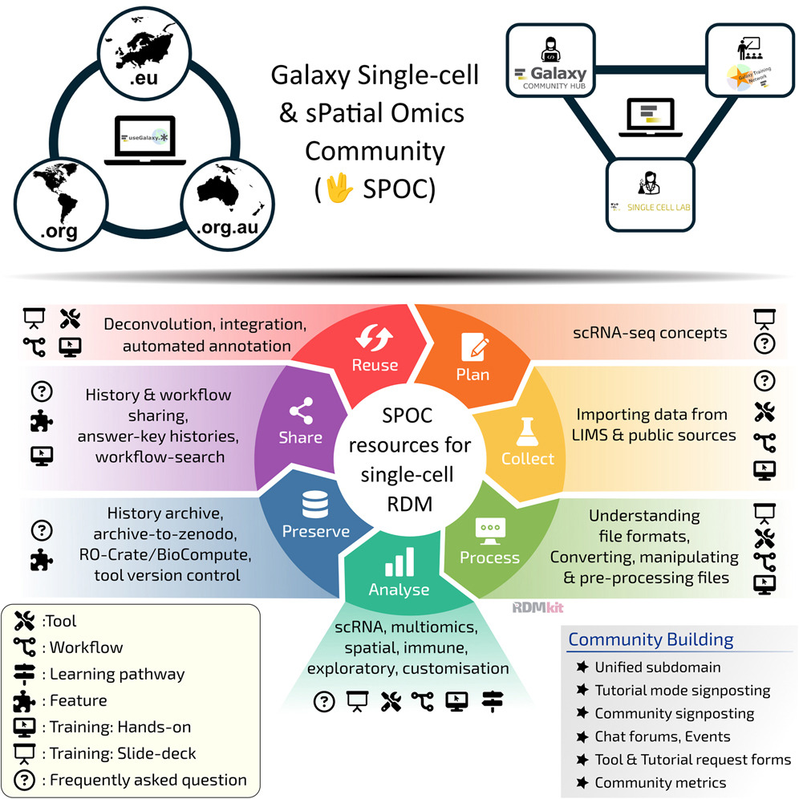

We’re thrilled to share our new publication in *Cell Genomics*:  
**“Galaxy single-cell & spatial omics community update: Navigating new frontiers in 2025.”**  
📘 [Read the full article here](https://www.cell.com/cell-genomics/fulltext/S2666-979X(25)00261-7)

## Empowering Reproducible Single-Cell and Spatial Omics

This update highlights how the Galaxy single-cell and spatial omics community continues to expand its ecosystem of tools, datasets, and training materials.  
The paper showcases the progress made toward more **FAIR single-cell and spatial omics analysis within Galaxy**, supported by over **175 tools**, **120 training resources**, and an active global community of contributors.

Key areas include:
- **New tool integrations** for multimodal single-cell data, pseudo-bulk, CNV, single-cell format converters, and spatial transcriptomics.  
- **Enhanced workflows** for reproducible preprocessing, clustering, and downstream analysis.  
- **Community-driven training** through the [Galaxy Training Network (GTN)](https://training.galaxyproject.org/), featuring hands-on tutorials and use cases.  
- **Cross-infrastructure interoperability**, connecting Galaxy instances and cloud resources across Europe and beyond.

## Collaborative Growth Across the Galaxy Community

The Galaxy single-cell and spatial omics community (SPOC) brings together researchers, developers, and trainers from around the world to build open, shareable solutions for complex biological data.  
Since its launch in **2022**, SPOC has grown into a thriving international network uniting developers, trainers, and users across Galaxy instances worldwide, ensuring **sustainable tool development, updated training materials, and shared best practices** for single-cell and spatial omics analysis.  
This collaborative effort demonstrates the value of open science, from transparent analysis pipelines to the co-creation of training materials and workflows.

## Join the Community

You can explore tools and training resources at:
- [Galaxy Europe Single-Cell Portal](https://singlecell.usegalaxy.eu/)
- [Galaxy Training Network](https://training.galaxyproject.org/)
- [SPOC: Galaxy Single-cell & sPatial Omics Community of Practice](https://galaxyproject.org/community/sig/singlecell/)
- [Galaxy Europe](https://singlecell.usegalaxy.eu/)
- [Galaxy Australia](https://usegalaxy.org.au)
- [Galaxy Main](https://usegalaxy.org)

Interested in contributing? Connect with us in community meetings, share your workflows, and be part of upcoming training and collaboration events.

---

🧬 *This work represents a collective achievement of the Galaxy single-cell and spatial omics community (SPOC), highlighting open science, sustainability, and collaboration at a global scale.*
