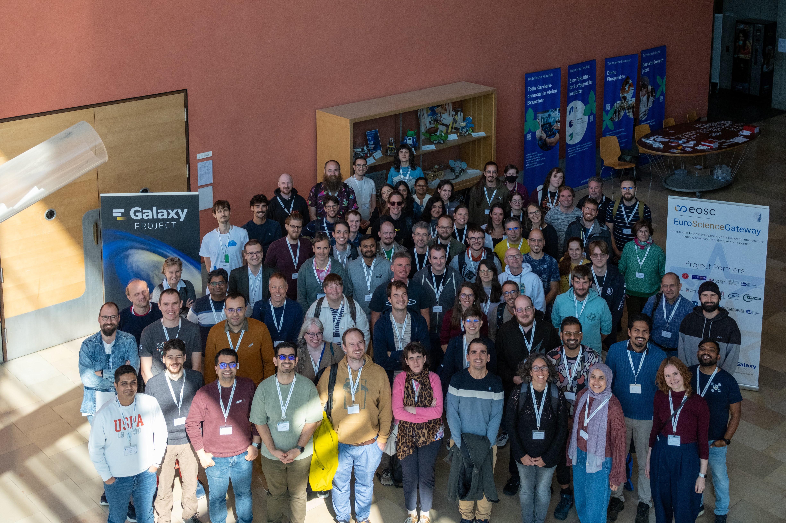

From **1–3 October 2025**, the [University of Freiburg](https://uni-freiburg.de/en/) hosted a packed, three-in-one meeting: [**European Galaxy Days (EGD)**,](https://galaxyproject.org/events/2025-10-01-egd2025/) the **[ELIXIR Galaxy Community](https://elixir-europe.org/communities/galaxy) face-to-face meeting**, and the **[EuroScienceGateway (ESG)](https://galaxyproject.org/projects/esg/) Final Meeting** with ~100 participants (87 in person + 12 online). Running side-by-side, these events created a special week where platform maintainers, tool and workflow developers, and domain scientists aligned roadmaps and moved from slides to practical solutions and future collaborations.

Across talks, demos, Birds-of-a-Feathers (BoFs), and a concluding hackathon, the week showed how the Galaxy ecosystem is advancing research across domains from [Microbiology](https://microbiology.usegalaxy.org/), [Materials Science](https://materials.usegalaxy.eu/), [Ecology](https://ecology.usegalaxy.eu/), [Climate Science](https://climate.usegalaxy.eu/), [Imaging](https://imaging.usegalaxy.eu/), and [Digital Humanities](https://galaxyproject.org/community/sig/digital-humanities/). Freiburg’s campus hosted hybrid sessions and BoFs across multiple rooms, with Friday dedicated to a focused Co-Fest & Hackathon where groups squashed bugs, improved tools, tuned workflows, and formed plans for next collaborations. If you want to learn more about the event, please have a look at our social media coverage on [Mastodon](https://mastodon.social/tags/EGD2025), [Bluesky](https://bsky.app/hashtag/EGD2025?author=galaxyproject.bsky.social), and [LinkedIn](https://www.linkedin.com/search/results/all/?keywords=%23egd2025&origin=HASH_TAG_FROM_FEED&sid=kCg) (47 posts with #EGD2025). Also, Matrix channels ([usegalaxy-eu Lobby](https://matrix.to/#/#usegalaxy-eu_Lobby:gitter.im) and [use-galaxy announce](https://matrix.to/#/!ArjKhGljVCmzqxhauY:matrix.org?via=matrix.org&via=matrix.uni-freiburg.de&via=t2bot.io)) supported live coordination and announcements and both are still available if you are interested to join.

Slides & photos
 
Photo gallery: https://photos.app.goo.gl/haiWYYBryV4pKvxe9
 
Slides: 

| Slide Title | Presenter(s) |
| --- | --- | --- |
| [Welcome, Logistics & General Galaxy and ELIXIR Update](https://f1000research.com/slides/14-1066) | Hans-Rudolf Hotz |
| [Special Interest Groups and Working Groups: the Galaxy Governance Model](https://f1000research.com/slides/14-1067) | Marisa Loach |
| [The Microbiology Galaxy Lab and the effort from the microGalaxy to build the first community-driven gateway for reproducible and FAIR analysis of microbial data](https://f1000research.com/slides/14-1021) | Bérénice Batut |
| [Building More Usable Galaxy Workflows with Improved Dataset Collections ](https://f1000research.com/slides/14-1069)| John Chilton |
| [A Galaxy Workflow for MAG Recovery Applied to Termite Microbiomes](https://f1000research.com/slides/14-1070) | Mina Hojat Ansari |
| [Managing materials science workflows with Galaxy at STFC ](https://f1000research.com/slides/14-1071)| Leandro Liborio |
| [The ISCC Discovery Protocol: Decentralized signing, timestamping, and discovery for the International Standard Content Code (ISCC)](https://f1000research.com/slides/14-1072) | Titusz Pan |
| [The Galaxy Community in Switzerland](https://f1000research.com/slides/14-1073) | Hans-Rudolf Hotz |
| [Galaxy Small Scale Admins](https://f1000research.com/slides/14-1074) | Hans-Rudolf Hotz |
| [Single Cell and Spatial Omics Community](https://f1000research.com/slides/14-1075) | Marisa Loach |
| [The Biodiversity Galaxy Lab: A Collaborative Hub with curated tools, workflows and training](https://f1000research.com/slides/14-1076) | Solenne Correard |
| [Galaxy Datarmor Present and Future Perspectives](https://f1000research.com/slides/14-1077) | Jérôme Detoc |
| [Streamlining the User Experience for Reproducible Image Analysis in Galaxy](https://f1000research.com/slides/14-1080) | Leonid Kostrykin |
| [From Galaxy to EGA: Orchestrating Sensitive Data Access for Interactive Federated Analysis.](https://f1000research.com/slides/14-1081) | María Chavero Díez |
| [Dynamic Meta-Scheduling in Galaxy with TPV Broker for Smarter Workload Distribution](https://f1000research.com/slides/14-1082) | Paul De Geest |
| [On-demand, Reproducible Galaxy Instances in a Secure Environment for the Dutch Scientific Community](https://f1000research.com/slides/14-1083) | Mirela Minkova |
| [Automatic tool generation for SAQC and OGS – Community building beyond users](https://f1000research.com/slides/14-1084) | Matthias Bernt |
| [Evolution of Galaxy at Bologna Sant’Orsola Hospital](https://f1000research.com/slides/14-1085) | Giuseppe Profiti |
| [Precision Diagnosis and Risk Stratification of Helicobacter pylori-Induced Gastritis Using Multi-Omics Machine Learning Signatures Or The Synergy Between Complex Research Projects and Galaxy](https://f1000research.com/slides/14-1086) | Paul Zierep |
| [Broadening the Galaxy: Introducing Digital Humanities in Galaxy](https://f1000research.com/slides/14-1087) | Daniela Schneider |
| [Serving Locally Hosted LLMs with Galaxy](https://f1000research.com/slides/14-1088) | Arash Kadkhodaei |
| [pyGenomeTracks – make a publishable figure out of your NGS data](https://f1000research.com/slides/14-1089) | Lucille Lopez-Delisle |
| [Galaxy Ecology: A new "2 step approach" to contribute source code for Galaxy (re)users(From raw data to operational indicators through essential variables)](https://f1000research.com/slides/14-1090) | Yvan Le Bras |
| [Galaxy Tools 2.0 — The next step in accessibility?](https://f1000research.com/slides/14-1091) | Marius van den Beek |
| [Simple and Secure Credential Handling for Tools in Galaxy](https://f1000research.com/slides/14-1092)| Alireza Heidari |
| [New integrations: ELNs (eLabFTW, RSpace) and ARC job runner](https://f1000research.com/slides/14-1093)| José Manuel Domínguez |
| [Making Galaxy workflows sustainable and FAIR](https://f1000research.com/slides/14-1094) | Nicola Soranzo |
| [Galaxy Ecology 2025 update](https://f1000research.com/slides/14-1095) | Yvan Le Bras |
| [Galaxy facing EARTH SYSTEM challenges](https://f1000research.com/slides/14-1096) | Jérôme Detoc |
| [Updates from the Imaging Community](https://f1000research.com/slides/14-1097) | Beatriz Serrano-Solano |
| [Modern Genome Browsing in Galaxy with JBrowse2](https://f1000research.com/slides/14-1098) | Anthony Bretaudeau |
| [GALAXY & ONEDATA INTEGRATION — managing Galaxy data using Onedata (BYOD & BYOS)](https://f1000research.com/slides/14-1099) | Lukasz Opiola |
| [Automating Galaxy Tool Management Using Templated Repository](https://f1000research.com/slides/14-1100) | Martin Čech |
| [Sustainability of a Platform: The Case of Galaxy](https://f1000research.com/slides/14-1101) | Jain Smitesh |
| [A “trivial” task: how to access my files and projects on the HPC file system from Galaxy?](https://f1000research.com/slides/14-1102) | Nikolay Vazov |
| [Laniakea Nebula: VPN-Based Isolation for Galaxy Private Deployments](https://f1000research.com/slides/14-1103) | Marco Antonio Tangaro |
| [Exploring the Galaxy Training Network: What’s Here, What’s New](https://f1000research.com/slides/14-1104)| Teresa Müller |
| [RO-Crate features in Galaxy (that you might already be using)](https://f1000research.com/slides/14-1105) | Eli Chadwick |
| [EuroScienceGateway – Final Project Meeting (Work Package 1)](https://f1000research.com/slides/14-1106) | Armin Dadras, Anika Erxleben-Eggenhofer |
| [Achievements of Work Package 2 of EuroScienceGateway – Stimulate FAIR and Reusable Research](https://f1000research.com/slides/14-1107) | Eli Chadwick, Stian Soiland-Reyes |
| [Achievements of Work Package 3 of EuroScienceGateway – The European Pulsar Network and Open Infrastructure](https://f1000research.com/slides/14-1108) | Marco Antonio Tangaro |
| [Achievements of Work Package 4 of EuroScienceGateway – Building Blocks for a Sustainable Operating Model](https://f1000research.com/slides/14-1109) | Sebastian Luna-Valero |
| [Achievements of Work Package 5 of EuroScienceGateway – Community Engagement, Adoption, and Onboarding](https://f1000research.com/slides/14-1110) | Nikolay Vazov, Leandro Liborio, Volodymyr Savchenko |

Thanks to the [University of Freiburg](https://uni-freiburg.de), [ELIXIR](https://elixir-europe.org/), the European Commission for making this event possible, and everyone who contributed talks, demos, code, and reviews. Community momentum is strong—the next community event is already underway. Are you ready for [GCC2026](https://galaxyproject.org/events/gcc2026/) in Clermont-Ferrand (France) from June 22-24 2026?

