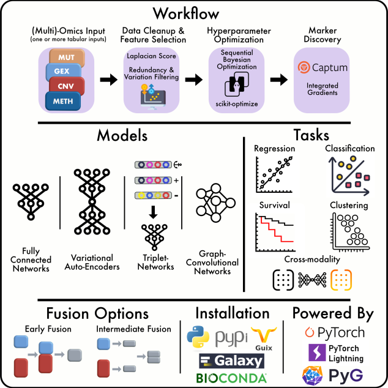

We're proud to share our new publication in *Nature Communications*:
**"Flexynesis: A deep learning toolkit for bulk multi-omics data integration for precision oncology and beyond."**
* [Read the full article here](https://www.nature.com/articles/s41467-025-63688-5)
* [GitHub Repository](https://github.com/BIMSBbioinfo/flexynesis)

---

🧬 *Flexynesis was developed by the Bioinformatics and Omics Data Science Platform at Max Delbrück Center for Molecular Medicine in collaboration with the Galaxy community, bringing cutting-edge multi-omics integration tools to researchers worldwide.*

---

## Advancing Multi-Omics Integration for Precision Oncology

Accurate decision making in precision oncology depends on integration of multimodal molecular information, for which various deep learning methods have been developed. However, most existing deep learning-based bulk multi-omics integration methods lack transparency, modularity, deployability, and are limited to narrow tasks.

To address these limitations, we introduce **Flexynesis**, a comprehensive toolkit that streamlines data processing, feature selection, hyperparameter tuning, and marker discovery. Flexynesis offers users the flexibility to choose from various deep learning architectures or classical supervised machine learning methods with a standardized input interface for single/multi-task training and evaluation for regression, classification, and survival modeling.

## Key Features

- **Modular and Transparent Architecture**: Choose from multiple deep learning architectures and classical machine learning methods with clear, understandable workflows
- **Multi-Task Capabilities**: Support for regression, classification, and survival modeling in both single and multi-task settings
- **Streamlined Workflow**: Automated data processing, feature selection, hyperparameter tuning, and biomarker discovery
- **Maximum Accessibility**: Available on PyPi, Guix, Bioconda and on [Galaxy Europe](https://usegalaxy.eu/?tool_id=toolshed.g2.bx.psu.edu%2Frepos%2Fbgruening%2Fflexynesis%2Fflexynesis%2F0.2.20%2Bgalaxy3&version=latest)
- **User-Friendly**: Designed for researchers with or without deep learning experience

## Making Deep Learning Accessible

This toolset makes deep learning-based bulk multi-omics data integration in clinical and pre-clinical research more accessible to the broader scientific community. Whether you're an experienced machine learning practitioner or new to computational approaches, Flexynesis provides the tools and transparency needed for rigorous multi-omics analysis in precision oncology.

## Want to have practical training to learn how to use Flexynesis?

Check out our available **Galaxy Training Material**:

* [Identifing Survival Markers of Brain tumor with Flexynesis](https://gxy.io/GTN:T00555)
* [Modeling Breast Cancer Subtypes with Flexynesis](https://gxy.io/GTN:T00554)
* [Prepare Data from cBioPortal for Flexynesis Integration](https://gxy.io/GTN:T00553)
* [Unsupervised Analysis of Bone Marrow Cells with Flexynesis](https://gxy.io/GTN:T00556)
