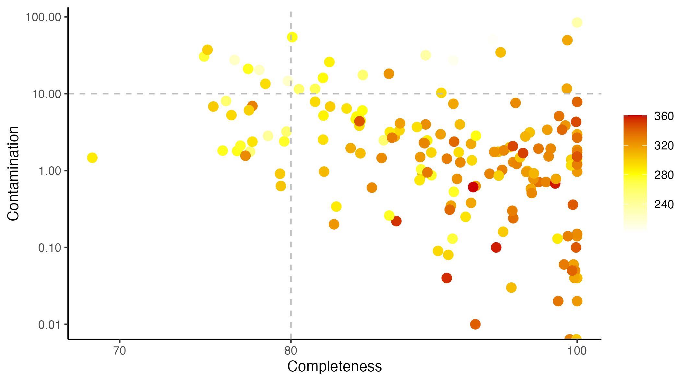
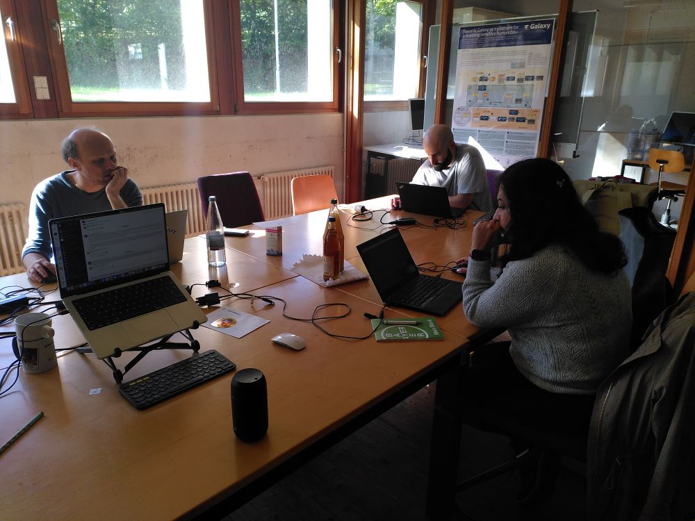
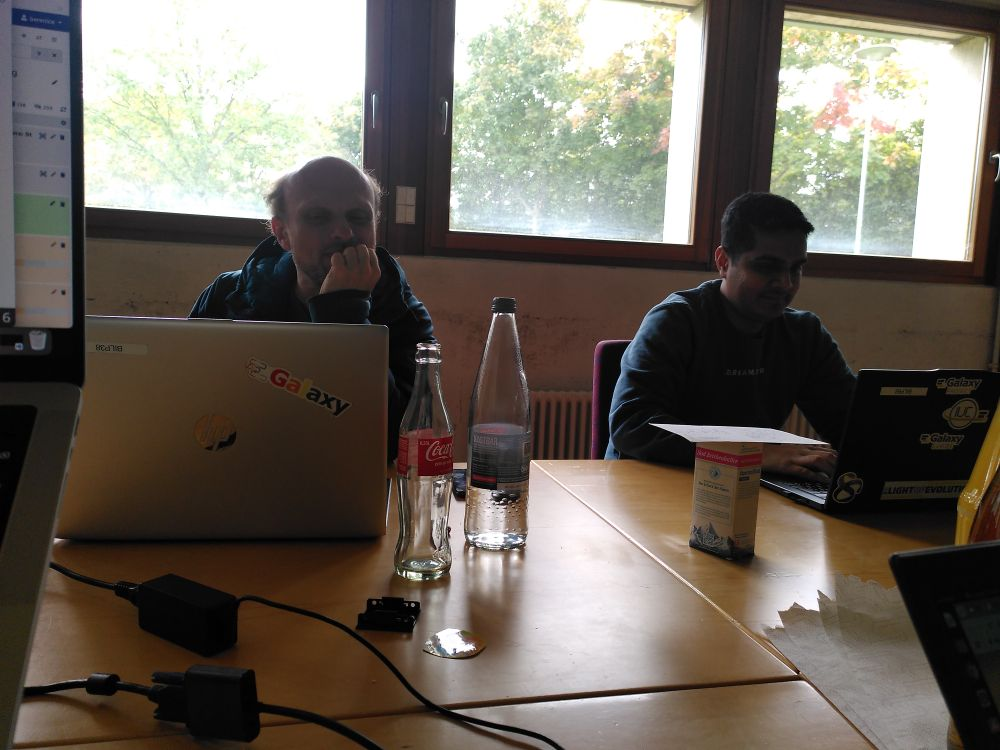

# 🧬 Introduction

The biological world as we know it is largely composed of *dark matter* — microorganisms that cannot yet be cultivated in the laboratory. Modern sequencing technologies and bioinformatics tools now allow us to explore this hidden world by generating **metagenome-assembled genomes (MAGs)**. This remains a challenging endeavor, and every bit of collaboration helps to deepen our understanding of these uncultured organisms.

From **October 6–9, 2025**, the [**FAIRyMAGs project**](https://elixir-europe.org/how-we-work/scientific-programme/commissioned-services/science/bfsp/fairymags) (funded by [ELIXIR](https://elixir-europe.org/)) organized a hybrid, four-day hackathon as part of the [**ELIXIR BFSP Programme**](https://elixir-europe.org/internal-projects/commissioned-services/science/biodiversity-foodsecurity-pathogens).
The event openly invited the MAGs community to collaborate on:

* Improving MAGs workflows
* Developing training materials
* Performing benchmarking
* Creating tools for computational resource estimation

A total of **35 researchers from around the world** participated — eight gathering in **Freiburg (Germany)** and five in an **Australian Outpost** (coordinated by **Tiff Nelson**), while the rest joined remotely.

Preparation included a shared Google Docs, spreadsheets, and slides for coordination. During the hackathon, participants joined **joint sessions** between Australia and Europe in the mornings and **Europe-focused working groups** in the afternoons. Communication flowed via a **dedicated Slack channel** in the Galaxy Training Network (GTN).

---

# 🚀 Highlight Outcomes

All progress was tracked in the
👉 [**FAIRyMAGs Hackathon – Coordination & Tracking Sheet**](https://docs.google.com/spreadsheets/d/1TbuSUWMILAB3W5uO8O8ZRHrh5i7BedXfSVcA2MB0iAM/edit). Some of the highlight outcomes are summarized here:

## ⚙️ Enhancing FAIR MAGs Building Workflows

### 🔧 Tool Updates

* **SemiBin2** version update → [PR #7347](https://github.com/galaxyproject/tools-iuc/pull/7347)
* **COMEBin**, a new high-performance binner → [PR #7285](https://github.com/galaxyproject/tools-iuc/pull/7285)
* **MaAsLin3**, for downstream differential analysis → [PR #7263](https://github.com/galaxyproject/tools-iuc/pull/7263)
* **Visualization plots collection** for advanced MAGs exploration → [Issue #54](https://github.com/usegalaxy-eu/FAIRyMAGs/issues/54)

### 🗂️ Database Updates

* **CheckM2** database update → [PR #6861](https://github.com/galaxyproject/tools-iuc/pull/6861)
* **GTDB-Tk mocked DB** for workflow testing → [PR #7338](https://github.com/galaxyproject/tools-iuc/pull/7338)

### 🧩 Workflow Improvements

* **Quality control and trimming** workflow → [PR #976](https://github.com/galaxyproject/iwc/pull/976)
* **Host/contamination removal** (long & short reads) → [PR #991](https://github.com/galaxyproject/iwc/pull/991)
* **Main MAGs workflow update** → [PR #975](https://github.com/galaxyproject/iwc/pull/975)
  * Added **user-friendly workflow annotations**
  * **Sample grouping subworkflow update** → [View on Galaxy](https://usegalaxy.eu/u/wolfgang-maier/w/grouping-wf)
    * **Bug fixes** in subworkflows
* **Fallback workflow** to recover MAGs when tools fail → [View on Galaxy](https://usegalaxy.eu/u/paulzierep/w/mags-fallback-1)
* **Adapted workflow for long reads** tested on ONT samples (thanks to *Stefan Kranz*)

### 📈 MAGs Visualization

* Plots modularized for reusability
* Discussions on **multi-sample binning** based on [Nature Communications, 2025](https://www.nature.com/articles/s41467-025-57957-6)
* **MAGs submission workflow** WIP in collaboration with the **MGnify team**:

  * ENA MAG file generation → [Issue #58](https://github.com/usegalaxy-eu/FAIRyMAGs/issues/58)
  * ENA upload tool → [PR #6807](https://github.com/galaxyproject/tools-iuc/pull/6807)

### 🌏 Galaxy Server Adaptation

* Added required tools and databases to **usegalaxy.org.au**, expanding FAIRyMAGs access to Australian researchers.

---

# 📚 Developing User-Friendly Training Materials

* **Dataset identification** is in progress (blocked by subworkflow bug — WIP)
* Started a **comprehensive tutorial** to run the full workflow on  short & long reads → [HackMD draft](https://hackmd.io/Oa3WA5BvTi-eg-LrhWSfSg?edit)

### 🧭 Learning Pathway with step-by-step tutorials

* Updated tutorials to include missing tools:

  * **Preprocessing for Group Assignment and Co-Assembly** → [PR #6416](https://github.com/galaxyproject/training-material/pull/6416)
  * **Assembly tutorial update** → [PR #6410](https://github.com/galaxyproject/training-material/pull/6410)
  * **Binning tutorial update** → [PR #6409](https://github.com/galaxyproject/training-material/pull/6409)

---

# 📊 Advancing Workflow Evaluation & Benchmarking

Using **CAMI infrastructure and real datasets**, the group worked to standardize benchmarking for MAG workflows.

## Benchmarking Progress

* Agreed datasets:

  * **CAMI II plant-associated** dataset → [Dataset link](https://frl.publisso.de/data/frl:6425521/plant_associated/)
  * **Loman Lab Mock Community Experiments** → [Mock dataset](https://lomanlab.github.io/mockcommunity/)
* **MGnify**, **nf-core/mag**, and **Galaxy** teams aligned on common benchmarking datasets.
* Planned reach out to **MAGNETO** developers.
* Improved **visualizations for CAMI II benchmarks** using *amber* → [Issue #66](https://github.com/usegalaxy-eu/FAIRyMAGs/issues/66)
* Added **amber CAMI workflow** to IWC → [PR #924](https://github.com/galaxyproject/iwc/pull/924)

## Use Cases

* **Marine MAGs exploration** — first mid-quality MAGs identified via the fallback workflow (figure forthcoming 🌊).

  
  
<em>MAGs of the marine use case: Completeness, Contamination and Average Gene Length.</em>

---

# ⚙️ Building Smarter Resource Estimation Tools

* Collected **binning tool performance data** from MGnify → [PR #75](https://github.com/usegalaxy-eu/FAIRyMAGs/pull/75)
* Evaluated **correlation between sample metadata and memory usage** → [PR #68](https://github.com/usegalaxy-eu/FAIRyMAGs/pull/68)

  
  
<em>Correlation between sample metadata and memory usage</em>

A key challenge identified:

> Galaxy cannot yet use workflow-generated parameters for dynamic resource assignment.
> This limits automatic resource prediction, but **workarounds and future solutions** are under discussion with Galaxy core developers.

---

# 💬 Summary and Outlook

The **FAIRyMAGs hackathon** brought together a great community of MAGs scientists. And although the hackathon was slightly Galaxy-centric, a nice exchange beyond workflow engines could be establised, targeting major MAGs issues together !

  
  
  
  
  

    FairyMAGs Hackers
  

To continue this exchange, we created a dedicated community Slack channel for MAGs workflows, which will be used to continue the discussions, and openly invites anyone working on MAGs. The Slack channel is part of the [microbioinfo](https://microbial-bioinfo.slack.com) workspace. If you want to join, contact us and we will send an invite!

  <a href="https://microbial-bioinfo.slack.com/archives/C09M4D21Q3U" target="_blank" 
     style="display: inline-block; background-color: #4A154B; color: #ffffff; 
            font-weight: bold; padding: 15px 30px; border-radius: 8px; 
            text-decoration: none; font-size: 18px;">
    Join mags-workflows on Slack
  </a>

