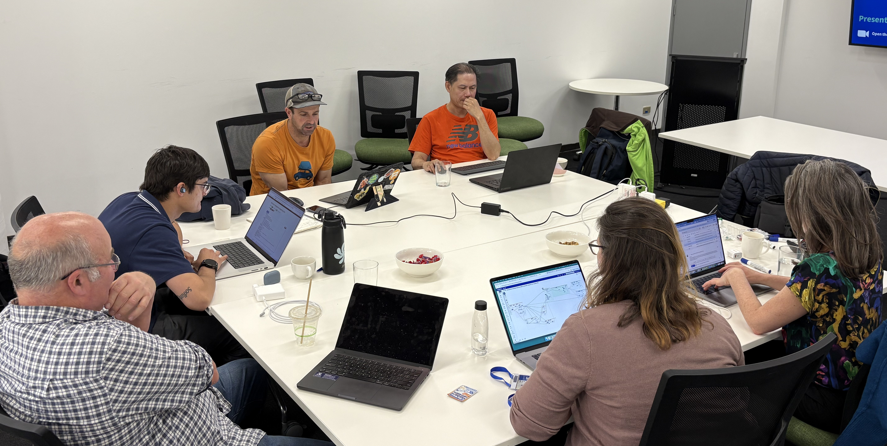
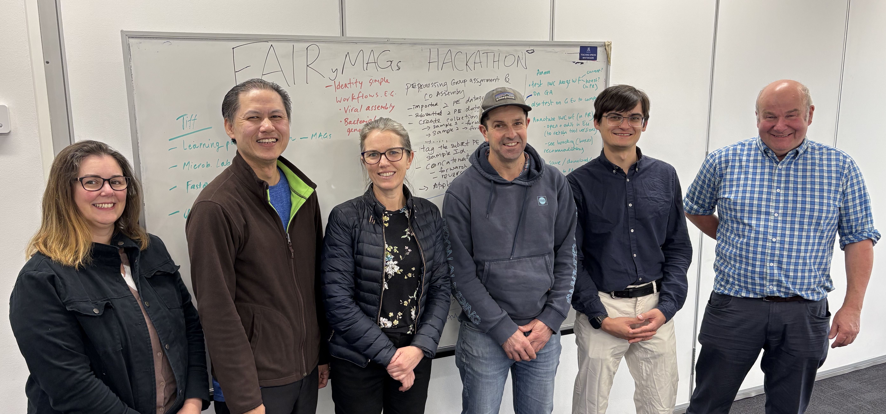

# 🧬 Introduction

The biological world as we know it is largely composed of *dark matter* — microorganisms that cannot yet be cultivated in the laboratory. Modern sequencing technologies and bioinformatics tools now allow us to explore this hidden world by generating **metagenome-assembled genomes (MAGs)**. This remains a challenging endeavor, and every bit of collaboration helps to deepen our understanding of these uncultured organisms.

From **October 6–9, 2025**, the [**FAIRyMAGs project**](https://elixir-europe.org/how-we-work/scientific-programme/commissioned-services/science/bfsp/fairymags) (funded by [ELIXIR](https://elixir-europe.org/)) organized a hybrid, four-day hackathon as part of the [**ELIXIR BFSP Programme**](https://elixir-europe.org/internal-projects/commissioned-services/science/biodiversity-foodsecurity-pathogens).

## FAIRyMAGs project

The **FAIRyMAGs project** was started in January 2025 for the duration of 20 months until August 2026 and is led by **Paul Zierep** and **Bérénice Batut**, in collaboration with four **ELIXIR Nodes**:

* **ELIXIR France** – Bérénice Batut
* **ELIXIR Germany** – Paul Zierep
* **ELIXIR Italy** – Giuseppe Defazio and Bruno Fosso
* **EMBL-EBI** – Martin Beracochea and Santiago Sanchez

The **FAIRyMAGs project** aims to advance metagenomics research by developing, optimizing, evaluating, and disseminating robust FAIR workflows for building **metagenome-assembled genomes (MAGs)**.

The project has already published an initial [Galaxy MAGs workflow](https://iwc.galaxyproject.org/workflow/mags-building-main/) and successfully applied it to both **CAMI benchmarking datasets** and real-world use cases, including **termite**, **cloud**, **marine**, and **bee** microbiomes.

To further enhance the quality and reproducibility of MAG analyses, FAIRyMAGs is also improving and extending existing **MAGs benchmarking frameworks** by integrating the [CAMI infrastructure](https://academic.oup.com/nar/article/53/W1/W102/8126258) into the Galaxy platform. The CAMI challenges provided simulated benchmark datasets for short and long reads, that can be used to benchmark assembly tools and binners used for MAGs workflows.

An additional focus of the project is the study of **computational resource requirements** for MAG construction. The team has investigated the resources needed for the assembly step of the workflow using data provided the **MGnify team**.

## The FAIRyMAGs hackathon

The hackathon aimed to build on the preliminary work of the project, but also openly invited the MAGs community to discuss and hack on any ideas related to MAGs generation !

A total of **23 researchers from around the world** participated — 8 gathering in **Freiburg (Germany)** and 6 in an **Australian outpost** (coordinated by **Tiff Nelson**), while the rest joined remotely.

Preparation included a shared Google Docs, spreadsheets, and slides for coordination. During the hackathon, participants joined **joint sessions** between Australia and Europe in the mornings and **Europe-focused working groups** in the afternoons. Communication flowed via a **dedicated Slack channel** in the Galaxy Training Network (GTN).

## Hackathon summary

During the hackathon, researchers worked independently on various goals related to MAGs workflows, depending on their background and expertise. Researchers familiar with Galaxy updated and added Galaxy tools, and modified and extended the preliminary MAGs workflow. Some participants focused on individual MAGs generation projects—for example, Stefan Kranz adapted the workflow to support long-read input. Impressively, the full modification was completed in just one hour, showcasing the efficiency of the Galaxy workflow editor.

Beyond hands-on development, the hackathon also included multiple discussion sessions that extended beyond Galaxy-centric topics. One such discussion focused on the potential to predict the computational resources required for MAGs workflow tools based on input data characteristics and metadata. Reducing resource demands could have significant environmental benefits, given the scale of MAGs-related analyses.

Another collaborative effort among MAGs developers from different communities centered on establishing shared benchmark and CI-testing datasets. As part of this, core developers from the nf-core, MGnify, and Galaxy MAGs workflows initiated the first steps toward a benchmark focusing on complete MAGs workflows.

The team also began developing detailed training materials on MAGs generation. The broader community was invited to contribute their own resources via the Galaxy Training Network (GTN), which supports training materials both within and beyond the Galaxy ecosystem. For example, MGnify plans to develop training modules on MAGs submission using various approaches—such as command-line, front-end submission, and Galaxy-integrated tools.

# 🚀 Highlight Outcomes

All progress was tracked in the
👉 [**FAIRyMAGs Hackathon – Coordination & Tracking Sheet**](https://docs.google.com/spreadsheets/d/1TbuSUWMILAB3W5uO8O8ZRHrh5i7BedXfSVcA2MB0iAM/edit). Some of the highlight outcomes are summarized here:

## ⚙️ Enhancing FAIR MAGs Building Workflows

### 🔧 Tool Updates

* **SemiBin2** version update → [PR #7347](https://github.com/galaxyproject/tools-iuc/pull/7347)
* **COMEBin**, a new high-performance binner → [PR #7285](https://github.com/galaxyproject/tools-iuc/pull/7285)
* **MaAsLin3**, for downstream differential analysis → [PR #7263](https://github.com/galaxyproject/tools-iuc/pull/7263)

### 🗂️ Database Updates

* **CheckM2** database update → [PR #6861](https://github.com/galaxyproject/tools-iuc/pull/6861)
* **GTDB-Tk mocked DB** for workflow testing → [PR #7338](https://github.com/galaxyproject/tools-iuc/pull/7338)

### 🧩 Workflow Improvements

* **Quality control and trimming** workflow → [PR #976](https://github.com/galaxyproject/iwc/pull/976)
* **Host/contamination removal** (long & short reads) → [PR #991](https://github.com/galaxyproject/iwc/pull/991)
* **Main MAGs workflow update** → [PR #975](https://github.com/galaxyproject/iwc/pull/975)
  * Added **user-friendly workflow annotations**
  * **Sample grouping subworkflow update** → [View on Galaxy](https://usegalaxy.eu/u/wolfgang-maier/w/grouping-wf) to fix bugs in subworkflows
* **Fallback workflow** to recover MAGs when tools fail → [View on Galaxy](https://usegalaxy.eu/u/paulzierep/w/mags-fallback-1)
* **Adapted workflow for long reads** tested on ONT samples (thanks to *Stefan Kranz*)
* **Visualization plots collection** for advanced MAGs exploration → [Issue #54](https://github.com/usegalaxy-eu/FAIRyMAGs/issues/54)

### 📈 MAGs Visualization

* Plots modularized for reusability
* Discussions on **multi-sample binning** based on [Han *et al*, Nature Communications, 2025](https://www.nature.com/articles/s41467-025-57957-6)
* **MAGs submission workflow**: WIP in collaboration with the **MGnify team**:

  * ENA MAG file generation → [Issue #58](https://github.com/usegalaxy-eu/FAIRyMAGs/issues/58)
  * ENA upload tool → [PR #6807](https://github.com/galaxyproject/tools-iuc/pull/6807)

### 🌏 Galaxy Server Adaptation

* Added required tools and databases to **usegalaxy.org.au**, expanding FAIRyMAGs access to Australian researchers.

## 📚 Developing User-Friendly Training Materials

* **Dataset identification** is in progress (blocked by subworkflow bug — WIP)
* Started a **comprehensive tutorial** to run the full workflow on  short & long reads → [HackMD draft](https://hackmd.io/Oa3WA5BvTi-eg-LrhWSfSg?edit)

### 🧭 Learning Pathway with step-by-step tutorials

* Updated tutorials to include missing tools:

  * **Assembly tutorial update** → [PR #6410](https://github.com/galaxyproject/training-material/pull/6410)
  * **Binning tutorial update** → [PR #6409](https://github.com/galaxyproject/training-material/pull/6409)

* New tutorial:

  * **Preprocessing for Group Assignment and Co-Assembly** → [PR #6416](https://github.com/galaxyproject/training-material/pull/6416)

## 📊 Advancing Workflow Evaluation & Benchmarking

Using **CAMI infrastructure and real datasets**, the group worked to standardize benchmarking for MAG workflows.

### Benchmarking Progress

* **MGnify**, **nf-core/mag**, and **Galaxy** teams aligned on common benchmarking datasets.
* Started discussion with the **MAGNETO** developers for benchmark alignment. 
* Agreed datasets:
  * **CAMI II plant-associated** dataset → [Dataset link](https://frl.publisso.de/data/frl:6425521/plant_associated/)
  * **Loman Lab Mock Community Experiments** → [Mock dataset](https://lomanlab.github.io/mockcommunity/)

* Improved **visualizations for CAMI II benchmarks** based on *amber* - a dedicated MAGs benchmarking tool, originally developed for the CAMI challanges  → [Issue #66](https://github.com/usegalaxy-eu/FAIRyMAGs/issues/66)
* Added **amber CAMI workflow** to IWC → [PR #924](https://github.com/galaxyproject/iwc/pull/924)

## Use Cases

* **Marine MAGs exploration** — high-quality MAGs identified for the Marine use case

  
  
<em>MAGs of the marine use case: Completeness, Contamination and Average Gene Length.</em>

* **Termite related MAGs discussions** — attempt to recover more MAGs via group-assembly strategy.
* **Progress on the Cloud use case** — recovered mid-quality MAGS via the fallback workflow.

## ⚙️ Building Smarter Resource Estimation Tools

* Collected **binning tool performance data** from MGnify → [PR #75](https://github.com/usegalaxy-eu/FAIRyMAGs/pull/75)
* Evaluated **correlation between sample metadata and memory usage** → [PR #68](https://github.com/usegalaxy-eu/FAIRyMAGs/pull/68)

  
  
<em>Correlation between sample metadata and memory usage</em>

A key challenge identified:

> Galaxy cannot yet use workflow-generated parameters for dynamic resource assignment.
> This limits automatic resource prediction, but **workarounds and future solutions** are under discussion with Galaxy core developers.

---

# 💬 Summary and Outlook

The **FAIRyMAGs hackathon** brought together a great community of MAGs scientists. And although the hackathon was slightly Galaxy-centric, a nice exchange beyond workflow engines could be established, targeting major MAGs issues together!

  
  
  
  
  
  
  

    FAIRyMAGs Hackers
  

To continue these exchanges, we created a dedicated community Slack channel for MAGs workflows, which will be used to continue the discussions, and openly invites anyone working on MAGs. The Slack channel is part of the [microbioinfo](https://microbial-bioinfo.slack.com) workspace. If you want to join, contact us and we will send an invite!

  <a href="https://microbial-bioinfo.slack.com/archives/C09M4D21Q3U" target="_blank" 
     style="display: inline-block; background-color: #4A154B; color: #ffffff; 
            font-weight: bold; padding: 15px 30px; border-radius: 8px; 
            text-decoration: none; font-size: 18px;">
    Join mags-workflows on Slack
  </a>

