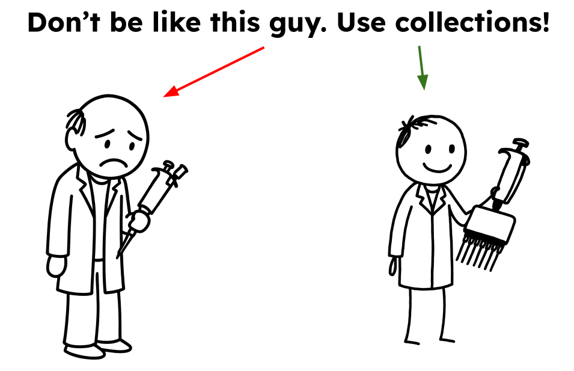

## Right tools are everything!

Have you ever found yourself facing a 396-well plate with only a single-channel pipette?

Yeah ... me neither ... But imagine for a second that you actually did — and then someone handed you a multichannel pipette:

Suddenly, life looks a whole lot better.

## Collections are Galaxy’s multichannel pipette

Dataset collections are Galaxy’s secret superpower — they let you process dozens, hundreds, thousands, or even tens of thousands of datasets with a single click.

On the left below is a Galaxy history with over 10,000 datasets. Processing them one-by-one? That is just batshit-crazy. Instead, you can bundle them all into a collection — shown on the right — and run your analyses once across the entire set.

## Intrigued? 

[Watch this video](https://youtu.be/m6NjGxD4F68) to see how this works:

<iframe width="560" height="315" src="https://www.youtube.com/embed/m6NjGxD4F68?si=vIDCKdG76NdQoASO" title="YouTube video player" frameborder="0" allow="accelerometer; autoplay; clipboard-write; encrypted-media; gyroscope; picture-in-picture; web-share" referrerpolicy="strict-origin-when-cross-origin" allowfullscreen></iframe>

## The bottom line

Use collections. Seriously. Use them. They’ll save you time, sanity, and maybe even your pipetting thumb.

