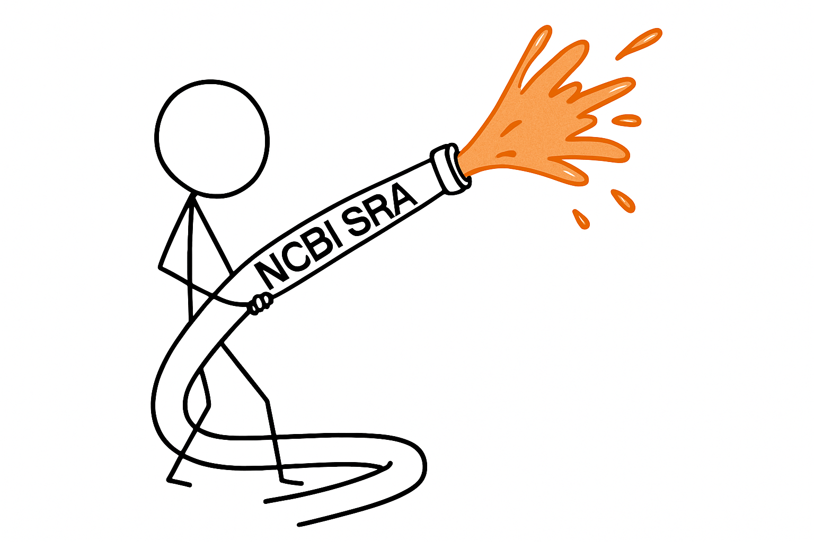

## Once upon a time I saw that paper ...

… and the paper included sequencing data (for example, [GSE244303](https://www.ncbi.nlm.nih.gov/geo/query/acc.cgi?acc=GSE244303)). Suppose you want to download these data. The general strategy for doing this in Galaxy has traditionally been:

1. Download the list of accessions from NCBI
2. Upload that list into Galaxy
3. Use Galaxy’s [fasterq-dump](https://usegalaxy.org/root?tool_id=toolshed.g2.bx.psu.edu/repos/iuc/sra_tools/fasterq_dump/3.1.1+galaxy1) to retrieve the data

## ... but there is a better way

fasterq-dump is a robust tool, but sometimes one accession fails—and if one fails, the entire job fails. To address this, we developed a [simple workflow](https://iwc.galaxyproject.org/workflow/parallel-accession-download-main/) that splits your list of accessions into separate fasterq-dump jobs, runs them independently, and then produces two output collections: one for paired-end data and one for single-end data.

## Intrigued?

[Watch this video](https://youtu.be/sz9VrPeG03E?si=_I4Bq4sCLNcws-5u) to see how this works:

<iframe width="560" height="315" src="https://www.youtube.com/embed/sz9VrPeG03E?si=-NcRRk9vRfJsb4Jt" title="YouTube video player" frameborder="0" allow="accelerometer; autoplay; clipboard-write; encrypted-media; gyroscope; picture-in-picture; web-share" referrerpolicy="strict-origin-when-cross-origin" allowfullscreen></iframe>

## The bottom line

Use [parallel-download](https://iwc.galaxyproject.org/workflow/parallel-accession-download-main/) workflow to reliably pull down tens to hundreds of datasets from NCBI SRA.

  ❗ This approach works reliably for up to ~100 SRA datasets. For downloading thousands of accessions, you will need a slightly different strategy—coming soon in a follow-up blog post and video. 

