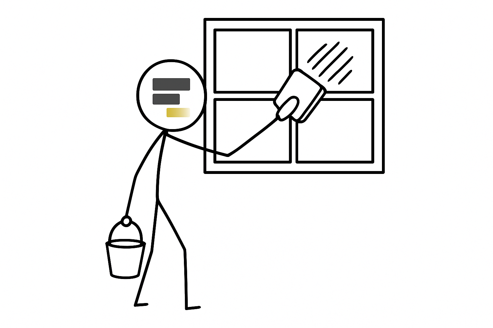
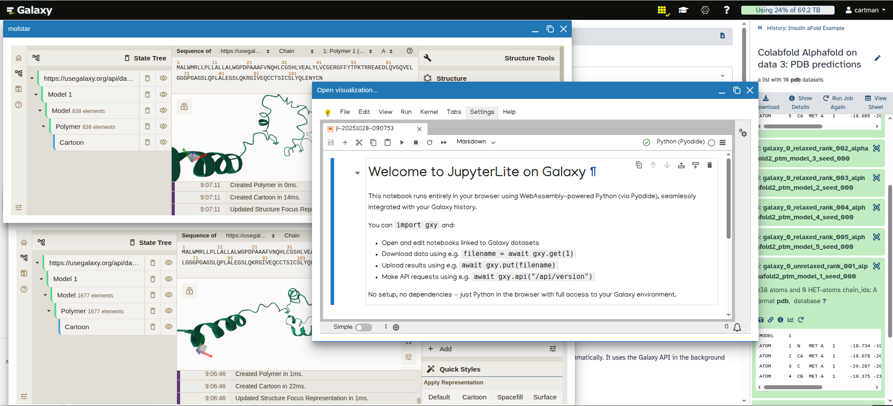

## There is an icon on the Galaxy toolbar:

Click on it, and it turns yellow …

… but that’s just the beginning! Once activated, you can open and view multiple datasets and visualizations as individual windows right inside Galaxy’s interface:

## Intrigued?

[Watch this video](https://youtu.be/V5pPDYhHVKc) to see it in action:

<iframe width="560" height="315" src="https://www.youtube.com/embed/V5pPDYhHVKc?si=c1H7ZUdTcLv_DGt9" title="YouTube video player" frameborder="0" allow="accelerometer; autoplay; clipboard-write; encrypted-media; gyroscope; picture-in-picture; web-share" referrerpolicy="strict-origin-when-cross-origin" allowfullscreen></iframe>

## The bottom line

Use Galaxy’s window manager to organize, visualize, and compare your data.