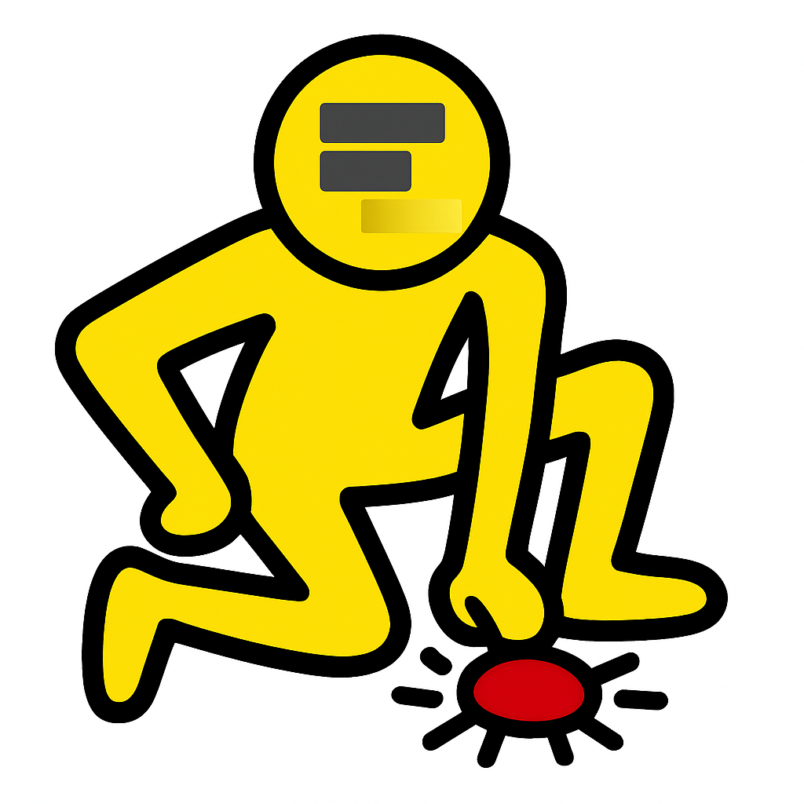

## Galaxy not working ... really?

When you encounter a problem, report it! Use Galaxy's built-in reporting functionality to let us know about any issues you're experiencing.

[Watch this video](https://youtu.be/rId4s3v57z4?si=t1KdxTNQvP-2b6QS) to learn how to report bugs:

<iframe width="560" height="315" src="https://www.youtube.com/embed/rId4s3v57z4?si=xgJZcRjrjbHPPJ3J" title="YouTube video player" frameborder="0" allow="accelerometer; autoplay; clipboard-write; encrypted-media; gyroscope; picture-in-picture; web-share" referrerpolicy="strict-origin-when-cross-origin" allowfullscreen></iframe>

## The bottom line

Galaxy is free. So the ONLY thing we ask in return is to help us track and squish bugs. Do it!
