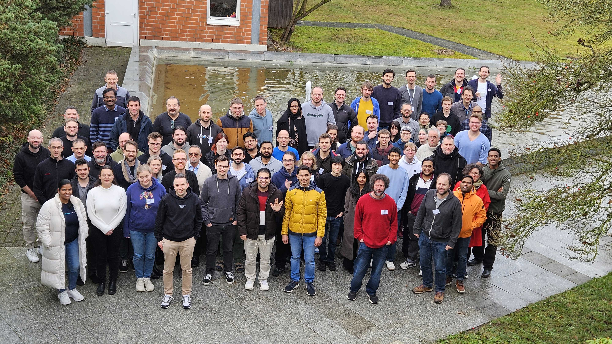
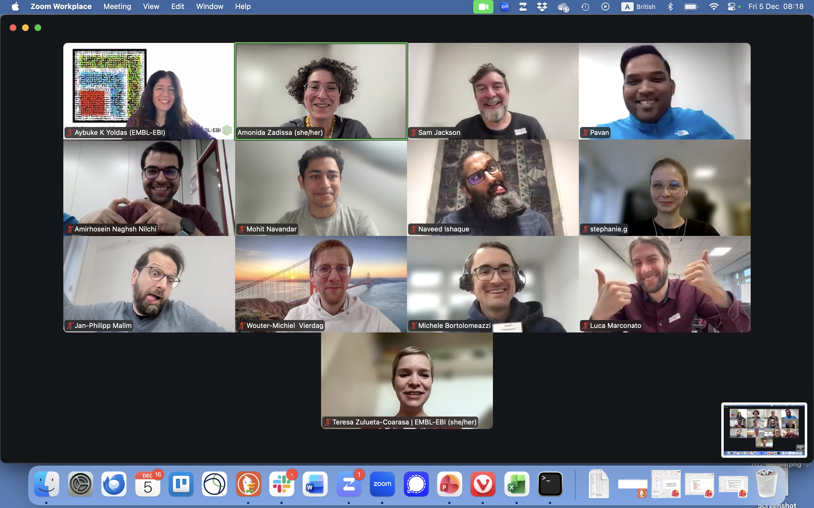

The [4th BioHackathon Germany](https://www.denbi.de/de-nbi-events/1840-4th-biohackathon-germany) took place from December 1-4, 2025, in Walsrode, Germany. Members of the Galaxy Freiburg team participated in [Project 2: IO-FAST meets SpaceHack 4.0 - FAIRification of Spatial Omics Data](https://www.denbi.de/de-nbi-events/1931-4th-biohackathon-germany-io-fast-meets-spacehack-4-0-fairification-of-spatial-omics-data), specifically leading Subproject 4 focused on integrating spatial transcriptomics into the Galaxy ecosystem.

You can view the [presentation slides from the event](https://docs.google.com/presentation/d/1ibNUlL4RmSqtSPy-b31nu-WoJWyatgaRWPZDytBLJFE/edit?usp=sharing) (slides 19-22 cover our work).

## Project 2: FAIRification of Spatial Omics Data

This collaborative project brought together the IO-FAST consortium and the SpaceHack initiative to address critical challenges in spatial omics data management. The project aimed to enhance metadata standards, data conversion, and visualization tools while ensuring reproducibility through shared analytical pipelines—directly supporting the open science and infrastructure goals of de.NBI/ELIXIR Germany.

The project focused on interfacing [SpatialData](https://spatialdata.scverse.org/) objects, the emerging community-accepted data format for spatial omics, with the EBI BioImageArchive (BIA) and the Galaxy ecosystem to enhance FAIRness (Findable, Accessible, Interoperable, Reusable) of data from the outset of research projects.

## Subproject 4: Spatial2Galaxy - Training Materials and Workflows

Led by Pavankumar Videm and Amirhossein Naghsh Nilchi from Galaxy Freiburg, Subproject 4 focused on enhancing the integration of spatial transcriptomics within the Galaxy ecosystem through several key initiatives:

### Key Achievements

During the hackathon, we successfully accomplished several major milestones:

#### 1. SpatialData Datatype in Galaxy

The SpatialData datatype is now available on [Galaxy Europe](https://usegalaxy.eu), enabling native support for this community-standard format. This implementation includes automatic file recognition and seamless integration with Galaxy's workflow system, allowing researchers to process spatial omics data without format conversion hassles.

#### 2. MERSCOPE Data Conversion Tool

We developed and implemented the spatialdata-io tool for converting MERSCOPE data to the SpatialData format. This tool is still a WIP in a [pull request to the IUC tools repository](https://github.com/galaxyproject/tools-iuc/pull/7455), and other technologies will be added to the tool gradually.

#### 3. Complete Analysis Workflow

We created a comprehensive [workflow for MERSCOPE data analysis using Squidpy](https://usegalaxy.eu/u/mohitnavandar/h/vizgen-analysis-using-squidpy), a Python library for spatial data analysis. This end-to-end workflow covers:
- Data import and conversion to SpatialData format
- Quality control and preprocessing
- Spatial neighborhood analysis
- Cell-cell interaction analysis
- Statistical analysis and visualization

The workflow is publicly available on Galaxy Europe and can be used as a template for similar spatial transcriptomics analyses.

#### 4. Training Materials

To ensure the community can effectively use these new tools and workflows, we developed comprehensive [training materials for MERSCOPE data analysis with Squidpy](https://github.com/galaxyproject/training-material/pull/6547). These tutorials provide:
- Step-by-step instructions for data import and preprocessing
- Detailed explanations of spatial analysis concepts
- Best practices for quality control
- Example datasets and expected outputs
- Tips for interpreting results and troubleshooting

#### 5. Interactive Visualization with Vitessce

We integrated easy-vitessce, which streamlines the creation of configuration files for Vitessce, a powerful web-based visualization tool, enabling interactive exploration of single-cell and spatial omics data directly within Galaxy. With easy-vitessce, the existing Galaxy Scanpy and Squidpy plotting tools can produce interactive visualizations without requiring any changes to their inputs.
This integration allows researchers to:
- Visualize spatial coordinates and gene expression patterns
- Interactively explore cell types and tissue organization
- Create publication-ready figures
- Share interactive visualizations with collaborators

Additionally, we created conda recipes for Vitessce and easy-vitessce, making them easy to install via conda for Galaxy and other platforms.

#### 6. BioStudies Upload Integration

To enhance data sharing and FAIR compliance, we developed functionality for uploading SpatialData objects to BioStudies, a repository for biological study metadata. This [pull request](https://github.com/bgruening/galaxytools/pull/1716) enables researchers to:
- Directly upload analysis results from Galaxy to BioStudies
- Ensure proper metadata annotation
- Make spatial omics data publicly accessible
- Comply with journal and funder data sharing requirements

### Impact and Community Engagement

By integrating SpatialData into Galaxy, we've created a bridge between the spatial omics community and the broader bioinformatics ecosystem. The workflows and training materials will enable researchers to:

- Process spatial transcriptomics data using a user-friendly, web-based platform
- Apply standardized, reproducible analytical pipelines
- Share their analyses and data following FAIR principles
- Collaborate more effectively through shared workflows and RO-Crate exports

## Collaborative Atmosphere

The hackathon provided an excellent environment for collaboration, bringing together spatial omics experts, bioinformaticians, FAIR data specialists, and infrastructure developers. Beyond the intensive coding and development work, participants enjoyed sports events, and excellent food, fostering the connections that make open science communities thrive!

