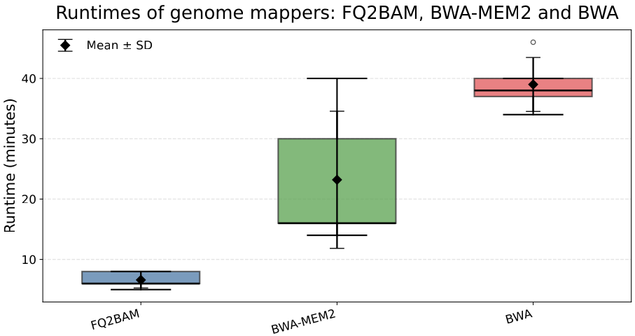
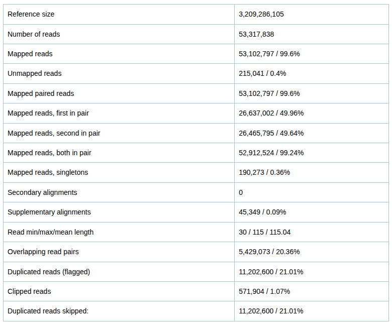
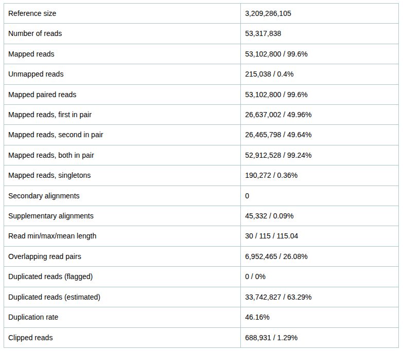
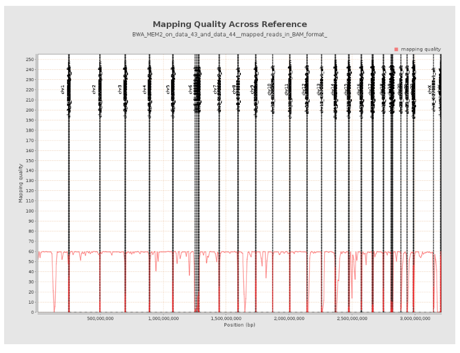
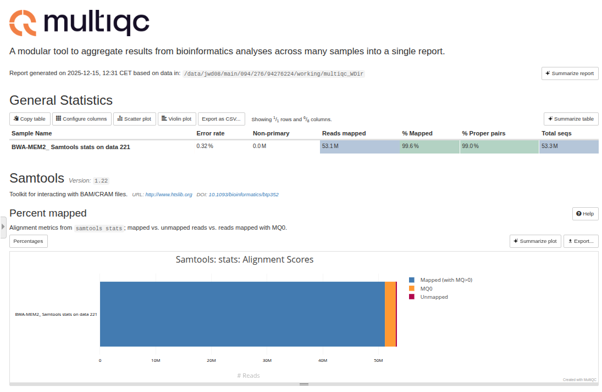
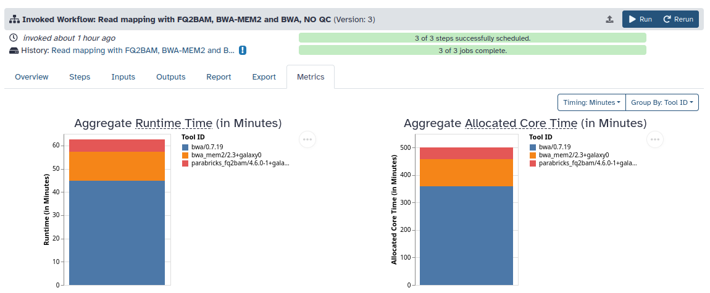
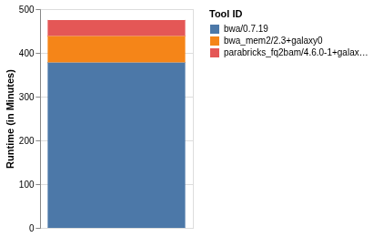

# Parabricks FQ2BAM mapper

NVIDIA's [Parabricks](https://docs.nvidia.com/clara/parabricks/latest/gettingstarted/gettingthesoftware.html#running-nvidia-parabricks) developed a GPU-accelerated tool suite for genomic analysis. One of the tools from the suite is [FQ2BAM](https://docs.nvidia.com/clara/parabricks/latest/documentation/tooldocs/man_fq2bam.html) which accelerates mapping of DNA reads. It is now integrated into Galaxy and runs on a GPU to generate read alignments in a few minutes for zipped paired-end FASTQ reads of size 2.5 GB. It is a drop-in replacement for BWA-MEM2 while maintaining nearly identical mapping characteristics such as achieving 99.6% mapped reads and 31.4 mean mapping quality for the paired-end FASTQ reads, the same achieved by BWA-MEM2. [FQ2BAM](https://docs.nvidia.com/clara/parabricks/latest/documentation/tooldocs/man_fq2bam.html) tool wraps BWA-MEM2 to perform alignment from FASTQ to BAM and then handles downstream processing such as sorting, with optional steps for duplicate marking and base-quality score recalibration.

## FQ2BAM vs BWA-MEM2 runtime comparison (on gzipped paired-end FASTQ files of the human genome, each of size approximately 2.5 GB)

Across five repeated runs, the three mapping tools separate very clearly in speed:

- FQ2BAM (running on 1 GPU (L40S) and 8 cores) was consistently the fastest: 5–8 min per run.

- BWA-MEM2 (running on 8 cores) came next but showed large variability: 14–40 min (median 16 min, mean 23.2 ± 11.4 min (SD)). Most runs are clustered around ~14–16 min, but one slow run (40 min) noticeably widened the distribution.

- BWA (running on 8 cores) was the slowest overall yet fairly steady: 34–46 min (median 38 min, mean 39.0 ± 4.5 min (SD)), making it predictable but substantially longer.

    

In terms of typical (median) speed, FQ2BAM (running on 1 GPU (L40S) and 8 cores) is approximately 3-4x faster than BWA-MEM2 (running on 8 cores) and 6-7x faster than BWA (running on 8 cores). FQ2BAM achieves superior performance on runtime optimizing throughput for Galaxy users. It will prove to be a game changer for faster genomic analyses while running Galaxy workflows. BWA-MEM2 is usually much faster than BWA but less consistent, and BWA remains the slow, steady baseline.

## FQ2BAM vs BWA-MEM2 mapping statistics

The alignment files (BAM) from FQ2BAM and BWA-MEM2 tools are analysed using QualiMap BamQC tool to compare various mapping statistics on the same human reads. Both alignments are essentially identical in overall mapping performance: they use the same reference size (3,209,286,105 hg38) and number of reads (53,317,838), and both achieve approximately 99.6% mapped reads (53,102,797 for FQ2BAM vs 53,102,800 for BWA-MEM2) with only approximately 0.4% unmapped. Paired-end behavior is also nearly the same (approximately 99.24% “both in pair”) and supplementary alignments are comparable (approximately 0.09%).

    

FQ2BAM reports 11.2M duplicate reads flagged as duplicates (21.01%) and "duplicated reads skipped" consistent with duplicates being explicitly marked and handled in that pipeline, while the BWA-MEM2 report shows 0 flagged duplicates but a large estimated duplicate count (33.7M; duplication rate 46.16%), suggesting duplicates were not marked and QualiMap BamQC inferred them instead. BWA-MEM2 also has more overlapping read pairs (26.08% vs 20.36%) and slightly more clipped reads (1.29% vs 1.07%), indicating small differences in alignment/fragment handling even though the headline mapping rates are the same.

    

### FQ2BAM vs BWA-MEM2 mapping quality comparison

In both "mapping quality across the reference" plots, FQ2BAM and BWA-MEM2 show a very similar overall pattern: the mapping quality stays close to the maximum (around ~60) across most of the genome, indicating that the majority of reads are placed confidently. In both cases, there are sharp, localized drops to low/near-zero mapping quality at specific genomic intervals—typical of repetitive or hard-to-map regions where reads become multi-mapping reads.

    

While both tools deliver broadly comparable mapping confidence, BWA-MEM2 output (BAM file) often preserves the contig order coming from the FASTA at alignment time (resembling more “alphabetical” depending on how that FASTA is ordered) but FQ2BAM output follows a different sequence order (chr1, chr10 appearing first and then blocks of "_alt" (alternate loci) and "chrUn_*" (unplaced) contigs).

    

MultiQC tool produces the following plots showing similar outcomes of alignments by FQ2BAM and BWA-MEM2.

    

    

### Workflow invocation

The [Galaxy workflow invocation](https://usegalaxy.eu/workflows/invocations/9b028594c3ddbf80/metrics) plot shows comparison between FQ2BAM, BWA-MEM2 and BWA across several parameters. The individual runtimes of mappers are: BWA (~45 min), BWA-MEM2 (~12 min) and FQ2BAM (~6 min), being the fastest. 

    

In terms of compute usage, allocated core time, BWA takes around 360 minutes, followed by BWA-MEM2 (around 100 minutes) and FQ2BAM (around 40 minutes). Overall, FQ2BAM, accelerated by GPU, achieves the best runtime compared to standard mappers such as BWA-MEM2 running on CPUs.

## Performance comparison on human WGS from 1000 genomes project

The mapping performance of FQ2BAM is compared with BWA-MEM2 and BWA using paired-end whole-genome sequencing (WGS) data from a [human subject](https://www.internationalgenome.org/data-portal/sample/HG00513)
 in the [1000 Genomes Project](https://www.internationalgenome.org/). Each read file (forward and reverse) is approximately 8 GB. FQ2BAM (running on one L40S GPU and 8 CPU cores) is the fastest, completing mapping in approximately 36 minutes, whereas BWA-MEM2 takes more than 60 minutes on 8 CPU cores. The runtimes of the three mappers are shown in the following plot. More details on the runtime comparison can be found in the corresponding [workflow invocation](https://usegalaxy.eu/workflows/invocations/23928023449e767a/metrics).

    

## Resources

- Try out the [FQ2BAM tool](https://usegalaxy.eu/?tool_id=toolshed.g2.bx.psu.edu%2Frepos%2Fbgruening%2Fparabricks_fq2bam%2Fparabricks_fq2bam%2F4.6.0-1%2Bgalaxy1&version=latest) available on European Galaxy server.

## Acknowledgements

Thanks a lot to Wolfgang Maier, Michael Schatz, Björn Grüning and Mira Kuntz for helping in the development and integration on the European Galaxy server, NVIDIA team (Ben Busby, Daniel Puleri, Tong Zhu and others) for their support and explanations and everyone involved in making this possible.
