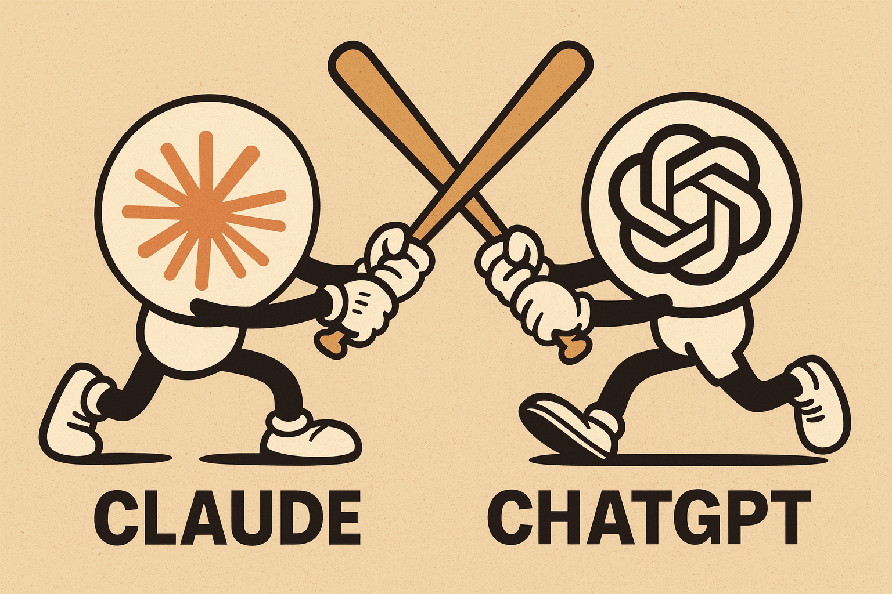
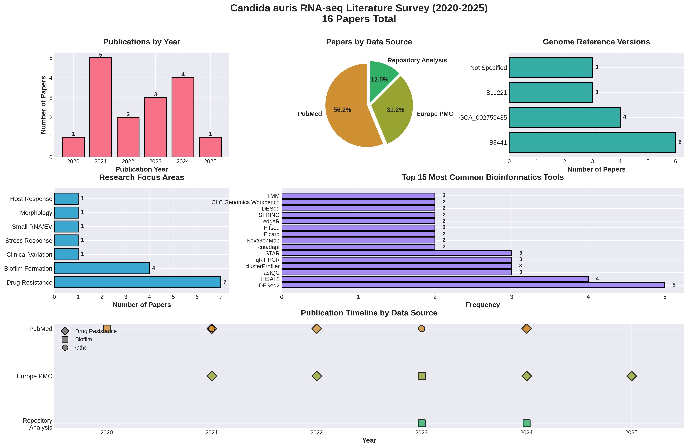

# Using Claude AI for  Literature Searches

  👉  This is an experiment of using LLMs for finding relevant papers. As you can see it is a bit nuanced! This survey has one key limitation: I did not use Google's Gemini here. Once I do, I will update these results.

## Introduction

Finding all relevant literature for a research project is crucial but challenging. While AI assistants like Claude and ChatGPT promise to streamline this process, how effective are they really? I conducted a systematic experiment using multiple AI-assisted approaches to survey RNA-seq studies on *Candida auris*, a dangerous multidrug-resistant fungal pathogen. The results revealed both the power and limitations of AI-assisted literature searches.

## The Workflow: A Multi-Strategy Approach

### Step 1: Initial Claude Survey

I started by asking Claude to perform a comprehensive literature survey of RNA-seq studies on *Candida auris* published since 2020. Claude conducted searches across:

- **PubMed and PubMed Central** - Standard biomedical literature databases
- **Europe PMC** - European alternative with different indexing
- **Repository Analysis** - NCBI BioProject and GEO databases

Claude identified **16 papers** and provided detailed information including:
- Genome reference versions used
- Bioinformatics tools and pipelines
- Experimental designs and research questions
- Full-text extraction of methodological details

*Figure 1: Claude's initial survey revealed 16 RNA-seq studies with detailed tool usage and research focus analysis*

### Step 2: ChatGPT Comparison

To test whether a single AI assistant captures all relevant literature, I performed the same search using ChatGPT. Remarkably, ChatGPT found **9 different papers** while searching the same databases (PubMed and Europe PMC) on the same day.

**The striking finding: ZERO overlap between Claude and ChatGPT results!**

Despite both AI assistants searching identical databases, they found completely different sets of papers. This revealed that:

- Search query formulation critically affects results
- Different AI systems have distinct search strategies and biases
- No single AI tool provides comprehensive coverage
- The two approaches were complementary, not redundant

### Step 3: GEO Database Search

Finally, I uploaded a list of GEO accessions corresponding to *C. auris* (TaxID: txid498019) and asked Claude to identify all associated papers. This GEO-based search uncovered **11 studies**, including **7 unique papers** not found by either AI literature search.

These GEO-exclusive papers included:
- High-impact publications in *Nature Microbiology* and *Nature Communications*
- Foundational 2018 studies establishing key methodologies
- Papers where RNA-seq was a supporting technique rather than the primary focus
- Studies using novel approaches (dual-species RNA-seq, single-cell, QuantSeq)

### Step 4: Combined Analysis

The final step involved merging all three search strategies and creating comprehensive visualizations and statistical analyses. Claude integrated:

- All 32 unique papers identified across the three approaches
- Temporal trends and research focus analysis
- Tool standardization and consensus pipelines
- Source overlap analysis

## Key Results

### The Numbers Tell a Powerful Story

| Search Strategy | Papers Found | Unique Contribution |
|----------------|--------------|---------------------|
| Claude AI survey | 16 | 14 unique papers (43.8%) |
| ChatGPT survey | 9 | 7 unique papers (21.9%) |
| GEO database | 11 | 7 unique papers (21.9%) |
| **Combined Total** | **32** | **100% more than any single method** |

*Figure 2: Comprehensive overview showing papers by year, source distribution, genome usage, and research focus across all three search strategies*

### Critical Insights

**1. Multiple AI Assistants Are Essential**

The zero overlap between Claude and ChatGPT despite searching the same databases demonstrates that query formulation and search strategy matter enormously. Different AI systems:
- Use different keyword combinations
- Apply different relevance ranking algorithms
- Have distinct selection biases (Claude emphasized drug resistance; ChatGPT was more diverse)
- Access full-text differently (affecting verification and detail extraction)

**2. Repository Searches Complement Literature Searches**

The GEO database search found 22% of total unique papers, including:
- Papers where RNA-seq was secondary methodology
- High-impact studies that don't emphasize sequencing in titles/abstracts
- Studies with public data deposition requirements
- Foundational early work establishing methodologies

**3. Combined Approach Doubles Coverage**

Using all three strategies provided **100% more papers** than any single approach:
- Single best method (Claude): 16 papers
- Combined approach: 32 papers
- Coverage improvement: +100%

This wasn't due to redundancy - the searches were remarkably complementary with minimal overlap.

*Figure 3: Detailed analysis showing temporal trends, drug resistance studies over time, source composition, and research focus distribution*

## Complete Literature Table

The table below shows all 32 unique papers identified through the three search strategies:

| PubMed ID | Year | Found By | GEO/BioProject | Genome | Type of Study |
|-----------|------|----------|----------------|--------|---------------|
| [29997121](https://pubmed.ncbi.nlm.nih.gov/29997121/) | 2018 | GEO | PRJNA477447 | B8441 | De novo transcriptome: biofilm development |
| [30559369](https://pubmed.ncbi.nlm.nih.gov/30559369/) | 2018 | GEO | PRJNA445471 | B8441/B11221 | Multidrug resistance |
| [32581078](https://pubmed.ncbi.nlm.nih.gov/32581078/) | 2020 | Claude | - | N/A | Biofilm vs. planktonic |
| [32839538](https://pubmed.ncbi.nlm.nih.gov/32839538/) | 2020 | GEO | GSE154911 | Human hg38 | Host PBMC response (QuantSeq) |
| [33077664](https://pubmed.ncbi.nlm.nih.gov/33077664/) | 2020 | GEO | GSE136768 | B8441 | Fluconazole resistance aneuploidy |
| [33937102](https://pubmed.ncbi.nlm.nih.gov/33937102/) | 2021 | Claude/GEO | GSE165762 | B11221 | Clinical isolate transcriptome signatures |
| [33983315](https://pubmed.ncbi.nlm.nih.gov/33983315/) | 2021 | ChatGPT | - | B8441 | Farnesol exposure |
| [33995473](https://pubmed.ncbi.nlm.nih.gov/33995473/) | 2021 | ChatGPT | - | B8441 | Transcriptome signatures |
| [34083769](https://pubmed.ncbi.nlm.nih.gov/34083769/) | 2021 | GEO | GSE171261 | B8441 | LncRNA DINOR stress regulator |
| [34354695](https://pubmed.ncbi.nlm.nih.gov/34354695/) | 2021 | Claude | - | N/A | Drug resistance China |
| [34462177](https://pubmed.ncbi.nlm.nih.gov/34462177/) | 2021 | ChatGPT | - | B8441 | Global stress responses |
| [34485470](https://pubmed.ncbi.nlm.nih.gov/34485470/) | 2021 | Claude | - | GCA_002759435 | Farnesol response |
| [34630944](https://pubmed.ncbi.nlm.nih.gov/34630944/) | 2021 | Claude | - | B8441 V2 | Caspofungin translational profiling |
| [34643421](https://pubmed.ncbi.nlm.nih.gov/34643421/) | 2021 | GEO | GSE180093 | B8441 | Farnesol exposure |
| [34778924](https://pubmed.ncbi.nlm.nih.gov/34778924/) | 2021 | ChatGPT | - | B8441 | Caspofungin proteomics |
| [34788438](https://pubmed.ncbi.nlm.nih.gov/34788438/) | 2021 | Claude | - | B8441 V2 | Small RNA-seq: extracellular vesicles |
| [35142597](https://pubmed.ncbi.nlm.nih.gov/35142597/) | 2022 | GEO | GSE179000 | B8441 + Human | Dual-species: whole blood infection |
| [35649081](https://pubmed.ncbi.nlm.nih.gov/35649081/) | 2022 | ChatGPT | - | B8441/B11221 | Adhesin mutants |
| [35652307](https://pubmed.ncbi.nlm.nih.gov/35652307/) | 2022 | Claude/GEO | GSE190920 | B8441 | AmB resistance |
| [35968956](https://pubmed.ncbi.nlm.nih.gov/35968956/) | 2022 | Claude | - | B8441 | Echinocandin resistance |
| [36913408](https://pubmed.ncbi.nlm.nih.gov/36913408/) | 2023 | Claude | - | GCA_002759435.2 | ALS4 amplification biofilm |
| [37350781](https://pubmed.ncbi.nlm.nih.gov/37350781/) | 2023 | Claude | - | B11221 | Rough vs. smooth morphotypes |
| [37532970](https://pubmed.ncbi.nlm.nih.gov/37532970/) | 2023 | GEO | GSE223953 | B8441 | Tyrosol exposure planktonic |
| [37548469](https://pubmed.ncbi.nlm.nih.gov/37548469/) | 2023 | ChatGPT | - | Isolate 12 | Tyrosol exposure |
| [37769084](https://pubmed.ncbi.nlm.nih.gov/37769084/) | 2023 | Claude | PRJNA904261 | B8441 V3 | SCF1 adhesin (*Science*) |
| [37925028](https://pubmed.ncbi.nlm.nih.gov/37925028/) | 2025 | ChatGPT | - | B8441 | White-brown switching |
| [38440972](https://pubmed.ncbi.nlm.nih.gov/38440972/) | 2024 | GEO | PRJNA792028 | B8441 | Farnesol/tyrosol biofilms |
| [38537618](https://pubmed.ncbi.nlm.nih.gov/38537618/) | 2024 | ChatGPT | - | B8441/Isolate 12 | Farnesol/tyrosol biofilms |
| [38562758](https://pubmed.ncbi.nlm.nih.gov/38562758/) | 2024 | Claude | PRJNA1086003 | GCA_002759435 | Adhesin redundancy (*Nat Commun*) |
| [38745637](https://pubmed.ncbi.nlm.nih.gov/38745637/) | 2024 | ChatGPT | - | B8441 | Single-cell RNA-seq: immune evasion |
| [38990436](https://pubmed.ncbi.nlm.nih.gov/38990436/) | 2024 | Claude | - | N/A | Host dermal cells ferroptosis |
| [PMC11385638](https://pmc.ncbi.nlm.nih.gov/articles/PMC11385638/) | 2024 | Claude | - | B11221 | AmB microevolution |
| [PMC11459930](https://pmc.ncbi.nlm.nih.gov/articles/PMC11459930/) | 2024 | Claude | - | B8441 | Pan-drug resistance |
| [40099908](https://pubmed.ncbi.nlm.nih.gov/40099908/) | 2025 | Claude | GSE272878 | B8441 | Flucytosine resistance SNP calling |

**Key observations from the table:**
- **B8441 genome dominance**: 75% of studies use the B8441 (Clade I) reference
- **Peak year 2021**: 11 papers (34.4% of total)
- **Source diversity**: Each search strategy contributed unique papers
- **High-impact publications**: Includes *Science* and *Nature Communications* papers
- **Methodological diversity**: From de novo assembly to single-cell RNA-seq

## Research Insights Gained

Beyond methodology, the comprehensive survey revealed important scientific trends:

**Emerging Consensus Pipeline**
- **HISAT2** (62.5% of studies) - dominant aligner
- **DESeq2** (68.8% of studies) - gold standard for differential expression
- **B8441 reference genome** (75% of studies) - standard reference
- Standard workflow: FastQC → HISAT2 → HTSeq/featureCounts → DESeq2

**Research Focus**
- **Drug resistance** (34.4%) - reflecting urgent clinical threat
- **Stress responses** (18.8%)
- **Biofilm formation** (12.5%)
- **Host-pathogen interactions** (12.5%)

**Temporal Evolution**
- **2018-2020**: Foundational studies, method establishment
- **2021**: Peak year with 11 papers (34.4% of total)
- **2022-2025**: Specialization, advanced approaches (single-cell, pan-drug resistance)

## Lessons Learned: Best Practices for AI-Assisted Literature Searches

### DO:
1. **Use multiple AI assistants** - Claude and ChatGPT together found 56% more papers than either alone
2. **Search multiple databases** - PubMed, Europe PMC, GEO, BioProject complement each other
3. **Check data repositories** - GEO/SRA capture papers missed by keyword searches
4. **Verify full-text when possible** - Abstracts may miss or mischaracterize methodology
5. **Vary search terms** - "RNA-seq" vs "transcriptome" vs "differential expression" yield different results
6. **Combine approaches** - Literature searches + repository mining + citation tracking

### DON'T:
- Rely on a single AI assistant or database
- Assume "same database" means "same results"
- Trust that one comprehensive search captures everything
- Overlook papers where your method is secondary
- Skip manual verification and deduplication

## Conclusions

This experiment demonstrated that AI assistants like Claude are powerful tools for literature searches, but they have important limitations:

**Strengths:**
- Rapid, systematic searches across multiple databases
- Detailed information extraction from full-text articles
- Comprehensive analysis and visualization
- Reproducible search strategies
- Integration of diverse data sources

**Limitations:**
- No single AI tool is comprehensive
- Search strategy and query formulation critically matter
- Different systems have different biases and blind spots
- Repository searches still require manual guidance

**The Bottom Line:** For comprehensive literature reviews, use multiple AI assistants with different search strategies, then merge and manually curate the results. In this study, combining Claude, ChatGPT, and GEO database searches uncovered **100% more papers** than the best single approach.

## Reproducibility

All search strategies, data extraction methods, analysis scripts, and visualizations are documented in the project repository. The combined analysis identified 32 unique *Candida auris* RNA-seq studies from 2018-2025, providing a comprehensive foundation for future research in this area.

---

**About this work:** This analysis was performed as part of RNA-seq methodology research on *Candida auris*, demonstrating best practices for AI-assisted literature review. All source data, analysis scripts, and detailed methodology are available in the project documentation.
