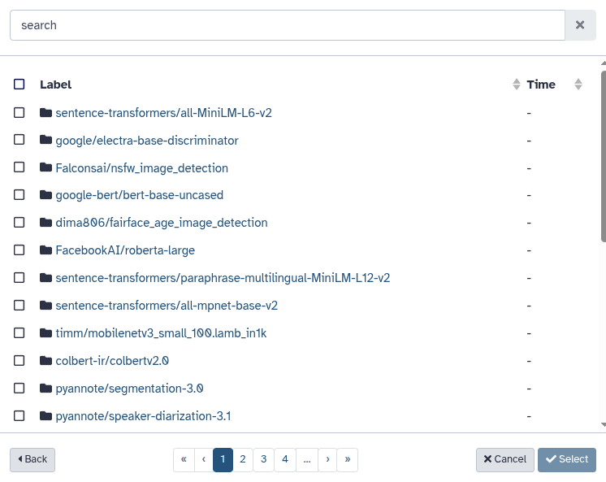
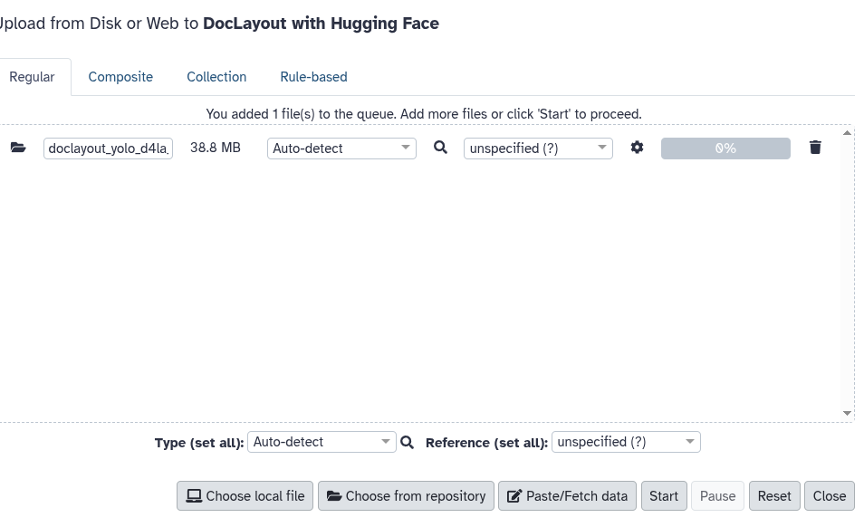
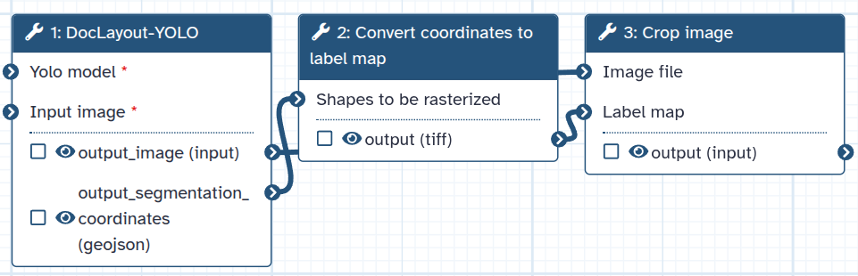
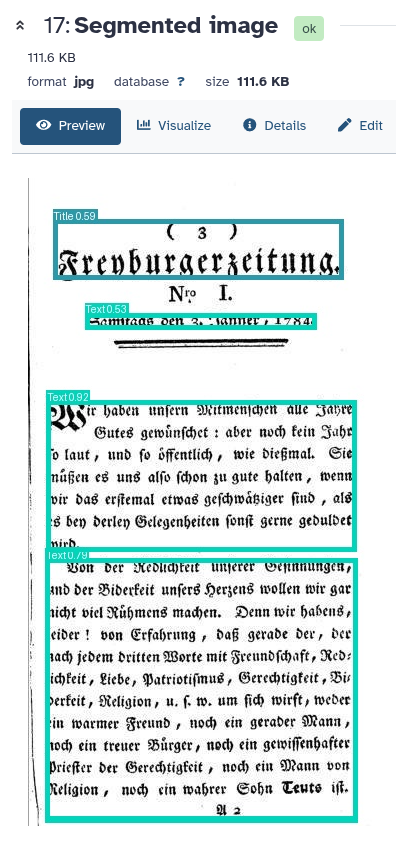
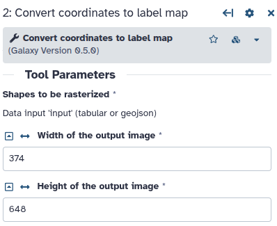

# Integration of Hugging Face Hub with Galaxy

A common friction point in ML-powered scientific analysis in Galaxy is **getting the appropriate model into the right tool**: downloading weights locally, uploading again, and repeating for every history or workflow run.

With Galaxy’s new [**Hugging Face Hub**](https://huggingface.co/) integration, you can **browse Hugging Face model repositories from within Galaxy** file uploader, import a model artifact directly into your history, and immediately use it as a tool input. This feature is implemented as a Galaxy's file source plugin built on the `fsspec` and `huggingface_hub` libraries. 

    

A wide range of models across many scientific disciplines include protein language models ([Rostlab/prot_bert](https://huggingface.co/Rostlab/prot_bert)), biomedical and clinical NLP ([medicalai/ClinicalBERT](https://huggingface.co/medicalai/ClinicalBERT)), chemistry language models ([ibm-research/MoLFormer-XL-both-10pct](https://huggingface.co/ibm-research/MoLFormer-XL-both-10pct)), weather monitoring models ([nvidia/fourcastnet3](https://huggingface.co/nvidia/fourcastnet3) and [ibm-nasa-geospatial/Prithvi-EO-1.0-100M](https://huggingface.co/ibm-nasa-geospatial/Prithvi-EO-1.0-100M)),  astronomy ([AstroMLab/AstroSage-8B](https://huggingface.co/AstroMLab/AstroSage-8B)), large language models ([Llama-4: meta-llama/Llama-4-Scout-17B-16E-Instruct](https://huggingface.co/meta-llama/Llama-4-Scout-17B-16E-Instruct)) and many more. All of these models can be swiftly pulled from Hugging Face Hub into Galaxy history, leading to faster ML-based analyses.

    

    

> **Note:** The Hugging Face Hub has been integrated as part of the **Galaxy v25.1** release.

## Model integration and inference

We’ll demonstrate the usage of a Hugging Face model for segmenting document layout in the following steps:

1. Open Galaxy **Upload**, click on **Choose from repository** and choose **Hugging Face Hub** as the repository source.
2. Browse to a DocLayout-YOLO model repository and select a `.pt` weights file (**Hint**: use "doclayout" as the search string to accurately find the model from the list).
3. Import the file into the Galaxy history.
4. Find and run the [**DocLayout-YOLO** tool](https://usegalaxy.eu/?tool_id=toolshed.g2.bx.psu.edu%2Frepos%2Fbgruening%2Fdoclayoutyolo%2Fdoclayoutyolo%2F0.0.4.1%2Bgalaxy0&version=latest) using:
   - Imported YOLO model weights
   - Document page image as input  
5. View the segmented output image.

## Step-by-step: Import a model from Hugging Face Hub and run the DocLayout-YOLO tool

### 1) Open Galaxy Upload and choose “Choose from repository”

From the Galaxy **Upload** dialog, click **Choose from repository**.

    

### 2) Select “Hugging Face Hub” as the repository source

In the repository picker, choose **Hugging Face Hub**.

    

### 3) Search for the model repository

Now you can browse/search Hugging Face Hub models directly from Galaxy. Here we search for the model using *doclayout* as the search string and select the pretrained DocLayout-YOLO repository (juliozhao/DocLayout-YOLO-DocLayNet-Docsynth300K_pretrained).

    

### 4) Select the model weights file

Inside the repository, pick the weights file (here a `.pt` file).

    

### 5) Import the selected file into your history

After adding the file to the upload queue, click **Start** to import it into your Galaxy history.

    

At this point, your YOLO weights are now a normal Galaxy dataset: usable as a tool/workflow input and shareable.

## Run inference in Galaxy

The [workflow](https://usegalaxy.eu/u/schnda/w/extract-text-passages-from-images) for text segmentation uses DocLayout-YOLO tool for text segmentation. The DocLayout-YOLO tool uses the pre-trained model, powered by Galaxy's Hugging Face integration, to detect text chunks and create bounding boxes around them. These bounding boxes containing text chunks are extracted from the original image and are processed downstream by Convert coordinates to label map and Crop image tools. You could combine the output with other tools in Galaxy, such as the [LLM Hub](https://usegalaxy.eu/?tool_id=llm_hub) or [Tesseract](https://usegalaxy.eu/?tool_id=tesseract) for optical character recognition (OCR). This will make your image machine-readable.

    

### DocLayout-YOLO tool in the workflow

The [**DocLayout-YOLO**](https://usegalaxy.eu/root?tool_id=toolshed.g2.bx.psu.edu/repos/bgruening/doclayoutyolo/doclayoutyolo/0.0.4.1+galaxy0) tool form and set:

- **Yolo model** → the `.pt` file imported from Hugging Face
- **Input image** → the document page image to be segmented

#### The segmented image with detected layout regions

The DocLayout-YOLO tool produces a segmented image with detected regions (e.g., headings, paragraphs, page headers) drawn as bounding boxes.

    

### Convert coordinates to label map tool

To make use of the segmented information, the workflow converts the location coordinates into a different format. In this step, [**Convert coordinates to label map**](https://usegalaxy.eu/root?tool_id=ip_points_to_label) tool is used. It is important that the width and height of your input match the image you want to cut. 
You can find this information about your image by clicking on the image in your history and clicking on the "i" at the bottom to show the dataset details. Navigate to the edit tab to find your image's height and width. You can now feed this information to the **Convert coordinates to label map** tool. Use the [cropping tool](https://usegalaxy.eu/root?tool_id=ip_crop_image) to extract your images. 

    

### Workflow output by Crop image tool

The Crop image tool creates sub-images for each shape identified by the segmentation and rasterisation by DocLayout-YOLO and Convert coordinates to label map tool, respectively. Depending on the input image, we get several separate images. Those can now be used with other tools, like Tesseract or LLM Hub, for example.

    

## Significance for reproducible Galaxy ML-based workflows

Pulling models from Hugging Face from *inside Galaxy* makes ML workflows much easier to operationalize:

- **Broad model coverage**: A wide range of models such as large language models (LLMs), biology and imaging foundation models and many more are available for downstream analyses.
- **No manual download/upload loop** (especially cumbersome for large weights and models)
- **Tool inputs become explicit**: the exact model file used is captured in the history and workflow provenance.
- **Reusable across analyses**: share histories/workflows with the model artifact included.
- **Standardization of ML models**: usage of widely used Hugging Face Hub as model repository provides standard and safer model loaders and structured model metadata.

## Acknowledgements

Thanks a lot to David Lopez for the integration of Hugging Face Hub into Galaxy and Daniela Schneider for updating the workflow.

## Resources

- Galaxy history: https://usegalaxy.eu/u/schnda/h/extract-text-passages-from-images-test

