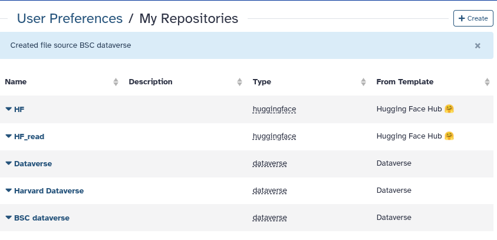
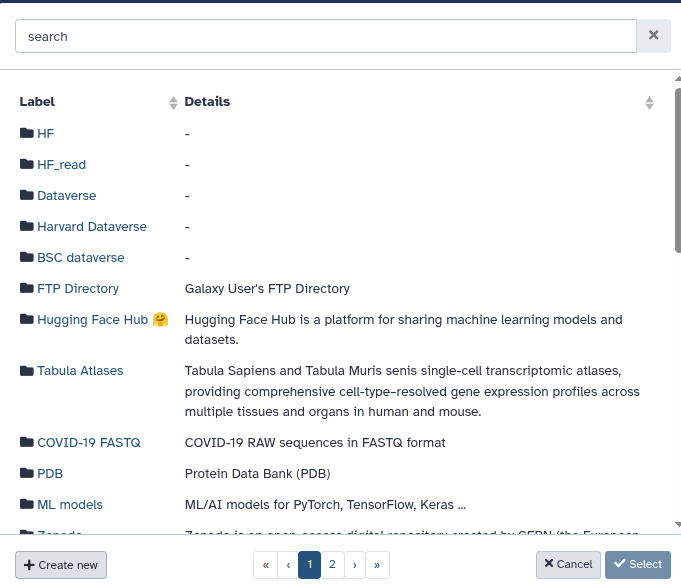
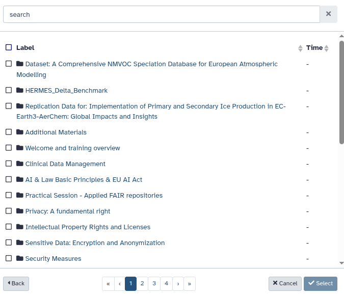
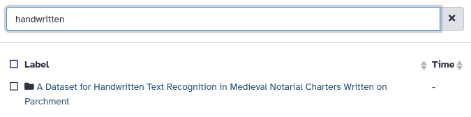
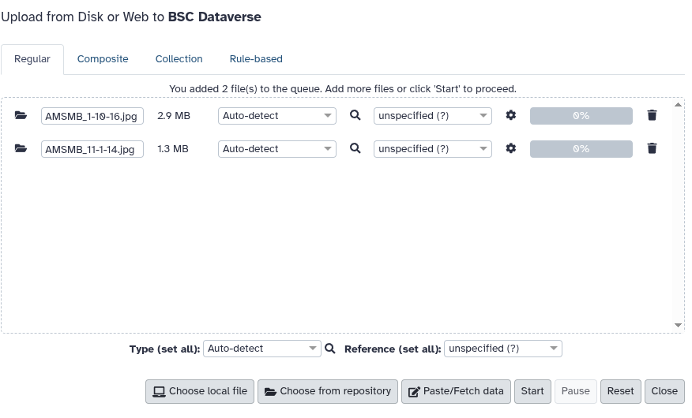
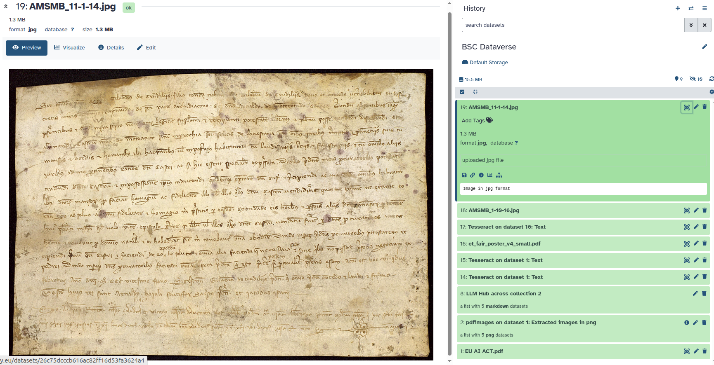
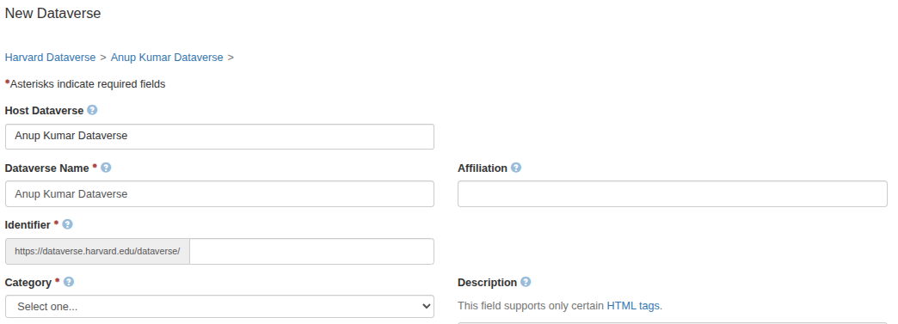
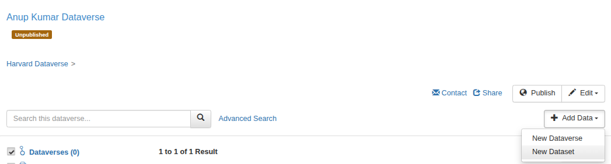
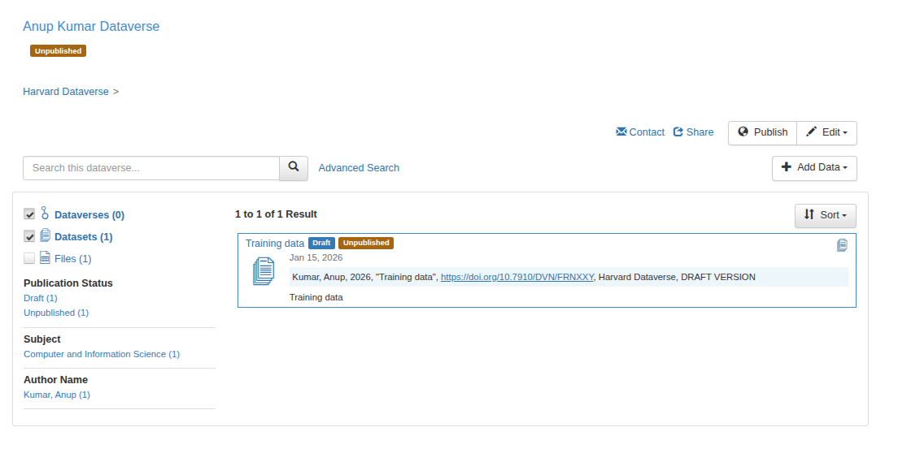
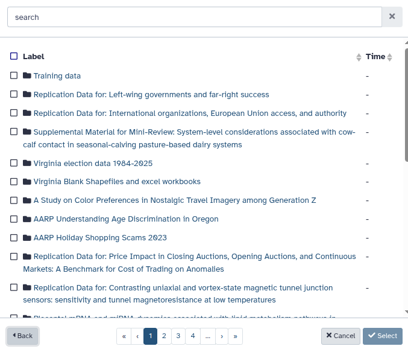

# Integration of Dataverse with Galaxy

A common bottleneck in reproducible research is **moving data between analysis platforms and FAIR repositories**: downloading files locally, re-uploading them to Galaxy, and later repeating the process to publish results back into a repository. We will walk through an example dataverse - [Barcelona Supercomputing Center (BSC))(https://dataverse.bsc.es/) Dataverse showcasing its usage from within Galaxy. The public datasets inside the dataverse become directly accessible using the Galaxy's dataverse file source plugin. For showing the usage of private data repositories, we will use [Harvard Dataverse](https://dataverse.harvard.edu/).

With Galaxy’s dataverse integration, you can connect a dataverse instance (here: **BSC Dataverse**) as a **file source** and then:

- **Browse and search dataverse datasets/collections from Galaxy**
- **Import files directly into a Galaxy history** (as normal datasets)

This keeps your analyses reproducible while reducing manual “download/upload loops”.

---

## Get your BSC Dataverse API token

To access private content and to enable uploads from dataverse, you’ll need an API token from your dataverse account. First create an account on [BSC Dataverse](https://dataverse.bsc.es/). Then, create an API token.

  

---

## Create a BSC Dataverse repository in Galaxy

Galaxy stores external repositories under **User Preferences → My Repositories**. This lets you reuse the same repository across uploads, tools, and workflows.

### 1) Create a new repository

Go to **User Preferences → My Repositories → Create**. From the repository options, choose **Dataverse**.

  

### 2) Configure the dataverse connection

Fill in the Dataverse settings:

- **Name**: a label for your repository (e.g., `BSC Dataverse`)
- **Dataverse instance endpoint**: `https://dataverse.bsc.es/`
- **Allow Galaxy to export data to Dataverse?**: set to **Yes** if you want to upload from Galaxy to dataverse
- **Publication Name**: creator name used in dataset metadata
- **API Token**: paste the token from your dataverse account

  

### 3) Confirm the repository was created

After saving, your new entry appears in **My Repositories**.

  

---

# Import datasets from BSC Dataverse into a Galaxy history

## Step-by-step: browse/search and import a file

### 1) Open Galaxy Upload and choose “Choose from repository”

From the Galaxy **Upload** dialog, click **Choose from repository** and select your configured dataverse source (e.g., **BSC Dataverse**).

  

### 2) Browse Dataverse collections/datasets

You can navigate folders/collections and list available datasets.

  

### 3) Select dataset(s) and import

Search for "handwritten" and select the dataset: **A Dataset for Handwritten Text Recognition in Medieval Notarial Charters Written on Parchment** by clicking on **Select**.

  

---

# Export from dataverse to Galaxy history

### 1) Add files to the upload queue from BSC Dataverse source in Galaxy

In the Upload dialog, choose **BSC Dataverse** as the destination and add the file(s) to the queue.

  

---

  

### 2) Verify the dataset is available in your Galaxy history

Once imported, the file appears as a normal Galaxy dataset (usable as tool input, workflow input, or for sharing).

  

---

# Configuring a private dataverse

For working with private datasets, we will use [Harvard Dataverse](https://dataverse.harvard.edu/). We will repeat the same steps as we did for creating and configuring BSC Dataverse.

### 1) Create an account on [Harvard Dataverse](https://dataverse.harvard.edu/) and acquire an API token.

  

### 2) Create a private Dataverse on Harvard Dataverse

  

### 3) Add datasets to the newly created dataverse

  

  

  

### 4) Browse the Harvard Dataverse from within Galaxy's file uploader

  

### 5) Select the newly created "Training data" repository from the uploader and import the underlying dataset into Galaxy history

  

The datasets imported from public and private dataverses can be directly used in any suitable Galaxy tool or workflow or for sharing.

# Significance for reproducible Galaxy tools and workflows

Connecting BSC Dataverse as a direct repository source in Galaxy makes it easier to operationalize FAIR data management:

- **Direct repository access in the Galaxy Upload** (browse + search).
- **Less manual file handling** (fewer downloads/re-uploads).
- **Clear provenance**: imported files become explicit history items.
- **Sharing and reusablility**: one repository configuration can power many analyses and workflows.
