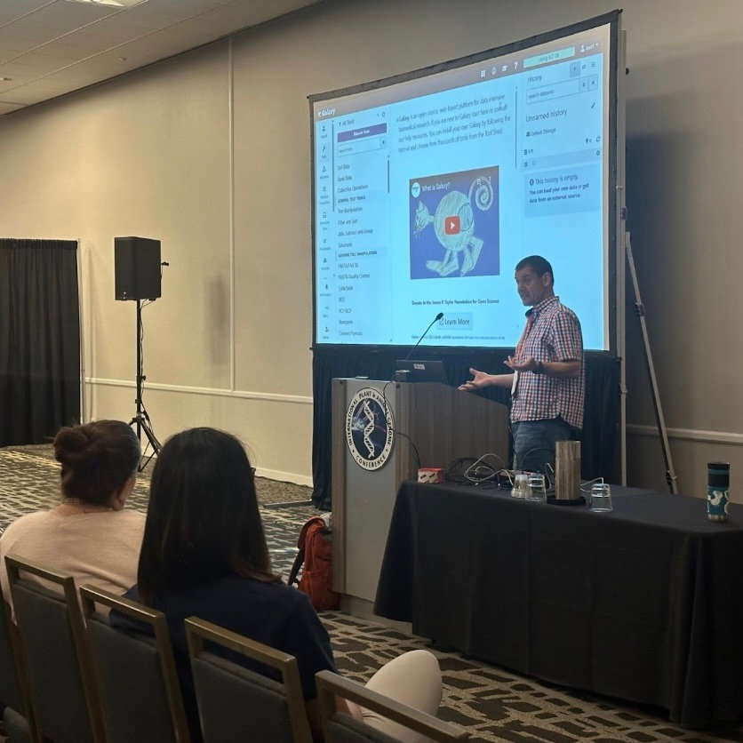
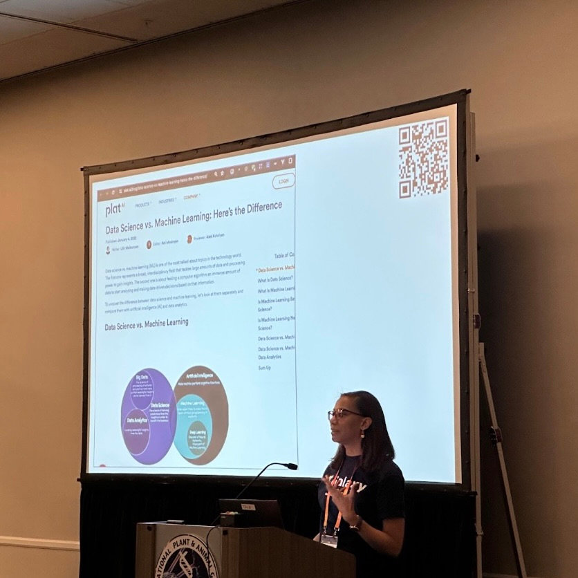
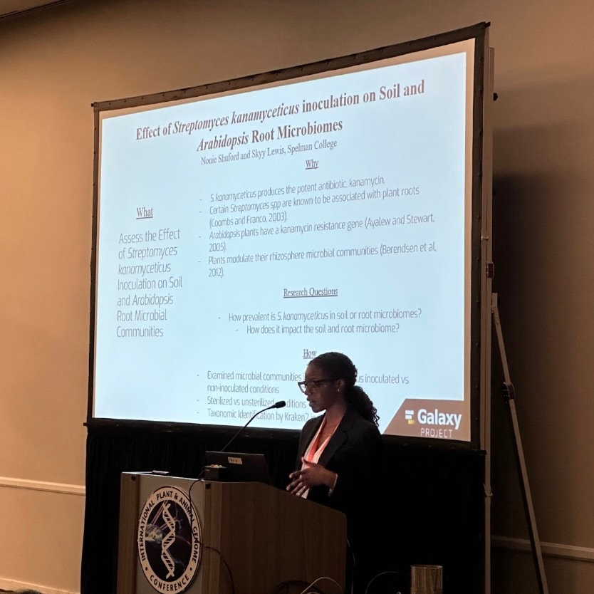
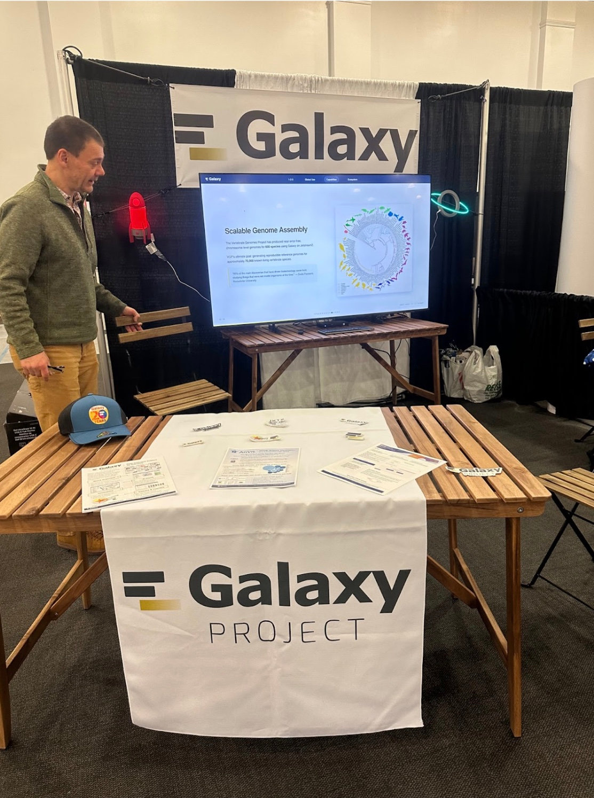
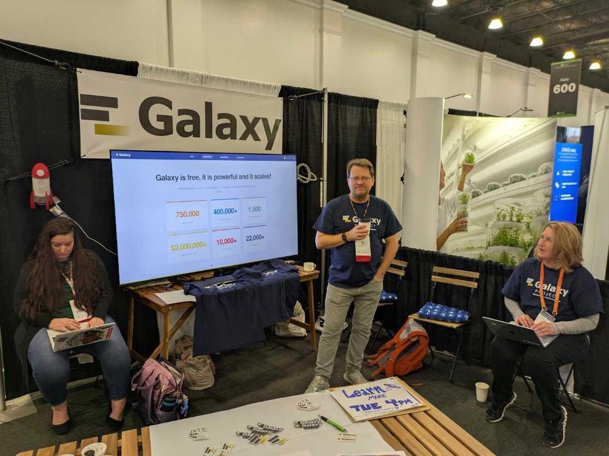

# Galaxy at PAG33

The Galaxy Project returned to the 33rd Plant and Animal Genome Conference (PAG33) this year with a full slate of activities, including a well-attended workshop and, for the first time, an exhibition booth. Together, these efforts highlighted Galaxy’s continued growth as a platform for large-scale genomics, metagenomics, machine learning, and community-driven biological discovery.

# Galaxy Workshop at PAG33

Galaxy once again hosted a dedicated workshop showcasing recent scientific and technical advances across the Galaxy ecosystem. The session opened with an overview of Galaxy’s latest platform developments, including improvements to cloud support, interactive workflows, and tighter integration with global data resources. These updates reflect ongoing efforts to scale Galaxy to meet the increasing volume and complexity of modern biological data.

A major focus of the workshop was Galaxy’s role in large-scale genome assembly and comparative genomics through its collaboration with the [Vertebrate Genomes Project (VGP)](https://vertebrategenomesproject.org/). As sequencing technologies continue to improve and costs decline, VGP aims to generate thousands of high-quality reference genomes in the coming years. Galaxy workflows developed in partnership with VGP, now routinely used for assembly, annotation, and downstream analyses, are helping meet this challenge by supporting the submission and management of dozens of concurrent genome assemblies. Recent work has also focused on reducing bottlenecks associated with manual curation, using Galaxy workflows to streamline error detection and correction and to accelerate the production of near-error-free reference genomes.

The workshop also highlighted advances in microbiome research enabled by Galaxy. New and updated workflows support scalable amplicon, metagenomic, and metatranscriptomic analyses, with applications spanning taxonomic and functional profiling, assembly, and ecological interpretation. The [BioDIGS](https://biodigs.org/#home) project was presented as a case study demonstrating how Galaxy enables large-scale, open, and FAIR soil metagenomics research by tightly coupling workflows, public datasets, and training resources.

Emerging machine learning capabilities in Galaxy were another key theme. Presentations demonstrated how AI-driven approaches, including GPU-accelerated tools, integrated notebooks, and new resources for model training and interpretability, can be incorporated directly into genomic workflows for classification, prediction, and visualization.

The workshop concluded with updates from the Galaxy Training Network and the broader Galaxy community, highlighting new tutorials, international collaborations, and the wide range of Galaxy-related projects that were presented across PAG33.

  
  

  
  

## Student Research Highlights

The microbiome session concluded with an introduction to BioDIGS and microbiome research at Spelman College, presented by Mentewab Ayalew. This overview provided context for two student-led research projects that leverage Galaxy to conduct reproducible, course-based and independent microbiome analyses.

Nonie Shuford presented “Effect of Streptomyces kanamyceticus Inoculation on Soil and Arabidopsis Root Microbiomes,” examining how microbial inoculation alters community composition in soil and plant-associated microbiomes. Skyy Lewis followed with “Increased Antibiotic Resistance Genes in Contaminated Soils,” which examined the prevalence of antibiotic resistance genes in environments contaminated with them.

Together, these presentations highlighted how Galaxy supports accessible, reproducible microbiome research and training, enabling students to engage with complex, real-world datasets using scalable, transparent workflows.

  

  
  

# Galaxy’s First PAG Booth

For the first time, Galaxy also hosted an exhibition booth at PAG33. The booth provided an opportunity for direct engagement with conference attendees, resulting in many productive conversations with researchers interested in genomics, metagenomics, training, and community infrastructure. A recurring question from visitors, “What’s the catch?”, reflected both surprise and curiosity that a platform as powerful and full-featured as UseGalaxy.org is freely available. Overall, the booth was a strong success and underscored the value of in-person engagement for sharing Galaxy’s open, community-driven model.

  
  

# Looking Ahead

Galaxy’s presence at PAG33 demonstrated the continued expansion of the platform’s scientific scope, technical capabilities, and community reach. For large-scale genome assembly and microbiome research, as well as machine learning and training, Galaxy remains committed to supporting open, reproducible, and accessible biological research. Building on the success of another great year at PAG, the Galaxy team looks forward to returning to future PAG meetings with an even stronger presence.
