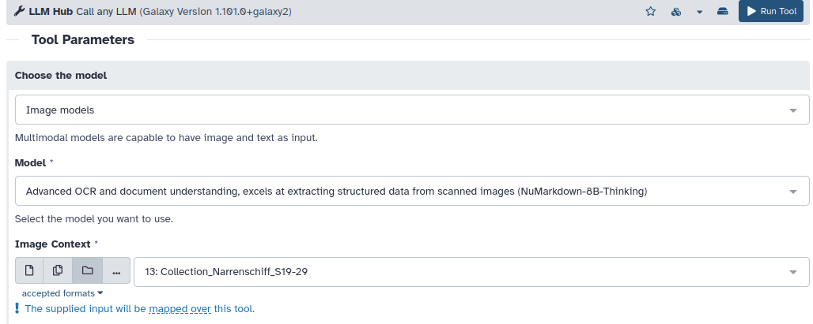
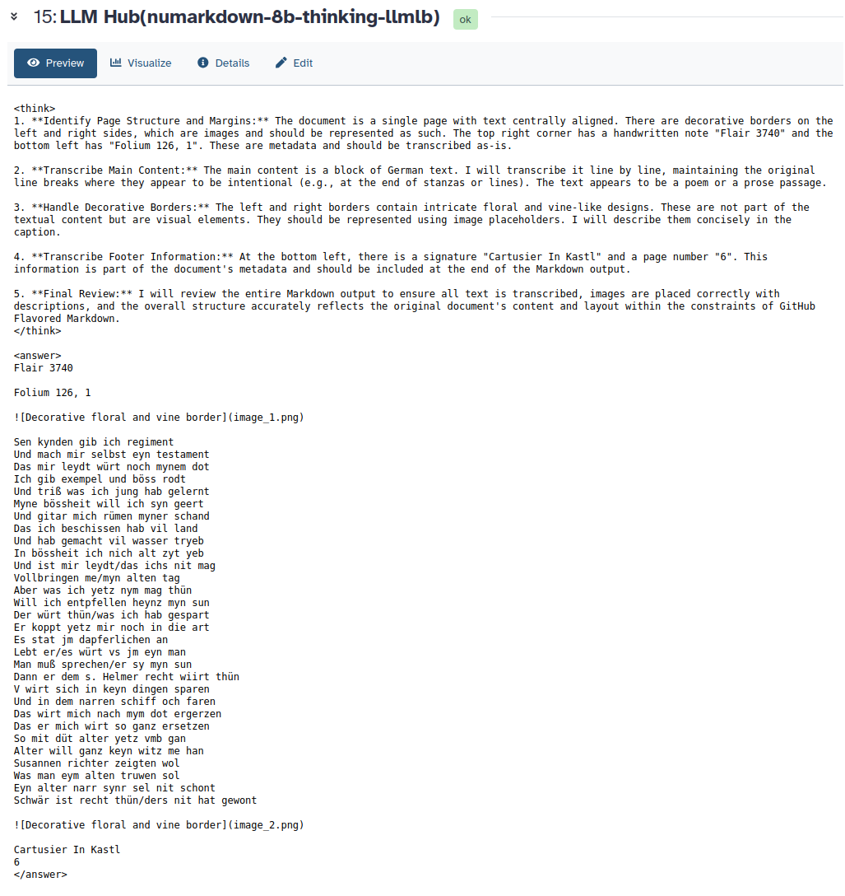

# Connecting Humanities Data: Analyzing DaSCH data on Galaxy

We're excited to announce the collaboration between [DaSCH](https://dasch.swiss/), the Swiss National Data and Service Center for the Humanities, and the data analysis platform [Galaxy](https://usegalaxy.eu/). 
While DaSCH provides a wealth of research data, Galaxy offers a wide range of tools and workflows for analysing it - sounds like a match made in heaven!

# DaSCH as a data provider

Imagine a researcher who has spent countless hours collecting data. After publishing a paper, the data often rots on a private computer and is then lost forever.
What a pity for the scientific community, and what a waste of time and money! 
That’s where DaSCH comes in. DaSCH is a Virtual Research Environment (VRE) and long-time repository for research data from the Humanities. 
Its mission is to operate a platform where researchers can work on and publish their data. This has multiple benefits: 

- The data doesn’t rot any more on a private computer, but is publicly available for generations to come.
- DaSCH supports researchers in tidying up their data and annotating it. This improves quality.
- All data published at DaSCH is semantically structured and richly documented, so that future users can understand and reuse it.
- This access is not limited to humans, but the data is also machine-readable and optimised for interoperability with a wide range of tools.

In short, DaSCH provides FAIR research data, i.e., data that is findable, accessible, interoperable, and reusable. 
In addition, DaSCH engages in education about best practices in research data management, offers support for data archiving, and ensures the long-term availability of the archived data by providing stable and citable identifiers.

# Galaxy as a data consumer

Galaxy is an open-source data analysis platform and a powerful workflow management system. 
It enables researchers to analyse their data and make their research reproducible. 
This allows sharing the analysis steps that have been applied to data, rerunning the tools with different settings on the same data, or with the same settings on different data. 
This brings reproducibility to the next level! 

# Matchmaking between DaSCH and Galaxy

The idea of connecting research data infrastructures isn’t new, but only recently has it been systematically pushed forward by initiatives like the European Open Science Cloud ([EOSC](https://eosc.eu/)). 
The ambition of EOSC is to develop a ‘Web of FAIR Data and Services’ for science in Europe. This is achieved by a long-term process of alignment and coordination between existing infrastructures, like DaSCH or Galaxy. 
In this blog post, we’d like to present a concrete example of collaboration between these two. So let’s dive in!

# Extract text from historical prints

You can use Galaxy to analyse data from a wide range of sources, e.g. from DaSCH. 
One of the datasets accessible at DaSCH is the “Bilderfolgen Basler Frühdrucke”. 
It consists of 20 richly illustrated incunabula, i.e. scans of prints from the earliest stages of book printing, from the 15th century. 

We picked the [Ship of Fools (Narrenschiff)](https://ark.dasch.swiss/ark:/72163/1/0803/cpQ3=JfqVZOkd7hUQ26kTg7.20110414T075758Z), a satirical allegory in German verse published in 1494 in Basel. 
**It was the most popular German book before the Reformation.**
It is a moral satire about 100 fools on a boat trip, which holds up a critical and satirical mirror to the world through an entertaining description of their vices and oddities. 
While the book’s scans are very precious, their texts are not machine-readable, so they cannot be used for further analysis without retrieving a full-text from another source. 
At this point, Galaxy comes in.

We created a workflow to make the scans from the incunabula machine-readable. 
The scans can be accessed by visiting [https://app.dasch.swiss/](https://app.dasch.swiss/), navigating to “Incunabula”, choosing “Book”, selecting “[Das] Narrenschiff (dt.)”, and then leafing through the pages. 
The current analysis started with page 19. The link to an image can be obtained by clicking on “Share” and then “Copy IIIF URL to clipboard”.

  

We can use the links from DaSCH to upload the images to Galaxy. To process all images in the same way, we create a collection of the 10 images we want to work with. 

  

You can follow the steps described below in this [published history](https://usegalaxy.eu/u/schnda/h/transcription-with-llm-hub-dasch-example).
And you can use [this workflow](https://usegalaxy.eu/u/schnda/w/transcription-narrenschiff-deutsch-dasch) if you want to reproduce the steps on Galaxy.

There are many ways to perform optical character recognition (OCR) on images - here we only present one of several approaches offered in Galaxy.
The [LLMHub](https://galaxyproject.org/news/2025-10-10-llm-hub/) allows running various open-source LLMs to extract text from images. We decided to use the NuMarkdown image model.

  

It returns the recognised text in Markdown format, so that the structure of the original text is maintained. One of NuMarkdown's strengths lies in its structured output. The reasoning steps are clearly separated from the actual answer by XML tags like \<think\> and \<answer\>.

  

This screenshot shows that the LLM's output is split between “thinking” and “answering”. This allows us to extract only the machine-readable text output and discard the other information the LLM provides, which is not relevant for us at this point.

Steps 3 and 4 of the workflow, therefore, use Regular Expressions (RegEx) to select only the answer and discard the tags that show the LLMs' “thinking”.
As a result, we get a machine-readable text of the ship of fools, as shown in the image below. 

  

Depending on your needs, you can concatenate the 10 text files from the collection into a single document, apply additional analysis tools, or share your outputs. 

The final workflow is reusable and available online. 
The 4 steps from uploading via LLM Hub and two steps of RegEx look as follows:

  

# Conclusion

What do you think about the interplay of research data repositories and analytics platforms? 
Is there a dataset on DaSCH that has sparked your interest, so that you'd like to analyze it on Galaxy?

---
