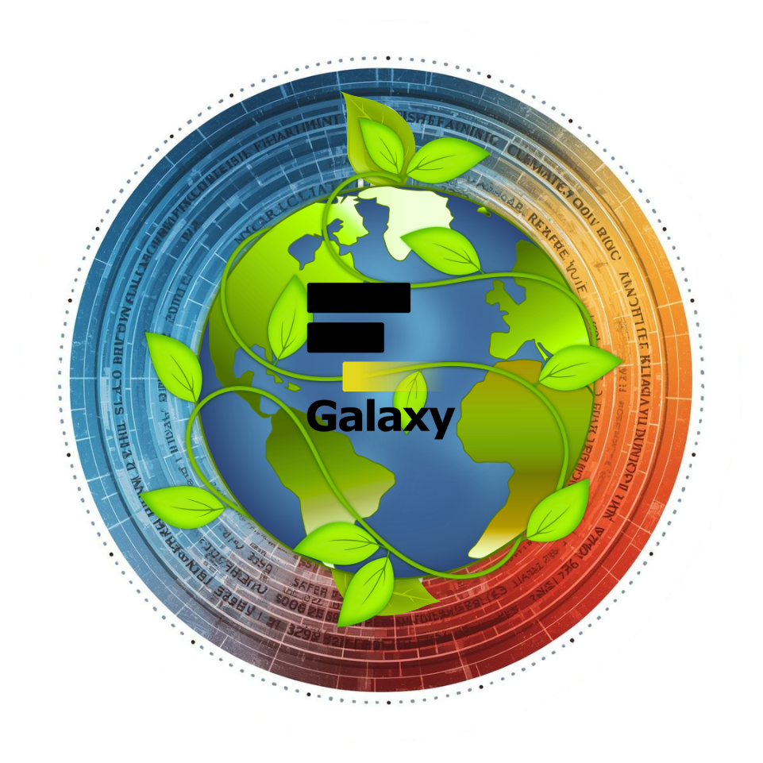

We’ve created a dedicated Matrix room to support discussions around Galaxy Ecology, climate, and Earth system science.

Instead of spreading conversations across multiple channels, we decided to bring our expertise together in one place.

The room is supported by:

- **Anne** – Climate

- **Yvan** – Ecology

- **Marie** – Earth system science

Together, we aim to help users and developers with questions, ideas, and challenges related to modeling, processes, and interdisciplinary topics.

If you work on climate, ecosystems, or Earth system interactions — or if you're just curious — feel free to join us.

Let’s connect our disciplines and work more efficiently, together. 

