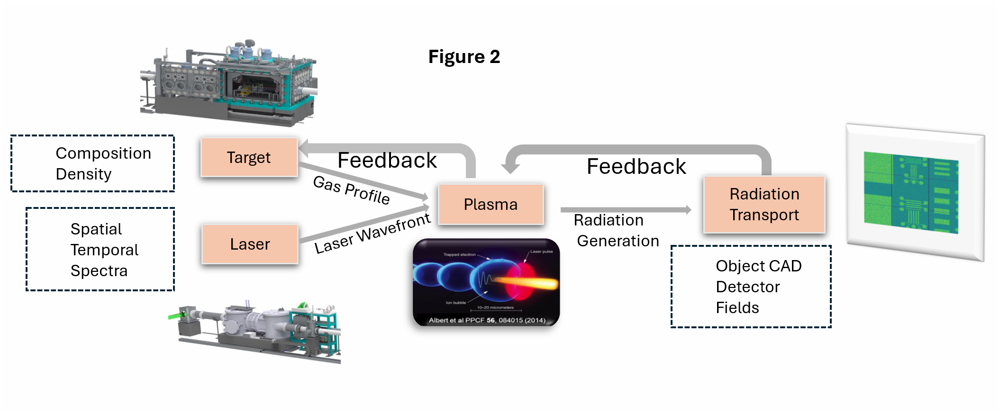

Subindev Devadasan¹, Leandro Liborio¹, Patrick Austin¹, Milan Kumar¹,Oli Finley², Adam Bennet², Archit Bhardwaj²,  Kirill Fedorov², Dan Symes², Chris Armstrong², Rajeev Pattathil²

*¹ Scientific Computing Department, Science and Technology Facilities Council, UK*

*² Central Laser Facility, Science and Technology Facilities Council, UK*

Members of the [Scientific Computing Department (SCD)](https://www.sc.stfc.ac.uk/) and the [Central Laser Facility (CLF)](https://www.clf.stfc.ac.uk), of the [Science and Technology Facilities Council (STFC)](https://www.ukri.org/councils/stfc/) in the United Kingdom, are working on the implementation and management of Galaxy workflows associated to large scale facilities experiments performed at the Harwell Science and Innovation Campus in the UK.  Specifically, workflows associated to the [Extreme Photonics Application Centre (EPAC)](https://www.clf.stfc.ac.uk/Pages/EPAC.aspx), which is a 10 Hz PW laser facility that can be used as a compact plasma accelerator. 

Figure 1 shows a schematic plot describing the Experimental Area 1 (EA1) at EPAC.  A high-intensity laser pulse enters EA1 and goes through an optical system, where its intensity and shape may be modified. The modified pulse is then directed towards a target gas chamber, where it interacts with a gas and rapidly ionises it, forming a plasma. From this plasma an ultra-relativistic electron beam can be accelerated, which can generate synchrotron-like radiation light -such as high-intensity X-rays-  that can be used to obtain, for instance, radiographic images of a sample. 

As it can be seen in Figure 1, the EPAC system comprises a workflow of interconected experimental processes.  We are working on the development of **vEPAC**: a start-to-end simulation system for the EPAC system. vEPAC will be used for the initial design and optimisation of experiments by determining the best operating conditions that meet specific user requirements, and also to manage the workflows resulting from the computational modelling of processes and the analysis of experimental data.  In particular, we are developing a set of Galaxy tools based upon the simulation tools used to model the four constituent experimental processes occurring during an EPAC experiment, namely:

a) A tool for determining the temporal, spatial and energy settings for the laser pulse;

b) A tool for determining the composition and density of the gas target;

c) A tool for modelling of the plasma production; and

d) A tool for modelling of radiation transport and its use for imaging the experimental sample
 
All of these tools will be connected and feedback loops will be used to adjust the whole process. Figure 2 shows a schematic view of the computational workflow associated with vEPAC.

Once connected, the end-to-end simulation system will have an associated Galaxy workflow. Figure 3 shows an schematic representation of this Galaxy workflow.

There, it can be seen the specific software tools that are being adapted for EPAC. Lasy will be used for modelling the laser pulse, CFD for modelling the gas, FBPIC for modelling the production of high-E beam and, finally, GEANT4 for modelling the production, transport and use of radiation.

We are building associated Galaxy tools for each one of these modelling tools, which we have connected in an associated Galaxy workflow that will be used for running the vEPAC simulation system.[^1]

We will soon also start developing a framework to train machine learning (ML)-based surrogate models of computationally slow particle-in-cell (PIC) simulations, which are run with the FBPIC software. These FBPIC simulations are part of vEPAC, and are computationally very expensive to run in the current setting. Hence, we plan to work on generating surrogate models based on the dataset produced by the FBPIC code, a high-fidelity PIC software tools for plasma interactions that uses parameters directly relevant to EPAC operations: laser energy, focal spot position, gas pressure, and pulse length.

---
[^1]: "Managing materials science workflows with Galaxy at STFC", L. Liborio et. al., Galaxy Community Conference 2025, <https://gbcc2025.bioconductor.org/program/scientific_program/>

