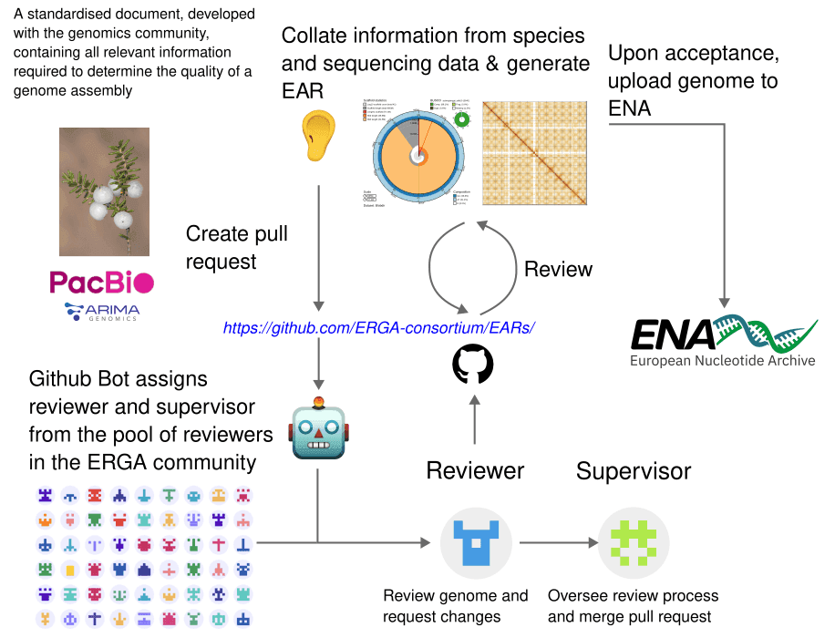

# **The ERGA EAR Bot**

The EAR bot is a [GitHub-based](https://github.com/apps/erga-ear-bot) automation tool developed to streamline the review process for ERGA assembly reports generated through the ERGA Assembly Report [(EAR)](https://usegalaxy.eu/root?tool_id=make_ear) tool. Given the substantial volume of assembly reports generated within the project, there was an imperative need to automate the review process to minimize manual intervention and reduce technical dependencies. This necessitated the development of a GitHub Bot, designed to streamline the review process by automating manual tasks, thereby reducing technical dependencies. The implementation of this bot facilitates a more efficient, consistent, and FAIR (Findable, Accessible, Interoperable, and Reusable) approach to reviewing assembly reports.

The EAR bot is designed as a GitHub App to offer advanced repository access and customization capabilities, featuring a distinct name and logo for improved integration and user recognition. Unlike standard GitHub Actions, which have limited functionality, the GitHub App provides granular control over permissions, enabling capabilities such as reading and modifying pull requests, assigning reviewers, updating tracking files, and interacting with comments. This architecture ensures seamless automation while preserving security and adaptability.

The EAR bot operates on two core components: *GitHub Action workflows* configured using YAML and *a centralized Python script*. These elements form the architecture of the EAR bot, enabling it to streamline the FAIR review process for assembly reports. GitHub Action workflows assist in automating software development tasks by orchestrating customizable pipelines for building, testing and deploying code. They seamlessly integrate with the GitHub repository, allowing developers to trigger actions based on pull request events —such as when a Pull request (PR) is opened, updated, or commented on—as well as by scheduled tasks. Once activated, they automatically validate pull requests, assign supervisors and reviewers based on pre-defined criteria, process user comments, monitor PR events, and update tracking files. This automation significantly reduces manual intervention, ensuring timely and error-minimized review. The bot enhances efficiency, ensures consistency, and allows experts to prioritize critical evaluations over repetitive tasks, resulting in a faster, more reliable, and transparent review process.

    

**<h2>GitHub Action Workflows</h2>**

The EAR Bot simplifies and automates the review process for assembly reports using six well-defined workflows, all hosted in the [ERGA EARs GitHub repository](https://github.com/ERGA-consortium/EARs/tree/main/.github/workflows). Each workflow follows a unified structure: generating an authentication token, checking out the repository, setting up Python (v3.10), and executing a central Python script to manage review tasks. 

**1) New PR Handling: Find a supervisor & add label**

Triggered by a new EAR submission, this workflow applies a project label, identifies a supervisor using internal criteria, and validates the PR. It ensures only one file is modified, the change is a new EAR, and the PR body follows the required template. If issues arise, it reports an error and terminates.

**2+4) Reviewer Assignment: Triggered by Comments**

When a supervisor approves a PR with an "OK" comment, the bot assigns a reviewer using an internal selection script. It updates the reviewers_list.csv, marking reviewers as busy. If the reviewer responds with "Yes," the bot confirms the assignment and resets declined reviewers to "not busy." If "No," it moves to the next reviewer.

**3) Reviewer Escalation: Handling non-responses**

If a reviewer doesn’t respond within 100 hours, the bot escalates to the next reviewer. If all reviewers decline, it notifies the supervisor for manual assignment. It also monitors PR inactivity, alerting the supervisor if no updates occur within 7 days.

**5) PR Approval: Acknowledging reviewers**

Once a PR is approved, the bot thanks the reviewer and notifies the supervisor.

**6) PR Merge/Closure: Finalizing the process**

When a PR is merged, the bot updates reviewer statuses, adjusts review counts, and records merge details in reviewers_list.csv. If closed without merging, it flags the PR and alerts the supervisor.

**<h2>How the App works</h2>**

Modular scripts are the backbone of automated review systems, seamlessly integrating with platforms like GitHub Actions to ensure smooth, fair, and transparent processes. Here’s how they work:

**1. Smart reviewer selection**

The script automates reviewer assignments based on availability, workload balance, and institutional diversity. It prioritizes active reviewers, avoids conflicts of interest, and balances workloads by favoring first-time reviewers. This eliminates bottlenecks and ensures fairness.

**2. Comment & Approval management**

It handles comments and approvals, updating reviewer statuses in real-time and logging actions for accurate tracking. This ensures transparency and accountability throughout the review cycle.

**3. Merge & Finalization**

Once a review is complete, the script updates records, adjusts review points, and sends notifications. It also converts complex documents like PDFs into structured YAML files for easier processing, keeping workloads and histories up-to-date.

An example of ERGA EAR Bot in action can be found [here.](github.com/ERGA-consortium/EARs/pull/85) 

For the ERGA-BGE project, the EAR bot has streamlined Assembly Report reviews by automating reviewer assignments, tracking responses, and updating statuses. This has accelerated the process, reduced errors, and ensured fairness, enabling experts to focus on critical evaluation. By managing repetitive tasks, the bot has enhanced efficiency, reliability, and scalability in genome assembly reviews.

