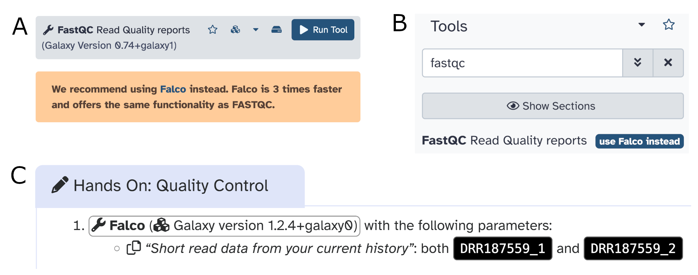

Galaxy instances accumulate history. That is a strength, but it also creates a familiar problem: 
Some tools remain scientifically valid and still need to run for old workflows to enable 
reproducibility, while newer alternatives are often faster, have better defaults or are easier to 
use. Removing the older tool outright risks breaking reproducibility. Leaving it untouched means 
users keep selecting them out of habit.

One practical answer is a soft deprecation layer in the Galaxy tool form itself.

Galaxy already supports site-specific UI extensions through [webhooks](https://docs.galaxyproject.org/en/master/admin/webhooks.html). The same pattern can be used to add a contextual information to 
specific tools. When a user opens an older (still functional tool) Galaxy can display a short 
notice explaining that the tool is retained for compatibility, why it is no longer the preferred 
choice, and which replacement should be used instead.

We want to: preserve execution, but improve defaults.

The `FastQC` to `Falco` transition on the European Galaxy server is a good example. `FastQC` has 
been executed more than two million times over the years and is still deeply embedded in many 
sequencing workflows. But `Falco`, published in 2021 as a reimplementation of `FastQC`, is roughly 
three times more efficient. When `Falco` first appeared on the European Galaxy server in June 2024, 
uptake was limited. Starting in September 2024, we began nudging users more actively. In 
the `FastQC` interface, in search results, and in training materials. The result was `Falco` reached 158,748 runs, about 29% of `FastQC`'s 546,369 runs in the same time window.

These images show the three intervention points together: a notice inside the old tool form, a hint in search results, and updated training content that is using the more efficient tool.

With a webhook-backed tool-form extension, the message can be simple and local to the instance:

- This tool is still available for compatibility and reuse
- This tool is no longer the recommended default for new analyses
- We recomment a replacement
- Here is why the replacement is better: faster runtime, lower resource use, better maintenance status, or improved interoperability
- Here is a direct link to open the alternative tool or the relevant training material

This approach is intentionally lightweight. It does not require to fork tools, remove wrappers, or 
invalidate existing workflows. It allows each Galaxy server to maintain a small registry of additional tool annotation mappings and display them only where they matter.

Soft deprecation helps us reduce wasted CPU time, memory, and 
job queueing time without forcing abrupt migrations. It also creates a transparent path for 
community tool curation. A tool can continue to exist for provenance and backward compatibility, while the interface tells users clearly that the community has moved on.

`FastQC` and `Falco` show why this matters. Many users were not looking for a new quality-control 
tool, they were simply opening the tool they already knew and that is cited in throusands of 
papers. A small information banner changed that behaviour. Extending the tool form with 
webhook-driven deprecation notices gives Galaxy administrators a practical way to repeat that 
success for other pairs of tools, whether the motivation is performance, sustainability, 
maintenance, or a better user experience.
