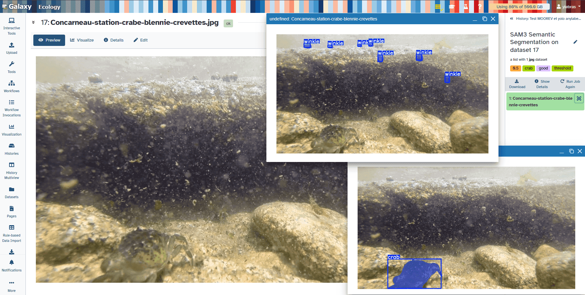
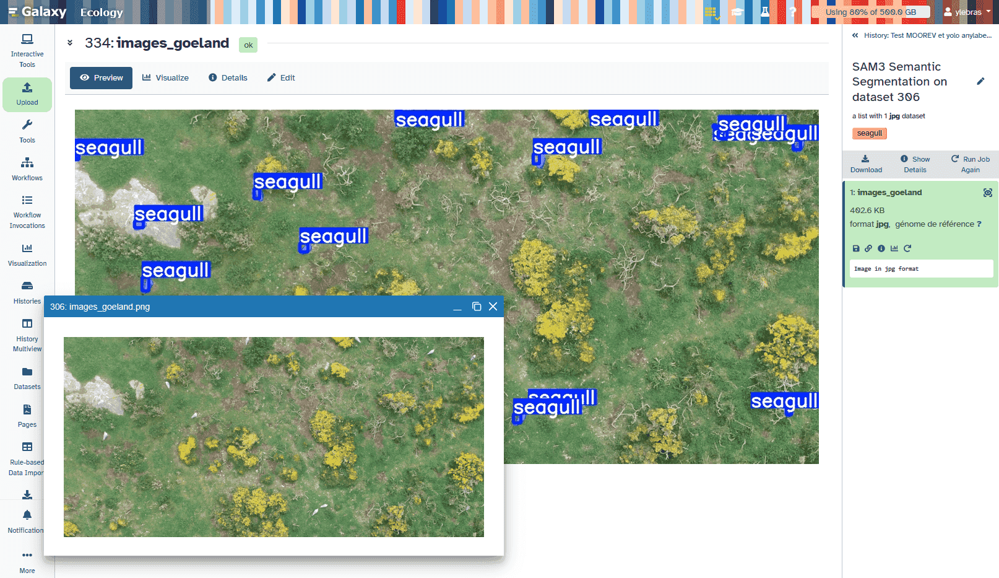
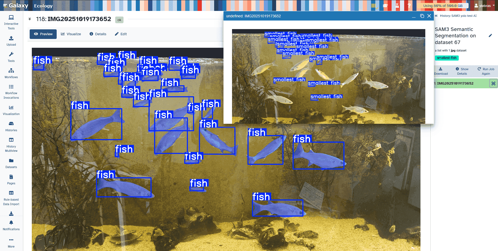

Since 2025, Galaxy Ecology team is notably working on marine images annotation and analysis through the MOOREV citizen science project. Thanks to existing Galaxy materials (tools, workflows and training) created by communities as Imaging one and strong support of usegalaxy.eu team, we were able to not start from scratch to meet the MOOREV objectives through a dedicated funding who allows to produce new materials for Galaxy communities. 

## MOOREV: Observing marine species interactions in response to microclimatic gradients on the local foreshore

The MOOREV project, led by Nadine Le Bris, Sorbonne Université, station marine de Concarneau, France, was launched in 2022 to improve and promote understanding of the effects of climate disturbances on the seashore and its biodiversity. The citizen science approach involves local stakeholders across the education and research communities. It aims at acquiring and transmitting knowledge about the role of microclimates to which marine species are exposed. Developed in partnership between researchers and environmental education professionals, it is co-constructed with classes and teachers, using the shoreline as a natural laboratory.

MOOREV's approach is based on the implementation of underwater imagery methods to study benthic species at the individual scale over the mosaics of the shore habitats. Using citizen science methods, repeated visits are done on schools' field sites such as some labelled by the Marine Educative Areas program of the French Office of Biodiversity to address changes over tidal cycles, seasons and multiple years.

Data sharing and processing support student numerical trainings from a broad range of scientific cursus, on one side, and outreach, on the other side. The objective is to better understand and make people understand and concerned by the role of species interactions in assessing vulnerability to climatic threats at the local scale. Ultimately, it aims at supporting the implementation of protection and conservation measures by taking into account the interaction of climate change and the ocean socio-ecosystems.

## And Galaxy on that?

Thanks to previous tests using Galaxy in 2023 and 2024, it appears of first interest for MOOREV to rely on an existing platform to share data, tools and workflows so reuseability will be enhanced and service provided for long term. Here Galaxy and notably european Galaxy instance was identified as a relevant solution as MOOREV data processing services entry, and Galaxy Ecology a community of interest to support tool development and update for the long term.

That's where was starting a strong collaboration between MOOREV team, Galaxy Ecology team and european Galaxy team in october 2025, with a dedicated human resource, wonder Arthur Barreau, the famous Galaxy Jupytool expert ;)

## What was done

### You Only Look Once

Many YOLO (You Only Look Once) oriented Galaxy tools are existing thanks to the amazing work of the Galaxy Imaging community! As it was something of interest for MOOREV, we decided to propose some updates to notably have the possibility to use several classes in annotation file and let the user provide its own yolo based model to the tool. These improvements are now implemented in the related [YOLO Training](https://ecology.usegalaxy.eu/?tool_id=toolshed.g2.bx.psu.edu%2Frepos%2Fbgruening%2Fyolo_training%2Fyolo_training%2F8.3.0%2Bgalaxy5&version=latest) and [YOLO predict](https://ecology.usegalaxy.eu/?tool_id=toolshed.g2.bx.psu.edu%2Frepos%2Fbgruening%2Fyolo_predict%2Fyolo_predict%2F8.3.0%2Bgalaxy5&version=latest) tools. These tools are compatible for YOLO v8 and YOLO v11 versions.

### Segment Anything Model 3
Segment Anything Model 3, SAM3, is a model created by Meta and allowing to identify, segment or track features on images or videos, notably using a prompt. SAM3 is an amazing recent evolution of the SAM2 model already proposed to Galaxy Europe users through "AnyLabeling" interactive tool. The idea of creating a SAM3 dedicated tool came after several tests of AnyLabeling, looking at SAM3 capabilities compare to SAM2 and comparing with MOOREV project needs. The better performance is something important, but the major added value is that we can use a prompt to specify features of interest, opening a new door to really start to identify / segment or track anything with concept-level understanding.

With [SAM3 Galaxy tool](https://ecology.usegalaxy.eu/root?tool_id=toolshed.g2.bx.psu.edu/repos/ecology/sam3_semantic_segmentation/sam3_semantic_segmentation/1.0.0+galaxy0) user can provide pictures or video (even gif) and ask to identify / segment / track features described thanks to a prompt. As an example, we tested it on several biodiversity oriented images as shown below.

We thus can identify crabs or winkles on picture coming from a MOOREV site on the shore at Concarneau, Brittany, France. Even if the picture is blurred, it is working quite well. Unfortunately, SAM3 doesn't seems to find the shrimp ;)

We also can identify seagull from aerial drone pictures. It is interesting to see that searching for "bird" is identifying same features, but searching "swallow" or others bird species didn't work. Here it is illustrating the specificity and precision the model can have.

. 

We also tested on Yvan's aquarium ;) to identify fish, mullet species seems to be unknown from SAM3 model, how can this be possible !!!. Here we see the interest of the concept-level understanding rerunning the tool with another prompt searching "smallest fish".

### References
- MOOREV website: https://moorev.fr/
- Galaxy Ecology article: Royaux et al. (2025) Guidance framework to apply best practices in ecological data analysis: lessons learned from building Galaxy-Ecology. GigaScience, Volume 14, 2025, giae122, https://doi.org/10.1093/gigascience/giae122
- Galaxy-E tools and workflows: https://github.com/galaxyecology/tools-ecology
- Galaxy-E tutorials:
    - Code https://github.com/galaxyproject/training-material/tree/master/topics/ecology
    - Website https://galaxyproject.github.io/training-material/topics/ecology/
- European Galaxy instance for Ecology: https://ecology.usegalaxy.eu/
