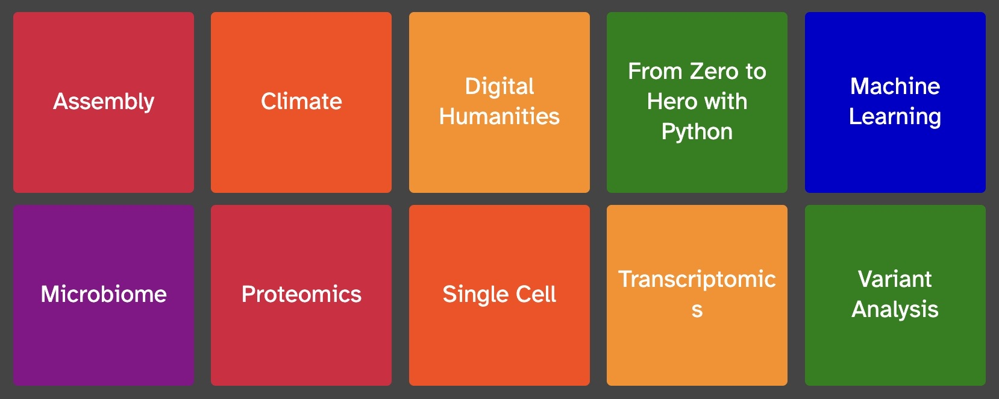
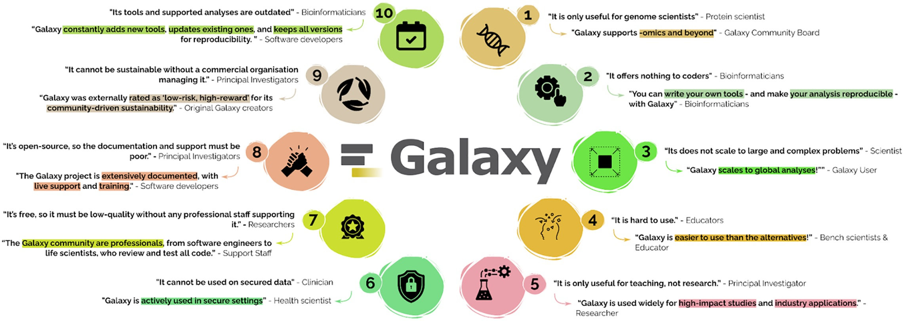
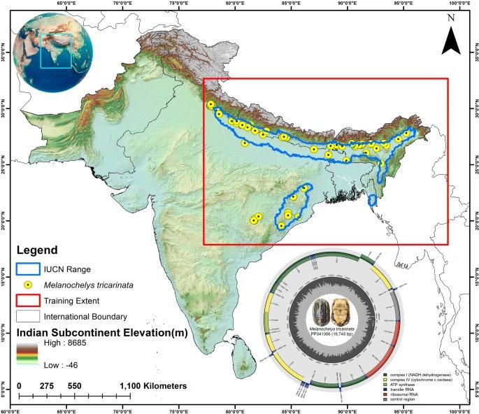
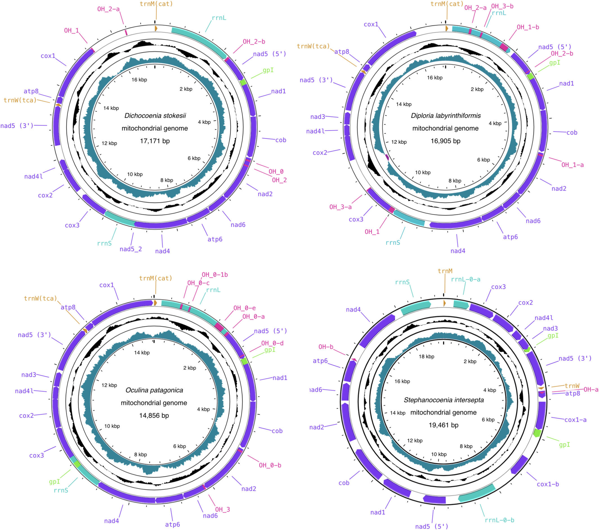
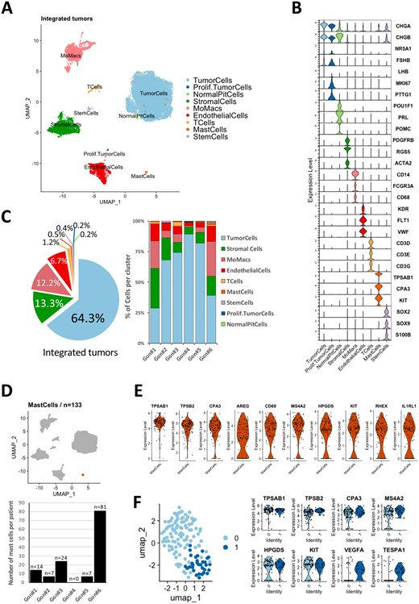

  

March 2026

Hello Galaxy Community,

We hope your year is off to a great start! The Galaxy community continues to grow and innovate, and this first newsletter of 2026 brings several exciting updates from across the ecosystem. In this issue, we highlight the upcoming Galaxy Training Academy 2026, share details about the Galaxy Community Conference (GCC2026) taking place this June in Clermont-Ferrand, France, and spotlight a new publication addressing ten common misconceptions about Galaxy.

We also feature several recent studies in our Galaxy in Research section that demonstrate the wide range of scientific questions being explored with Galaxy. As always, we’ve included a list of upcoming events where you can connect with the community, learn new skills, and stay involved with the latest developments in Galaxy.  

---

# Galaxy Training Academy 2026

Registration is now open for the Galaxy Training Academy (GTA) 2026, taking place May 18–22, 2026. This week-long online event brings together researchers, educators, and developers from around the world for hands-on learning with Galaxy.

The GTA combines self-paced tutorials with live support from trainers and community members across time zones, creating a collaborative environment where participants can explore new analysis techniques and ask questions in real time.

This year’s training topics include:

All sessions are based on tutorials from the Galaxy Training Network (GTN), a community-driven collection of openly accessible training materials designed to make advanced computational analysis more approachable for researchers at all experience levels.

Whether you're new to Galaxy or looking to expand your skills, the GTA is a great opportunity to learn new workflows and connect with the global Galaxy community!

[**Learn more and register!**](https://training.galaxyproject.org/training-material/events/2026-05-18-galaxy-academy.html)  

---

# Galaxy Community Conference 2026

The **Galaxy Community Conference 2026 (GCC2026) will take place June 22–24, 2026, in Clermont-Ferrand, France**, bringing together the global Galaxy community for three days of talks, discussions, and collaboration. GCC is the largest annual gathering of Galaxy users, developers, educators, and researchers working with data-intensive science.  
The conference highlights new developments across the Galaxy ecosystem and provides opportunities to connect with the community, share research, and explore new tools and workflows.

GCC2026 will feature:

* Scientific talks from Galaxy users and developers  
* Workshops and training sessions  
* Poster presentations  
* Community discussions and networking  
* Updates on Galaxy tools, infrastructure, and projects

Following the conference, **CollaborationFest (CoFest) will take place June 25–26**, offering a collaborative space for the community to work together on code, documentation, training materials, and other Galaxy initiatives.

Whether you are a long-time Galaxy contributor or new to the platform, GCC is a great opportunity to meet the community and learn about the latest developments in Galaxy.

[**Learn more and register!**](https://galaxyproject.org/events/gcc-2026/)  

---

# New Publication: Ten common misconceptions about Galaxy (and why they are wrong!)

A new paper titled “[Ten Common Misconceptions About Galaxy (and why they are wrong!)](https://journals.plos.org/ploscompbiol/article?id=10.1371/journal.pcbi.1013869)” was recently published in *PLOS Computational Biology*. The article addresses persistent myths about the Galaxy platform and highlights how the project has evolved into a powerful and versatile environment for modern data analysis.

Despite Galaxy’s widespread adoption, misconceptions persist. For example, common misconceptions include: Galaxy is only useful for genomics, cannot scale to large analyses, or is mainly designed for teaching rather than research. This paper tackles those assumptions directly, presenting evidence from real-world use cases, infrastructure, and community practices that demonstrate Galaxy’s scalability, flexibility, and impact across disciplines.

Some of the misconceptions discussed include:

* Galaxy is only useful for genome scientists  
* Galaxy does not scale to large datasets  
* Galaxy is only for teaching  
* Galaxy is unsuitable for developers or advanced users  
* Galaxy cannot support secure or industry applications

The paper shows that Galaxy supports a wide range of scientific domains, scales to massive datasets, and is actively used in research, education, clinical settings, and industry.

Whether you are new to Galaxy or a long-time user, this article provides a helpful overview of what the platform can really do and why it continues to grow as a global, community-driven research infrastructure.  

---

# Galaxy in Research

The Galaxy in Research section highlights recent publications that demonstrate how Galaxy is being used to advance science across disciplines. From foundational genomics to applied conservation and human health, these studies reflect Galaxy’s role in enabling open, reproducible research.

## [**Lineages to landscapes: mitogenomic insights and climate refugia informing proactive conservation of the endangered Tricarinate Hill Turtle (*Melanochelys tricarinata*) in the Indian subcontinent**](https://www.nature.com/articles/s41598-025-26890-5)

*Abedin et al., Scientific Reports, 2025*

Researchers sequenced and analyzed the complete mitochondrial genome of the endangered three-keeled land turtle (*Melanochelys tricarinata*) to better understand its evolutionary history and conservation needs. Using high-throughput sequencing, the team assembled a 16,745 bp mitochondrial genome containing the standard 37 mitochondrial genes, and used comparative phylogenetic analyses to clarify the species’ placement within the broader turtle lineage. The study also incorporated species distribution modeling to examine how climate change may impact habitat suitability, with results suggesting substantial future habitat loss and fragmentation for the species.

*(Abedin et al., 2025)*

These findings provide an important genomic resource for a threatened reptile while helping inform conservation strategies for freshwater turtles facing climate and habitat pressures. Galaxy supported key parts of the genomic analysis, including mitochondrial gene annotation validation using the MITOS tool and additional analyses, such as tRNA structure prediction, performed on the Galaxy platform.

## [**Genomic Resources for Imperiled Caribbean Reef-Forming Corals (Hexacorallia: Scleractinia): Complete Mitochondrial Genomes of *Dichocoenia stokesii, Diploria labyrinthiformis, Oculina patagonica, and Stephanocoenia intersepta***](https://onlinelibrary.wiley.com/doi/10.1002/ece3.72967)

*Zabransky et al., Ecology and Evolution, 2026*

In this study, researchers developed new genomic resources for several imperiled Caribbean reef-building corals, including *Dichocoenia stokesii* and related species, to support conservation and evolutionary research. By sequencing and assembling complete mitochondrial genomes, the team characterized gene content, genome structure, and phylogenetic relationships among coral taxa. These genomic data help clarify evolutionary relationships within reef-forming corals and provide important reference sequences for future studies of coral genetics, biodiversity, and reef resilience.

*(Zabransky et al., 2026)*

These resources are especially valuable as Caribbean coral reefs face growing pressures from climate change and other environmental stressors. Galaxy contributed directly to the analysis workflow, with mitochondrial genome annotation performed using MITOS2 in Galaxy EU and tRNA secondary structure prediction performed using Galaxy-based tools.

## [**Mast cells act as pro-angiogenic and pro-tumorigenic players in pituitary gonadotroph tumors**](https://academic.oup.com/neuro-oncology/article/28/1/175/8287636?login=false)

*Ilie et al., Neuro-Oncology, 2025*

In this study, researchers investigated the role of mast cells in pituitary gonadotroph tumors, focusing on their contributions to tumor growth and vascularization. Using single-cell and spatial transcriptomics, along with histological analysis and mouse experiments, the team identified mast cells in the tumor microenvironment and found that they were associated with increased microvessel density, thicker vessel walls, and faster tumor recurrence. Depleting mast cells in a mouse model reduced tumor growth, increased apoptosis, and disrupted tumor vascularization.

*(Ilie et al., 2025)*

These findings provide new insight into the cellular interactions driving pituitary tumor progression and highlight mast cells as potential therapeutic targets. Galaxy supported part of the transcriptomics workflow, with public single-cell sequencing data processed through STARsolo on usegalaxy.eu, helping the authors integrate normal pituitary and tumor datasets for their analysis.

---

# Upcoming Events

| Date | Event | Venue / Location |
| ----- | ----- | ----- |
| 03–08 May 2026 | [European Geosciences Union (EGU)](https://galaxyproject.org/events/2025-12-09-egu2026/) | Vienna, Austria |
| 05–09 May 2026 | [Biology of Genomes](https://meetings.cshl.edu/meetings.aspx?meet=GENOME&year=26) | Cold Spring Harbor, NY, USA |
| 08 May 2026 | [Enter the Galaxy: How to leverage the open source platform Galaxy for the Digital Humanities and Social Sciences](https://galaxyproject.org/events/2026-05-08-dhxpresso/) | Online |
| 18–22 May 2026 | [Galaxy Training Academy](https://training.galaxyproject.org/training-material/news/2025/09/12/gta-orga-2026.html) | Online |
| 15–19 June 2026 | [Data science for life scientists – hands-on machine learning for biological data](https://www.ebi.ac.uk/training/events/data-science-for-life-scientists-2026/?utm_source=Galaxy+Event+Horizon&utm_medium=calendar_listing&utm_campaign=DAT26#vf-tabs__section--tab1) | European Bioinformatics Institute, Hinxton, UK |
| 22–24 June 2026 | [2026 Galaxy Community Conference](https://galaxyproject.org/events/gcc2026/) | Clermont-Ferrand, France |
| 25–26 June 2026 | [CoFest 2026](https://galaxyproject.org/events/gcc2026/) | Clermont-Ferrand, France |
| 12–16 July 2026 | [Intelligent Systems for Molecular Biology](https://www.iscb.org/ismb2026/home) | Washington, DC, USA |
| 11 October 2026 | [ASM Conference on Rapid Applied Microbial NGS and Bioinformatic Pipelines](https://galaxyproject.org/events/2026-10-11-asm-ngs-conference/) | Washington, DC, USA |
| 12–16 October 2026 | [Galaxy Beyond Basics: Mastering Workflows, Automation, and Scalability](https://training.galaxyproject.org/training-material/events/2026-10-12-Advanced-Galaxy-Training.html) | Paris, France |
| 4–7 November 2026 | [Biological Data Science](https://meetings.cshl.edu/meetings.aspx?meet=DATA) | Cold Spring Harbor, NY, USA |

---

*Thank you for being a part of the Galaxy Community!* 

**Stay updated with the latest news by following us on [Mastodon](https://mastodon.social/@galaxyproject@mstdn.science), [Bluesky](https://bsky.app/profile/galaxyproject.bsky.social), and [LinkedIn](https://www.linkedin.com/company/galaxy-project)!**

