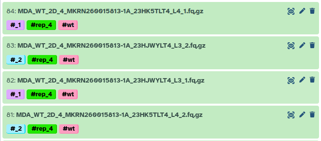
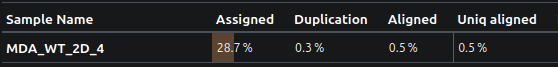
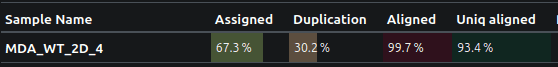

---
subsites:
- all
date: '2026-04-20'
title: How using collections saved my data
tags: []
tease: "Why you should ask help from the Galaxy experts"
contributions:
  authorship:
    - Nilchia
  funding:
    - uni-freiburg
    - deNBI
---

Hi,

Let me tell you a story about how a simple easy manual step almost ruined my data analysis, and how Galaxy collections came in to save the day (and my sanity).

Last week, I finally got my RNA sequencing data back from the sequencing facility. I was super excited to see how it looked, so I instantly uploaded everything to my Galaxy account. The data was paired-end, meaning each read had sequences from both the forward and reverse strands. To ensure high quality, the sequencing facility used a separate-lane strategy, meaning some of my samples were split across several sequencing lanes.

 

For example, here replicate 4 was sequenced on both lane 3 and 4.

 

This meant I needed to concatenate those FASTQ files from multiple lanes into single forward and reverse fastq files for each sample.

I used the [Concatenate datasets tail-to-head (cat)](https://usegalaxy.eu/?tool_id=toolshed.g2.bx.psu.edu%2Frepos%2Fbgruening%2Ftext_processing%2Ftp_cat%2F9.5%2Bgalaxy3&version=latest) tool to merge them. I simply dragged and dropped my fastq files, crossed my fingers, and clicked run. To be honest, it was pretty tedious. I had 188 fastq files to run through it, manually making sure I was selecting the correct replicates and conditions.

Next, I started the RNAseq IWC pipeline to analyze my data. Everything ran smoothly, but when I checked the QC plots... my heart stopped beating. Something was very wrong.

 

Bad QC result

 

As you can see, less than 30% of the reads were assigned to a gene, and a low **0.5%** actually aligned!

I couldn't believe it. The quality and depth of the sequencing data had looked perfect. Did I accidentally align to the wrong genome? Mix up mouse and human? But even then, the alignment rate should have been higher than 0.5%.

Desperate, I reached out to the Galaxy experts. I asked @gtn:pavanvidem to help me play detective. He kindly agreed, and we started digging. Why was the alignment rate so low? Why did some samples have >90% alignment while others struggled to hit 1%? Did the [fastp](https://usegalaxy.eu/?tool_id=toolshed.g2.bx.psu.edu%2Frepos%2Fiuc%2Ffastp%2Ffastp%2F1.2.0%2Bgalaxy0&version=latest) tool somehow aggressively trim away all my reads? Was there a bug in the forward/reverse pair assignment during alignment? Did the facility send me garbage data?

We went into full debugging mode. We ran mapping on the raw data, then on the fastp output, and even tried swapping the forward and reverse order. Nothing worked. Then Pavan suggested a wild idea: map the forward and reverse reads strictly separately.

Tada! **95.5% mapped!** How could this be? Did the facility mess up the forward and reverse assignment? That would be incredibly rare.

We decided to inspect those 0.5% mapped BAM files in IGV, and we noticed something totally odd: the insert sizes were wildly huge, with massive positive and negative numbers. It almost looked as if the genome itself had been shuffled. But what if the *data* was shuffled? We checked the IDs of the forward and reverse mapped reads, and they weren't the same.

You probably see where this is going! At the very beginning, during my tedious manual drag-and-drop concatenation session, I had accidentally messed up the order. For one sample, I concatenated lane 3 then 4 for the forward reads, but lane 4 then 3 for the reverse reads. The pairs were completely messed-up!

I *could* have just restarted the analysis and been super careful with the concatenation this time. But we knew there had to be a smarter, automated approach. The solution was to use **Collections** to handle the concatenation, so I could stop worrying about accidentally mixing things up. The only annoying part was that my data setup was a bit messy, it had forward/reverse pairs, and each piece was split across multiple lanes.

We pinged @gtn:wm75 for help creating a nested collection (a list within a list). As it turns out, the task is actually quite easy... well, if you know how the collection tools work! :P

This is roughly what I did:
1. Select all input fastq files.
2. Go to advanced Build list.
3. Select `Rule Builder`.
4. Using RegEx, create 3 columns: sample name, lane number, and for/rev.
5. Sort the file names alphabetically.
6. Assign sample name to the first layer, for/rev to the second layer, and lane number to the third layer.
7. Click `Build`.

Boom! Now I had a nested collection where each sample was an element. Inside each sample, there were two elements (forward and reverse), and inside *those* were the multiple lane files.

Next, I ran the concatenate tool again, but this time I just fed it the nested collection. It seamlessly generated a new collection containing my samples with perfectly concatenated forward and reverse files. A quick conversion to a paired collection, and I was back in business.

The result?

 

Just look how beautifully this data is mapped to the genome!

 

The take-home message?
1. **First, doing all that file wrangling by hand? Bad idea.** It’s way too easy to mess something up without noticing.
2. **Use Collections!** They look a bit confusing at first, but they save so much time (and stress).
3. **When in doubt, ask the Galaxy community.** They love a good mystery! and they’ve probably seen worse :P

Long live FAIR (Findable, Accessible, Interoperable, and Reusable) data analysis principles! 🚀