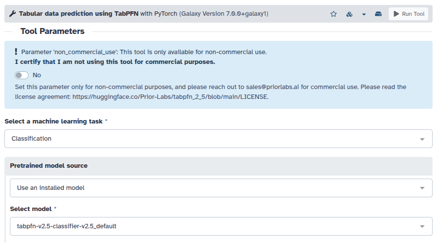
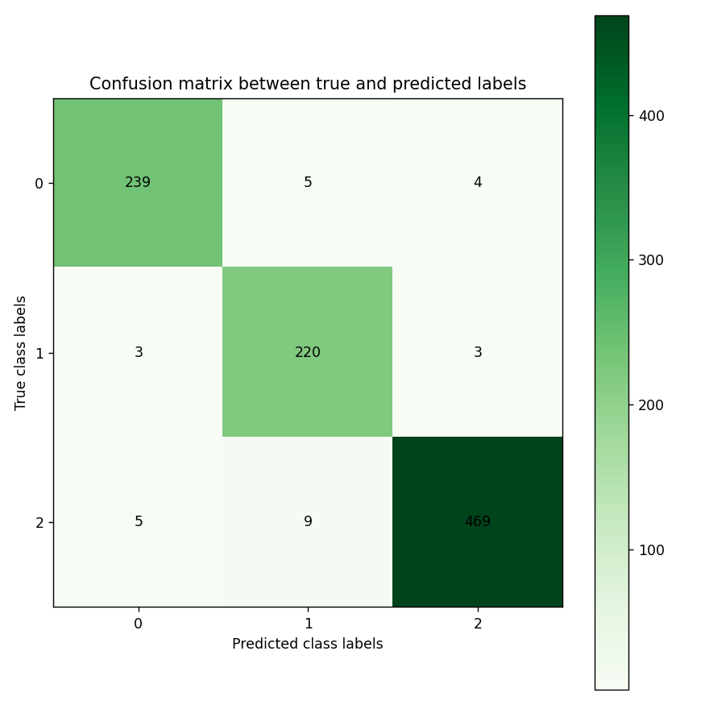
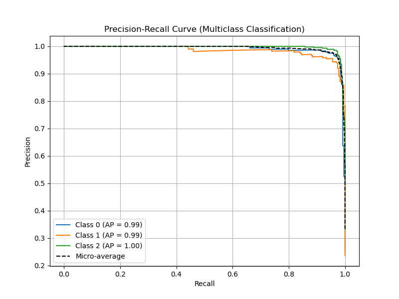
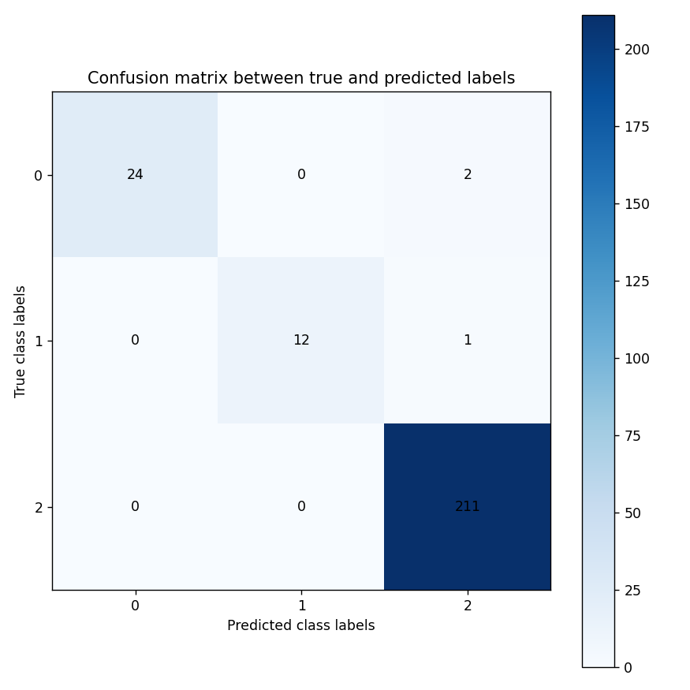
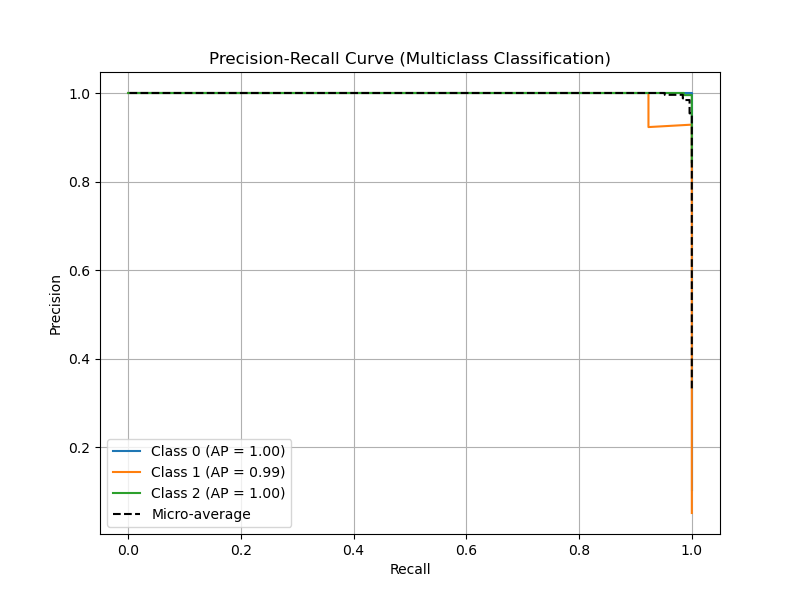

---
subsites:
- all
date: '2026-04-28'
title: Classification of biomedical datasets by TabPFN
tags: [tools, workflows]
tease: "Classification of biomedical datasets by TabPFN"
contributions:
  authorship:
    - anuprulez
  funding:
    - uni-freiburg
    - deNBI
---

## New version of TabPFN (v2_5) on Galaxy server

A newer version of [TabPFN](https://doi.org/10.1038/s41586-024-08328-6) tool (v7.0) using recent models (v2_5) has been integrated into the [European Galaxy server](https://usegalaxy.eu/). The choice of pre-trained TabPFN models (for both, classification and regression) can be directly selected from the "Select model" dropdown. Just choose the machine learning task, a model and your training/test dataset to achieve accelerated performance.

**Note**: The TabPFN models are under a non-commercial license and should be used for non-commercial purposes only. For commercial purposes, please contact sales@priorlabs.ai.

The following two use-cases of classification on biomedical datasets showcase the usage of TabPFN on the European Galaxy server.

### Splice-junction Gene Sequences

Understanding how genes are translated into proteins requires more than just reading DNA sequences—it involves recognizing how cells edit those sequences before use. In higher organisms, this editing process, known as RNA splicing, removes non-coding regions called introns and joins together coding regions called exons. The key challenge tackled in this dataset is identifying the precise points where this cutting and stitching occurs, known as splice junctions. Specifically, the task focuses on detecting exon–intron (EI) boundaries, also called donor sites, and intron–exon (IE) boundaries, known as acceptor sites. Accurately predicting these boundaries from raw DNA sequences is crucial for understanding gene structure and function, and it has become a classic problem in computational biology and machine learning.

To evaluate how well different machine learning approaches handle this problem, researchers created a dataset of DNA sequences and tested several algorithms using ten-fold cross-validation on a subset of 1,000 examples drawn from a larger pool of 3,190. Among the models tested was KBANN, a hybrid learning system designed to refine existing biological knowledge using data-driven insights. The results revealed varying error rates across algorithms, highlighting both the complexity of the task and the importance of incorporating prior knowledge into learning systems. This dataset remains a valuable benchmark for exploring how machine learning can bridge the gap between raw biological data and meaningful scientific interpretation.

To evaluate TabPFN on this high-quality benchmark dataset, [DNA_sequence_classification_TabPFN](https://usegalaxy.eu/published/workflow?id=6b7ad97c010ca356) workflow is created that preprocesses the DNA sequences to encode them into 3-mers, splits them into train and test sets, perform training to map features with labels and lastly do model evaluation using visualisation methods such as precision-recall curve and confusion matrix.

#### Workflow

This [workflow](https://usegalaxy.eu/published/workflow?id=6b7ad97c010ca356) outlines a DNA sequence classification pipeline built to distinguish between different types of splice junctions using machine learning. It begins with preprocessing steps that prepare raw DNA sequences into a structured format suitable for analysis, followed by feature handling tailored to sequence data. The core of the workflow applies a TabPFN-based model, which is designed to perform efficient probabilistic classification, even with relatively small datasets.

By integrating preprocessing and model inference into a single pipeline, the workflow streamlines the process from raw biological data to predictive insights. It is particularly useful for tasks like identifying exon–intron and intron–exon boundaries, demonstrating how modern automated workflows can simplify complex bioinformatics analyses while maintaining strong predictive performance. The workflow achieves high accuracy on DNA sequence classification task across 3 classes

### Diabetes dataset

Diabetes is a widespread disease with abundant data but serious complications, highlighting the need for more accurate diagnostic approaches. This dataset was collected from Iraqi patients at Medical City Hospital and Al-Kindy Teaching Hospital using real clinical records. It contains key medical and laboratory features such as age, gender, blood sugar level, BMI, creatinine, urea, cholesterol, lipid profile, and HbA1c. The target variable classifies patients into diabetic, non-diabetic, or pre-diabetic categories, making it suitable for building predictive models.

From the dataset table, each row represents an individual patient, while the columns correspond to different clinical measurements and attributes. Variables like blood sugar and HbA1c are strong indicators of glucose control, while BMI and cholesterol-related features help assess overall metabolic health. Kidney function markers such as creatinine and urea provide additional clinical context. Together, these features allow for identifying patterns and relationships between health indicators and diabetes status, supporting data 
analysis, classification tasks, and early diagnosis efforts.

To evaluate TabPFN on this high-quality Diabetes dataset, [Diabetes_detection_TabPFN](https://usegalaxy.eu/u/kumara/w/diabetes-detection-using-tabpfn) workflow is created that preprocesses the features such encoding gender into their numerical representation, splits them into train and test sets, perform training to map features with labels and lastly do model evaluation using visualisation methods such as precision-recall curve and confusion matrix.

#### Workflow

This [workflow](https://usegalaxy.eu/u/kumara/w/diabetes-detection-using-tabpfn) preprocesses tabular diabetes data by selecting relevant columns, encoding categorical features, and combining them into a structured dataset before splitting it into training and testing sets. It then applies a TabPFN classification model to predict outcomes and evaluates performance using a confusion matrix visualization.

### References

- [TabPFN on Galaxy](https://usegalaxy.eu/?tool_id=tabpfn)
- [Tabular Learning for Biomedical Data](https://openreview.net/pdf?id=3Phk0nC9hK)
- [Splice junctions datasets](https://archive.ics.uci.edu/dataset/69/molecular+biology+splice+junction+gene+sequences)
- [Publisehd workflow for DNA sequence classification on Galaxy](https://usegalaxy.eu/published/workflow?id=6b7ad97c010ca356)
- [Workflow invocation for DNA sequence classification](https://usegalaxy.eu/workflows/invocations/d244771639421489)
- [Diabetes datasets](https://www.kaggle.com/datasets/aravindpcoder/diabetes-dataset?resource=download)
- [Publisehd workflow for Diabetes detection on Galaxy](https://usegalaxy.eu/u/kumara/w/diabetes-detection-using-tabpfn)
- [Workflow invocation for Diabetes detection](https://usegalaxy.eu/workflows/invocations/a2b636544c89e8e4)
