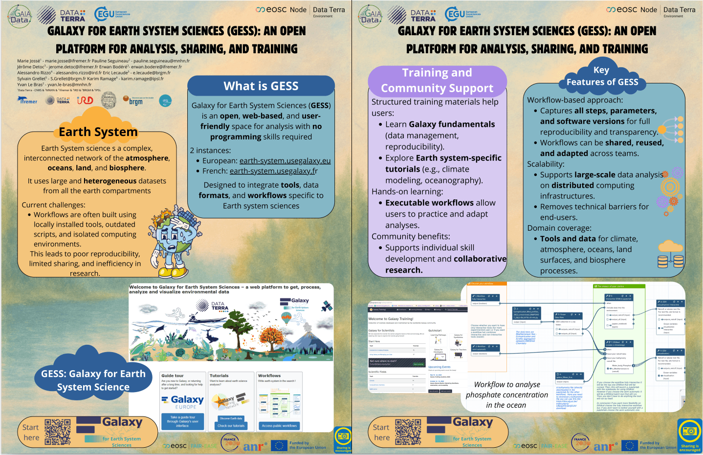
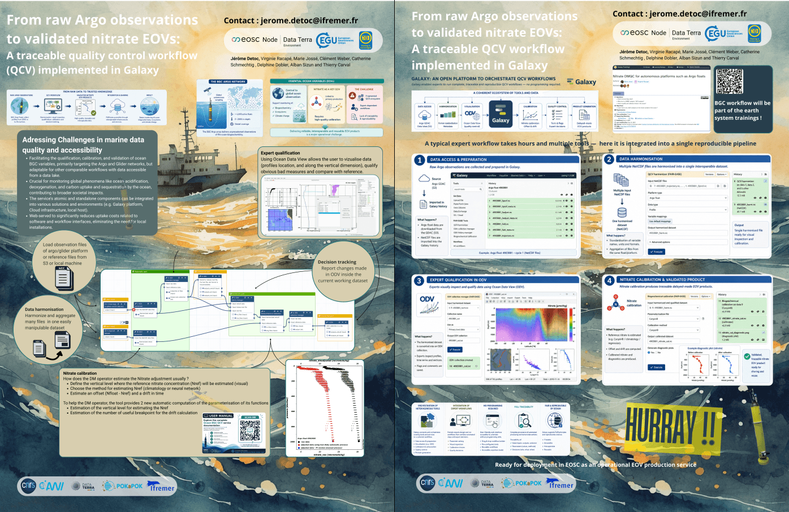
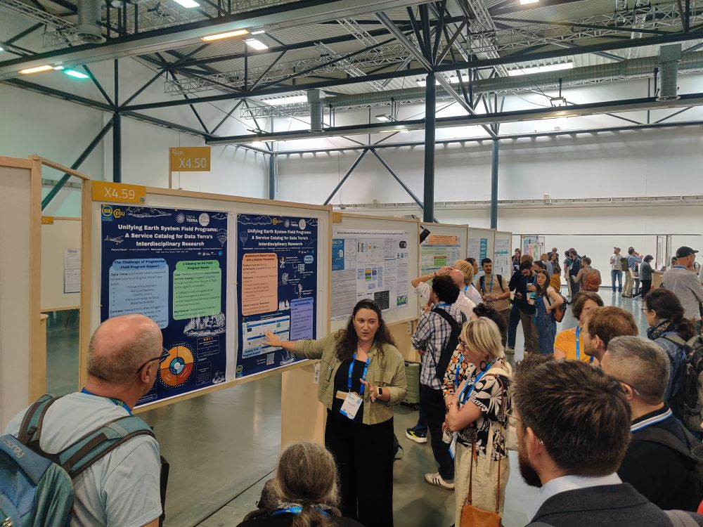
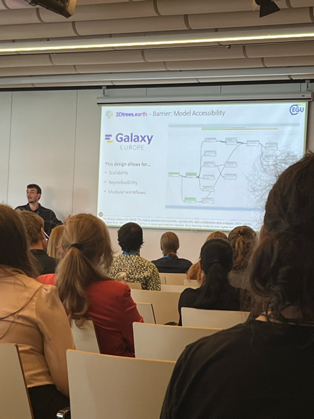
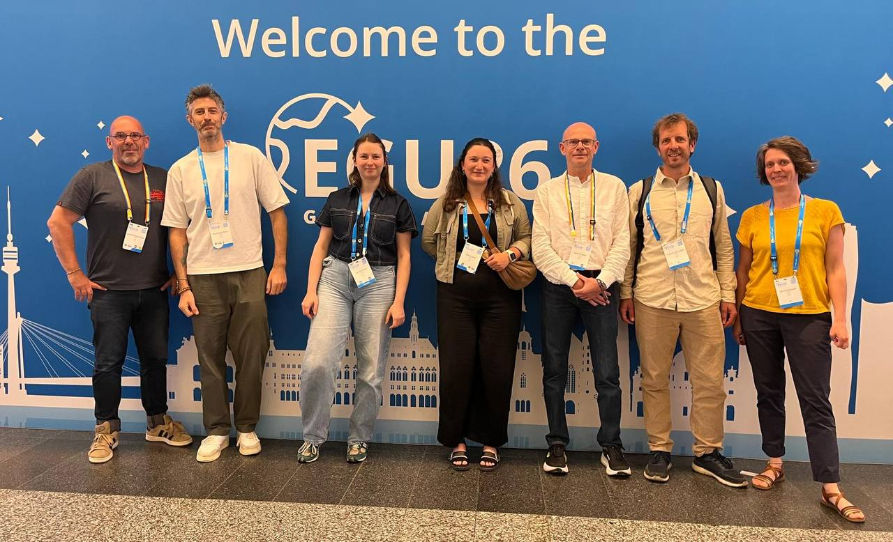

The European Geosciences Union (EGU) was held at the Austria Center Vienna (ACV) and online, from the 4th-8th May 2026.
The assembly is open to the scientists of all nations. During this conference the Galaxy for Earth System Science (GESS) was there and presented the community and its works through talks and posters.

# An inspiring talk

# Multiple beautiful posters

## Galaxy For Earth System Science (GESS): An open platform for analysis, sharing, and training !

This poster provides an overview of Galaxy for Earth System Sciences. It presents the platform, its representative tools and workflows, and the associated training ecosystem. 
Finally, it shows some lessons learned from deploying GESS, and perspectives for further development to support Earth system science.

## Operationalising essential ocean variables through robust and trusted QCV Workflows
This poster introduces the biogeochemical Argo data, before providing a concrete illustration of a complete nitrate QCV workflow.
It details the service implementation through interoperable workflows on the Galaxy platform and its deployment within the European Open Science Cloud (EOSC).

These posters where presented by teams and people from the Data Terra research infracture. Data Terra is greatly supporting GESS to grow !

# The follow-up
During this really fruitful conference, we were able to get in touch with multiple scientists interested in getting their hands on Galaxy. We hope they will reach again to contribute to GESS !

# Some photos of the event 

