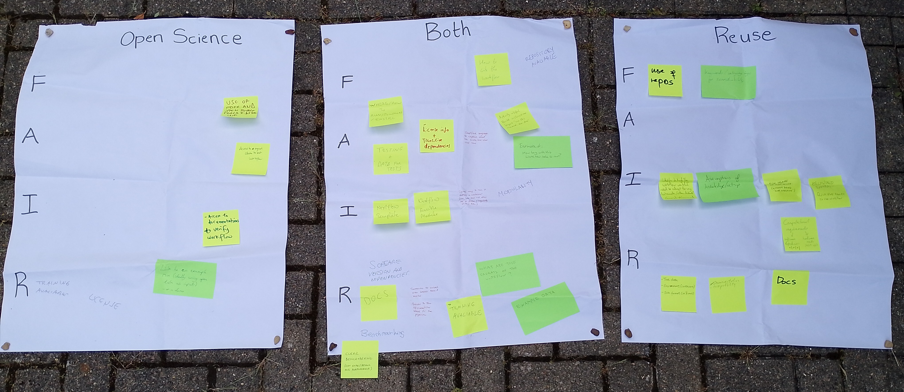
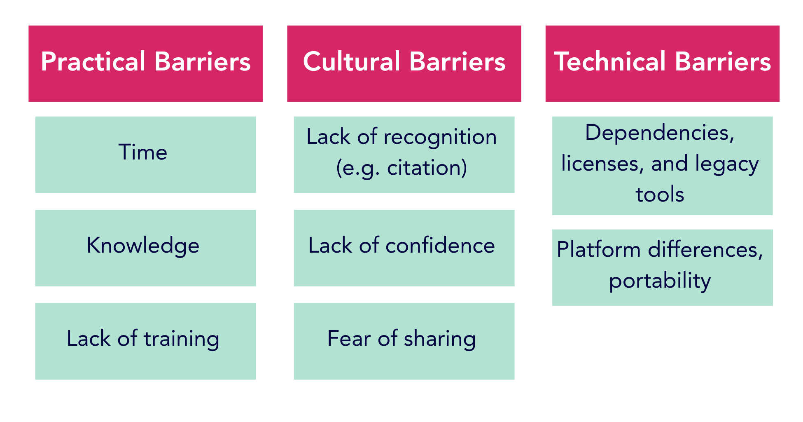
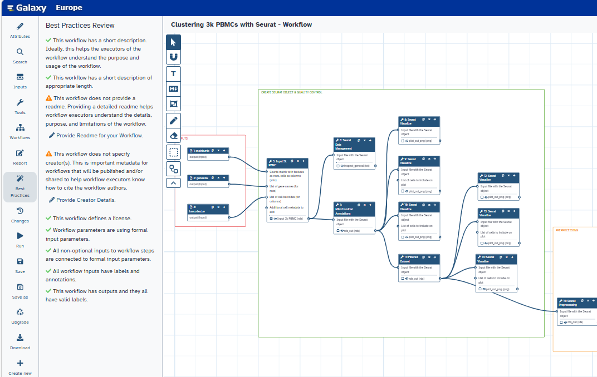

Galaxy’s magic wand for workflow FAIRification was one of the points of discussion during the workshop we recently ran at the [BioFAIR Showcase 2026](https://biofair.uk/biofair-annual-showcase-2026/) in Cambridge, UK. [BioFAIR](https://biofair.uk) is a UK-wide initiative to build a FAIR (Findable, Accessible, Interoperable, and Reusable) digital research infrastructure for the life sciences. The Showcase was a celebration of the last year of activity, including our own efforts as [BioFAIR Fellows](https://biofair.uk/fellows/), and a look at what to expect in the next twelve months.

The Showcase included several interactive workshops, including ours on ‘FAIRification of workflows: why, how, and barriers’. During this session, we were joined by around 25 researchers and research technical professionals with varying levels of experience in workflow FAIRification. Some had tied together bash scripts or GitHub Actions to run as workflows, others used workflow managers such as Snakemake, Nextflow, and Galaxy. Some attendees had only used their own workflows, while others had taken steps to share their workflows, make them FAIR or just reusable for themselves, their students or other researchers. Given the range of perspectives in the workshop, we were keen to learn why they were interested in workflow FAIRification and what barriers they might have encountered. 

### Why and How?
We began with a discussion of why we might want to produce FAIR workflows, which identified two key reasons: open science/reproducibility and workflow reuse. We then put ourselves in the position of someone who was trying to verify an analysis or attempting to reuse a workflow on their own data. We considered what we would need to know about the workflow in each case. 

Some aspects of FAIRness, such as availability of a test dataset, a simple explanation of what the workflow does, build instructions, and details of tool versions were considered generally useful. An open license and use of open-source tools were also preferred in both cases, since the workflow would need to be re-run to truly verify the results of a published analysis, not just when reusing the workflow. Availability of the original data (ideally itself FAIR) or an example run was essential for reproducibility. Some documentation explaining how to run the workflow was preferred in both cases, but when the aim was to reuse the workflow for a new analysis, more information was needed. In this case, researchers would like the documentation to include some advice on how the workflow could be adapted, what exceptions or caveats they should be aware of, and what assumptions were made about the user’s knowledge and computational set-up. Relevant keywords for finding useful workflows were also considered more important when the aim was to reuse them, since searchers would be looking for general terms rather than a specific paper or analysis.

A collection of post-it note contributions from the workshop participants:

  

### Barriers
Having considered why we might want to make our workflows FAIR, we moved on to discuss the reasons why we might find this hard to do. The group shared their experiences of encountering (and overcoming) practical, cultural, and technical barriers to workflow FAIRification.
Practical barriers were often encountered early in the process, with researchers lacking the time or knowledge to get started, or to build their skills to a level where they felt confident applying the FAIR principles. These initial challenges were exacerbated by the cultural barriers, with the lack of recognition from funders, institutions, and even from individuals reusing the workflows without citing them, making it harder for researchers to prioritise FAIRness or workflow sharing. Even if FAIRness is prioritised, we don’t always recognise how big of a step it can be to share a workflow. Researchers can feel unsure whether their workflow is good enough to share, or worry about potential problems - what if people have trouble using it and need help? What if a workflow bug invalidates someone’s results and causes their papers to be retracted? 
Overcoming these practical and cultural barriers is challenging enough, but researchers will then be faced with technical barriers. Creating a FAIR workflow can be complicated when it uses tools with incompatible licenses or old dependencies that aren’t readily available. Making that workflow run on different platforms is particularly difficult, although some attendees suggested that AI might make converting workflows quicker and easier. 

A summary of the barriers participants faced when making workflows FAIRer:

  

### Galaxy’s Magic Wand
And what about that Galaxy wand? Several attendees had already used this tool to make their Galaxy workflows FAIRer. If you’ve used Galaxy’s workflow editor, then you might have spotted the Best Practices magic wand in the toolbar. Open this up and you’ll get a list of suggested steps you can take to make your Galaxy workflows FAIRer - quickly and easily!

A screenshot of Galaxy's workflow editor showing the best practices suggestions:

  <figcaption></figcaption>

