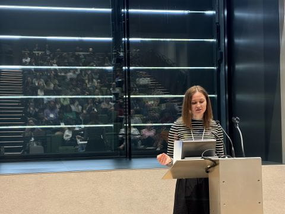
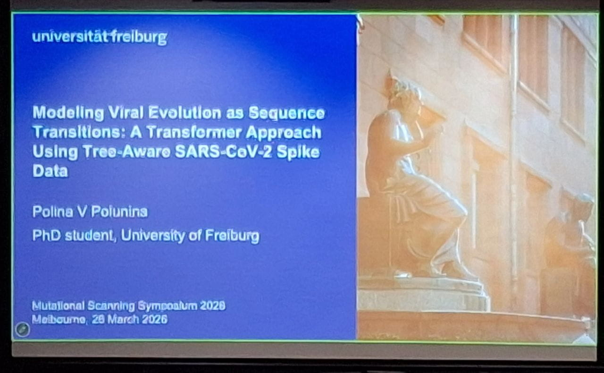
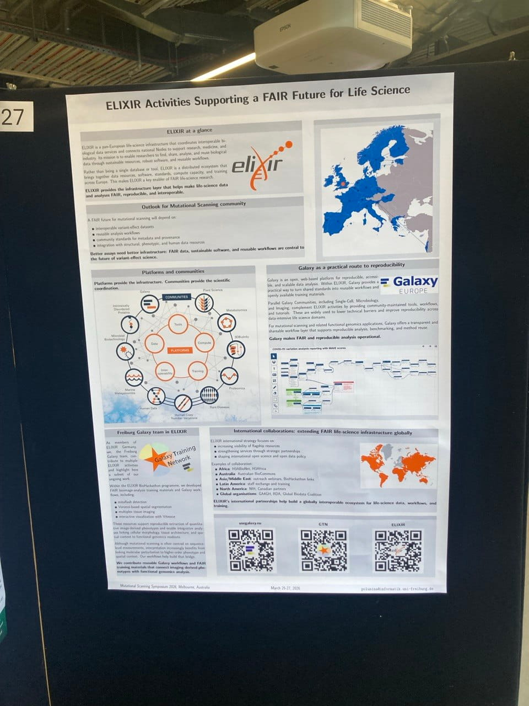

From March to May 2026, I had the opportunity to participate in the **ELIXIR Staff Exchange Programme**, spending just over two months in Melbourne, Australia. The exchange brought together researchers and infrastructure developers from **Galaxy Europe**, **Australian BioCommons**, **Galaxy Australia**, and the **University of Melbourne** around a shared goal: making deep mutational scanning (DMS) data and analysis more FAIR, accessible, and reproducible.

The exchange was hosted through collaborations with the **Collaborative Centre for Genomic Cancer Medicine** at the University of Melbourne and **Australian BioCommons**, with scientific supervision from Alan Rubin and close interaction with Gareth Price and the Galaxy Australia team.

## Why Deep Mutational Scanning?

Deep mutational scanning (DMS) has become an important experimental technology for studying the effects of genetic variants at scale. Applications range from clinical variant interpretation and protein engineering to understanding viral evolution and fundamental questions in molecular biology.

At the same time, the DMS community has developed important resources such as **MaveDB**, a public repository for multiplexed assays of variant effects. However, many researchers still face challenges when trying to access, analyse, and reproduce DMS datasets using standard bioinformatics platforms.

One of the main objectives of this exchange was therefore to strengthen interoperability between DMS resources and Galaxy, enabling researchers to work with these datasets through accessible and reproducible workflows.

## Participating in the Mutational Scanning Symposium

A major component of the exchange was participation in the **9th Mutational Scanning Symposium (MSS 2026)**, which brought together researchers from around the world working on functional genomics, protein science, variant interpretation, and machine learning.

During the symposium, I presented a talk **Modeling Viral Evolution as Sequence Transitions: A Transformer Approach Using Tree-Aware SARS-CoV-2 Spike Data**

The work explores how machine learning models can be used to study evolutionary trajectories and variant effects using large-scale protein sequence data.
<table align="center" width="80%">
<tr>
<td width="50%">

</td>
<td width="50%">

</td>
</tr>
</table>

I also presented a poster, [*ELIXIR Activities Supporting a FAIR Future for Life Science*](https://doi.org/10.5281/zenodo.20599058).

The poster introduced ELIXIR's role in building sustainable, interoperable, and FAIR life science infrastructure, creating opportunities to discuss how DMS resources and workflows could further benefit from integration with ELIXIR services.

  

## Sharing Research Across Different Communities

One of the most rewarding aspects of the exchange was the opportunity to present my work to audiences with very different backgrounds and interests.

During my stay, I delivered additional talks at:

### Journal Club – Collaborative Centre for Genomic Cancer Medicine

**21 April 2026** - Protein Language Models: Introduction

### Melbourne Bioinformatics Group Meeting

**5 May 2026** - From Deep Mutational Scanning to Evolutionary Modeling: Machine Learning Approaches for Studying Variant Effects in Proteins

### All of BioCommons Meeting

**14 May 2026** - Variant Effect Prediction from Deep Mutational Scanning Using Machine Learning

These presentations led to valuable discussions around variant interpretation, machine learning, FAIR data management, and the future of computational approaches for studying protein function.

Presenting to international, institutional, and national audiences also gave me valuable experience in adapting scientific communication to different communities and levels of expertise.

## Bringing DMS Infrastructure Closer to Galaxy

Alongside scientific discussions, the exchange included substantial technical development work focused on improving accessibility and reproducibility for DMS analyses.

One major outcome was the implementation of a **MaveDB FileSource for Galaxy**, enabling easier access to DMS datasets stored in MaveDB directly from Galaxy environments.

I also worked on the initial **CountESS integration into Galaxy**. CountESS is a toolkit designed for processing and analysing mutational scanning experiments, and integrating it into Galaxy represents an important step toward more reproducible and accessible DMS analysis workflows.

In addition, we explored broader opportunities for integrating mutational scanning tools and workflows into Galaxy and discussed future directions for supporting this growing research community within the Galaxy ecosystem.

To support adoption by researchers, I also began drafting **Galaxy Training Network (GTN)** materials for CountESS, laying the groundwork for future community training resources.

## Connecting Communities

One of the most valuable outcomes of the exchange was the opportunity to connect communities that do not always interact closely.

Deep mutational scanning researchers, Galaxy developers, infrastructure providers, and machine learning researchers often face similar challenges around reproducibility, data accessibility, and scalable analysis, yet they frequently work in separate communities.

The exchange helped create new links between:

* Galaxy Europe
* Galaxy Australia
* Australian BioCommons
* MaveDB developers and users
* Researchers working on variant effect prediction and protein evolution

An especially rewarding aspect was helping strengthen interactions between the Australian DMS community and Galaxy Australia. During the exchange, Gareth Price visited the University of Melbourne to meet with Alan Rubin and colleagues, helping establish connections that had not previously been explored.

These interactions are expected to continue through future collaborations, including ongoing discussions around Galaxy support for mutational scanning workflows and community engagement activities.

## Learning Beyond the Technical Work

While the technical achievements were important, the exchange also provided valuable professional and personal development opportunities.

Working within a new research environment allowed me to learn how researchers from different disciplines approach scientific problems, communicate results, and build collaborations. I gained experience presenting my work to audiences ranging from highly specialised domain experts to broader bioinformatics communities.

The many discussions throughout the visit also helped clarify my own scientific interests. Conversations with researchers at the University of Melbourne, Australian BioCommons, and the wider mutational scanning community reinforced my interest in using computational methods to better understand protein evolution and the effects of genetic variation on protein function.

## Looking Ahead

The ELIXIR Staff Exchange Programme provided an excellent framework for building lasting international collaborations while delivering concrete scientific and technical outcomes.

The integrations developed during the exchange, the training materials currently in preparation, and the new relationships established between European and Australian communities provide a strong foundation for future work. Many of the discussions initiated during the visit will continue through ongoing collaborations between Galaxy Europe, Galaxy Australia, Australian BioCommons, and researchers working in deep mutational scanning and variant effect prediction.

I am grateful to ELIXIR for supporting this exchange and to Alan Rubin, Gareth Price, their colleagues, and the broader Australian research community for their hospitality, collaboration, and many inspiring conversations throughout the visit.

## Acknowledgements

This work was supported through the **ELIXIR Staff Exchange Programme**. The exchange was hosted by the Collaborative Centre for Genomic Cancer Medicine (University of Melbourne) and Australian BioCommons, with participation from Galaxy Australia and Galaxy Europe.

Many thanks to Björn Grüning, Wolfgang Maier, Alan Rubin, Gareth Price, their colleagues, and everyone who contributed to making this exchange such a productive and inspiring experience.
