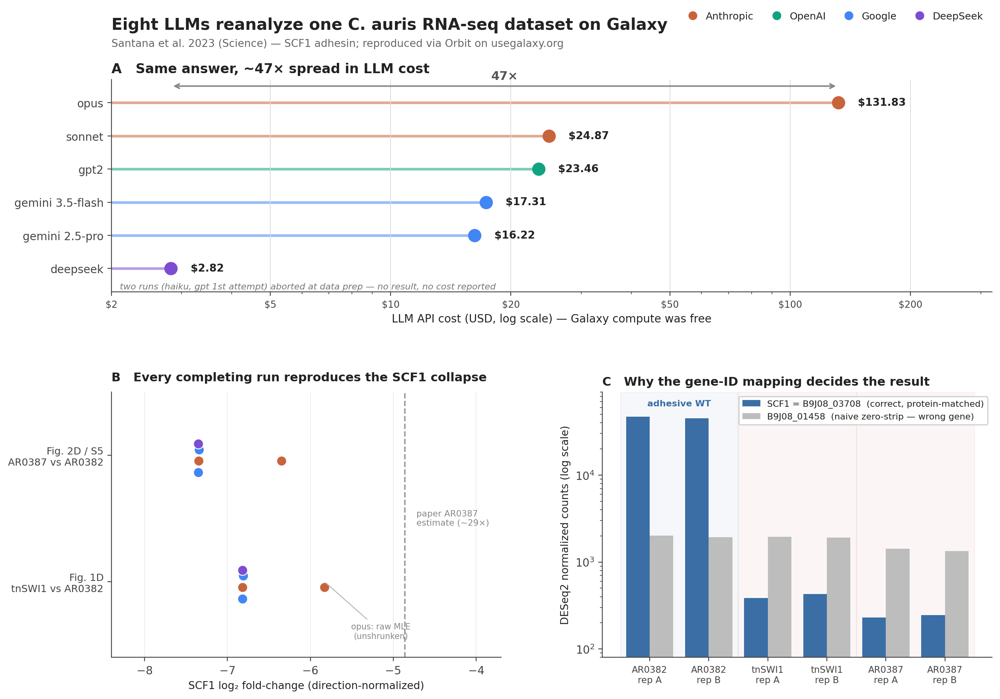

What happens when you hand a published bioinformatics analysis to an AI agent and ask it to reproduce the work on Galaxy? We ran that experiment eight times—once per frontier model—and the outcomes are both reassuring and instructive.

## The setup

We took the bulk RNA-seq data from [Santana et al. 2023, *Science*](https://pmc.ncbi.nlm.nih.gov/articles/PMC11235122/)—the study that identified **Scf1** as a *Candida auris*-specific adhesin—and asked eight large language models to reanalyze it independently. Each model drove an [Orbit](https://github.com/galaxyproject/loom) session (the agentic interface to Galaxy built on the Loom harness), connected to [usegalaxy.org](https://usegalaxy.org) through the Galaxy MCP server, with reference data from [BRC-analytics](https://github.com/galaxyproject/brc-analytics).

The task was identical for every model: build a paired-end collection from the six samples (BioProject `PRJNA904261`), run the IWC `rnaseq-pe` and `rnaseq-de` workflows on the current *C. auris* B8441 v3 assembly, reproduce the two key `DESeq2` contrasts from the paper, and recreate a labeled volcano plot highlighting *SCF1*. The lineup: Claude Opus, Sonnet, and Haiku; OpenAI GPT-5.5 (two attempts); Google Gemini 2.5 Pro and Gemini 3.5 Flash; and DeepSeek.

## Every completing run reproduced the published result

Six of the eight runs completed the full analysis, and all six independently reproduced the paper's central finding: *SCF1* is strongly down-regulated both in the *tnSWI1* mutant and in the poorly-adhesive AR0387 isolate (log2 fold-change ≈ −6.8 to −7.4, adjusted *p* ≈ 0).

The figure captures the three lessons of the experiment. **Panel B** shows how tightly the completing runs agree on the *SCF1* fold-change—every model lands in a narrow band, with only Opus mildly attenuated because it reported raw, unshrunken `DESeq2` estimates. **Panel C** shows the underlying expression collapse: *SCF1* falls from ~46,000 normalized counts in the adhesive wild type to a few hundred in the mutant and the poorly-adhesive isolate. The result is robust across models, and robust to a newer genome annotation than the original authors used.

## Locus tags were silently re-numbered between assembly versions

The most instructive scientific detail concerns gene identifiers. The paper used the B8441 *v2* assembly, whose locus tags read like `B9J08_001458` (SCF1). The current *v3* assembly re-numbered those tags—and not by a simple zero-strip. The naive guess `B9J08_001458` → `B9J08_01458` resolves to a *different* gene, one with no differential expression at all (Panel C, grey bars). Two models initially followed that mapping and reported *SCF1* as not differentially expressed—a false negative—before recovering. The correct bridge is protein-level reciprocal-best-hit matching with DIAMOND, which maps `B9J08_001458` to v3 `B9J08_03708`. The lesson generalizes to anyone re-running an older analysis on a current assembly, human or AI: never carry locus tags across assembly versions by their numbers; reconcile them at the protein level.

## Cost spanned ~47× for the same answer

Because Galaxy compute is free on usegalaxy.org, the only cost was the LLM API spend, which makes the figures directly comparable (**Panel A**). They ranged ~47×, from $131.83 for the most thorough run—fully labeled figures and a polished report—down to $2.82 for a run that reached the same scientific conclusion. The extra spend bought completeness, polish, and less hand-holding; it did not buy a more correct answer.

We also observed a clean demonstration of Galaxy's reproducibility: two runs that used the unmodified IWC workflows with identical parameters produced **bit-identical** `DESeq2` tables, matching to twelve significant figures. When the pipeline is fixed, the platform is deterministic regardless of which agent drove it.

## What broke—and what we are fixing

The failures were the most valuable part of the experiment. Two runs never reached the analysis at all, stalling at data preparation. Across all runs we catalogued recurring friction: agents blocking on polling loops and stalling silently for up to two hours; MCP tool errors reported as "success" with the failure buried in the result payload; a missing history-copy primitive; and the absence of a protein-FASTA and cross-assembly ID-mapping affordance that would have prevented the locus-tag confusion entirely.

The platform is already moving. The most common Galaxy-side failure—optional workflow parameters leaking an unresolved placeholder into a tool's command line—was **fixed upstream** in [Galaxy PR #22820](https://github.com/galaxyproject/galaxy/pull/22820) (merged into 26.0) during the very window these runs took place. We filed the remaining harness issues against [`galaxyproject/loom`](https://github.com/galaxyproject/loom/issues) so they can be addressed systematically.

## Try it yourself

The full write-up—model-by-model deep dive, the complete shortcomings catalogue, and concrete recommendations for Orbit, Galaxy, and the MCP servers—together with every run's working directory and the Galaxy history IDs, is public:

**[github.com/nekrut/orbit-paper](https://github.com/nekrut/orbit-paper)**

Agentic analysis on Galaxy is genuinely promising: the science reproduced cheaply across a wide range of models. The work ahead is in the tooling—making failures visible, waits non-blocking, and reference metadata rich enough to keep the agent on the right path.
