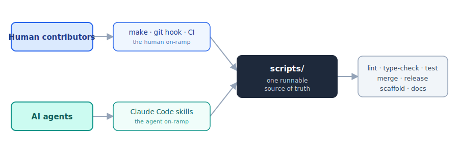
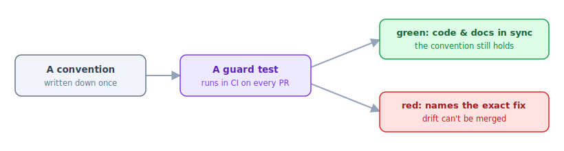

# A repository for both humans and AI agents

We've been building **galaxy-tool-refactor**, a toolkit for linting and upgrading Galaxy tool XML, with AI coding agents as real collaborators, alongside the usual human workflow of branches, reviews, and CI. The most useful lesson so far has nothing to do with XML, or with any one AI tool:

**Don't let the way an agent works on your repository and the way a person works on it become two different things.**

Add an `AGENTS.md`, a `CLAUDE.md`, or a folder of agent "skills," and you feel the pull toward a second, parallel description of your project, one only the agent reads, in a format only that agent runs. It drifts from your contributing guide and from CI, and contributors who don't use that agent get none of it. The fix turned out to be a comfortably old idea.

## One runnable source of truth, many callers

The principle: **put each workflow's logic in one runnable script, and have every consumer call it**: CI, your git hooks, a task runner for people, and your agent's skills. The agent becomes just one more caller, not a separate implementation.

*Two on-ramps, one source of truth. People reach the scripts through `make`, a git hook, and CI; agents reach the same scripts through skills. There is only one implementation under both doors.*

Our quality gate is the clearest example. One script runs the linter, the strict type-checker, and the test suite across every package, and it is invoked by:

- **GitHub Actions** on every pull request (across Python 3.10 to 3.13),
- a **git pre-push hook**, so a plain `git push` catches problems locally,
- a **`make qa-gate`** target for anyone who'd rather just type that, and
- the agent's **pre-PR review skill**, as its final mechanical step.

There is exactly one place the package list and the checks live. When we added or renamed packages, nothing silently fell out of sync, because there was nothing to keep in sync but the one script.

## Make conventions executable

Documentation drifts. A convention written down six months ago can quietly become false, and nobody notices until a newcomer, human or agent, follows it off course. So wherever we could, we turned conventions into **tests**.

*A convention you can run is a convention that can't quietly rot.*

A few that have earned their keep:

- Every "see decision §12" cross-reference in our docs is checked by a test that fails if the cited section doesn't exist.
- Our generated statistics pages can't go stale: a test fails (naming the exact command to regenerate them) if a rule is added without refreshing them.
- Our packages are released together; a test enforces that they all carry the same version and depend on each other exactly.

None of these are glamorous, but they are the difference between a convention and a hope. They help agents a great deal, too: an agent that breaks a convention gets a red test with a specific message, rather than a vague sense that "that's not how things are done here."

## Two on-ramps, one map

For the workflows that genuinely are step-by-step (merge a reviewed pull request and tidy up, scaffold a new component, or cut a release), we keep the steps in a script and let both audiences reach them. People run `make help` to discover them and, say, `make ship-pr PR=123` to run one; agents have a matching skill that calls the *same* script and adds the judgment a script can't, such as deciding *whether* to merge, or diagnosing one that's blocked. A short `workflows.md` lists each workflow's human path and agent path side by side, and a standing rule says any new agent skill has to ship its script and its `make` target in the same change. Neither audience ends up a second-class citizen.

## One set of documentation, read by both

The same idea applies to the words, not just the commands. In our setup an agent's "skill" is an ordinary Markdown file, so a person can open it and read it like any other document. The file that tells the agent how to cut a release is also the human's release runbook, and it points at the same contributing guide, the same `workflows.md` map, and the same format references a person would read, instead of restating them in a private dialect. There is one body of documentation, and both audiences read it: fix a doc once, and you have fixed it for the person and the agent at the same time. Anyone can also see exactly what the agent was told, because the skill is just a file in the repository, reviewable like the code. The agent's guidance is not a separate, opaque layer bolted onto the project; it is the project's own documentation, written so that a person and a program can both follow it.

## Encode the hard-won lessons

Here is a concrete one. Early on, a careless merge command twice wiped a large local test corpus that takes a long time to rebuild. The lesson lived only in someone's head as "be careful with that flag," which isn't good enough. So the safe merge sequence became a script with the guardrails built in: it refuses the dangerous option, confirms the merge actually succeeded before cleaning anything up, and verifies the corpus is intact afterward.

The payoff was immediate, and a little poetic. The very first time we ran that script to *preview* a merge, it surfaced a bug in itself (it was quietly switching branches) that the old prose checklist had hidden for weeks. A workflow you can run is a workflow you can test. A workflow that lives only in an instructions file is one you can only hope is correct.

We have made a habit of this. When we learn something the hard way, whether a constraint, a gotcha, or a new requirement, we try to put it where it cannot be lost again: a test, a script, or a line in the documentation that both a person and an agent will read, instead of leaving it as folklore in someone's memory. This post is itself an instance of the rule.

## Does it actually help both?

In our experience, yes, and fairly symmetrically:

- **People** get discoverability (`make help`), the same gate that CI runs, and a contributing guide that points at real commands instead of merely describing them.
- **Agents** get skills that call the same scripts, plus executable guards that turn "did I follow the conventions?" into a plain green or red answer.
- **Neither drifts**, because there is only one implementation beneath both doors.

We won't oversell this. galaxy-tool-refactor is still pre-release, and the above is what has worked *so far*, not a finished theory; your project may well need a different shape. But none of it is Galaxy-specific or tied to any one AI vendor; it's `make`, shell scripts, and tests, with a thin agent layer resting on top. If you're beginning to welcome coding agents into a Galaxy tool repository, or any repository, the one suggestion we'd offer from our own experience is this: resist writing a second, agent-only copy of your workflow. Write it once, make it runnable, and let everyone, and everything, call it.

The toolkit lives on [GitHub](https://github.com/richard-burhans/galaxy-tool-refactor). Questions, ideas, and contributions are very welcome, from humans and agents alike.
