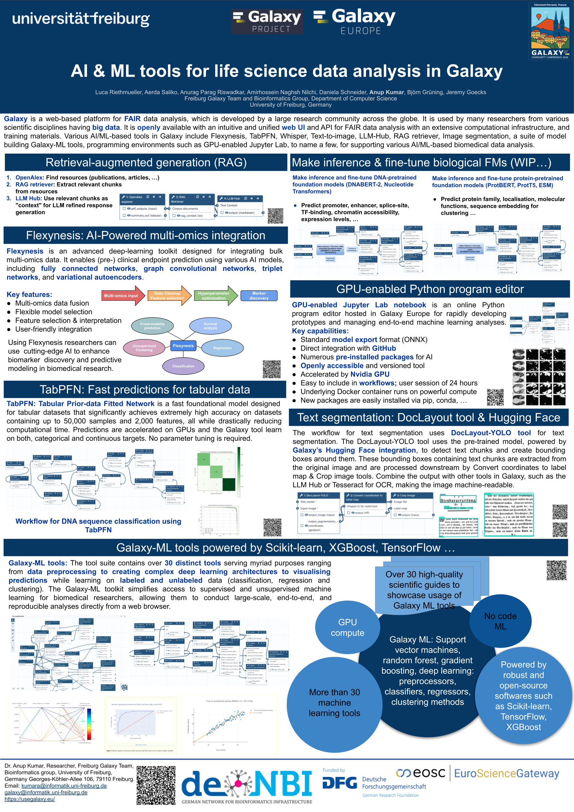
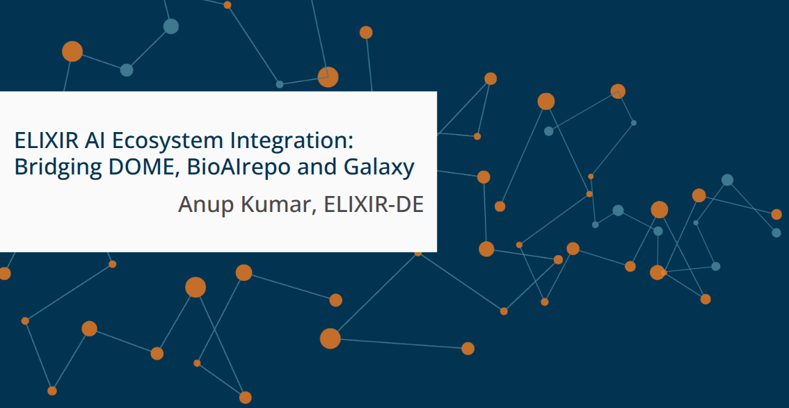
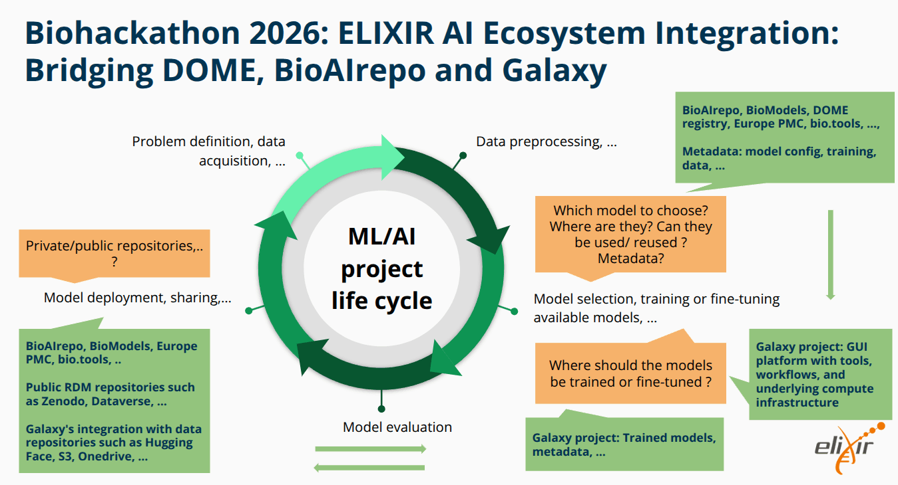
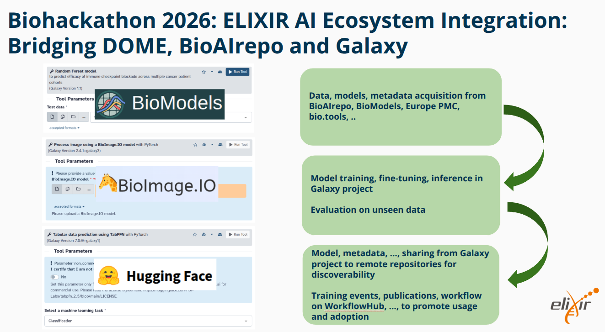
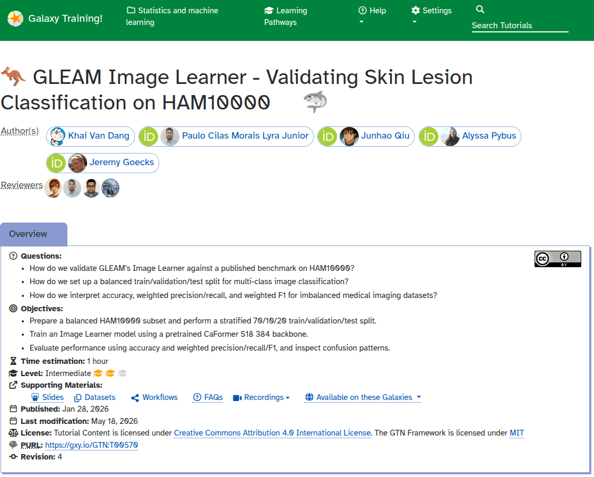
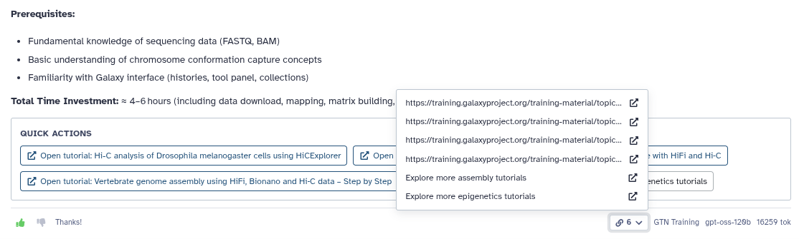

---
subsites:
- all
date: '2026-07-01'
title: Machine learning at Galaxy Community Conference 2026
tags: [tools, workflow, training]
tease: "Machine learning at Galaxy Community Conference 2026"
contributions:
  authorship:
    - anuprulez
  funding:
    - uni-freiburg
    - deNBI
---

## Machine learning at Galaxy Community Conference 2026

At the Galaxy Community Conference 2026 in Clermont-Ferrand, France, 22–26 June, the Galaxy Machine Learning community showcased a strong and connected vision for 
making AI/ML more usable, reproducible, and FAIR in life-science data analysis. The following sections highlights multiple contributions from the Galaxy ML community, including a poster, an ELIXIR BioHackathon talk, a training session, and CoFest work.

### Poster

The [ML poster](https://docs.google.com/presentation/d/1CRaXPXWu_ZO67V02vtp0kOMqsTCuFZ2w/edit?usp=sharing&ouid=113741045749084750249&rtpof=true&sd=true) highlighted the expanding Galaxy AI/ML ecosystem, including RAG workflows, 
[Flexynesis](https://usegalaxy.eu/?tool_id=flexynesis) for AI-powered multi-omics integration, [TabPFN](https://usegalaxy.eu/?tool_id=tabpfn) for fast tabular prediction, 
[GPU-enabled JupyterLab](https://usegalaxy.eu/?tool_id=interactive_tool_ml_jupyter_notebook&version=latest) for scalable model development, [Galaxy-ML tools powered by Scikit-learn](https://ml.usegalaxy.eu/), 
XGBoost and TensorFlow, text-segmentation workflows using [DocLayout-YOLO](https://usegalaxy.eu/?tool_id=doclayoutyolo) and Hugging Face's Galaxy integration, 
and ongoing work on inference and fine-tuning of biological foundation models such as DNABERT-2, ProtBERT, ProtT5 and ESM. 

### ELIXIR BioHackathon talk on "Bridging DOME, BioAIrepo, BioModels and Galaxy"

The project [Project 13: ELIXIR AI Ecosystem Integration: Bridging DOME, BioAIrepo and Galaxy](https://github.com/elixir-europe/biohackathon-projects-2026/blob/main/13.md) was accepted by ELIXIR for the 
upcoming BioHackathon 2026.I presented the project (from Galaxy side) in the ELIXIR BioHackathon talk at GCC 2026. The talk highlighted the need for a more connected ecosystem of AI/ML tools and resources in life sciences,
The ELIXIR talk presented potential ideas for bridging DOME, BioAIrepo, and Galaxy to support the full ML/AI project lifecycle: discovering models and metadata, 
training or fine-tuning models in Galaxy, evaluating them on unseen data, and sharing trained models and metadata back to public repositories such as BioAIrepo, BioModels, Europe PMC, 
bio.tools, Zenodo and Dataverse. Some of the research data repositories have already been integrated with Galaxy, 
and the talk highlighted the potential work to integrate BioAIrepo and others with Galaxy.

### ML training: Image classification with GLEAM Image Learner

Michelle and I conducted the ML training session using “GLEAM Image Learner – Validating Skin Lesion Classification on HAM10000,” tutorial, 
demonstrating practical image-learning tools in Galaxy for biomedical applications. including balanced train/validation/test splitting, use of a pretrained CaFormer S18 384 backbone, and evaluation 
with accuracy, weighted precision, recall and F1 for imbalanced medical imaging datasets. 

[GLEAM Image learner](https://training.galaxyproject.org/training-material/topics/statistics/tutorials/image_learner/tutorial.html)

### CoFest

During CoFest, I joined “Driving Galaxy using agents” project created by Dannon where I created a
pull request to contain reference URLs in a response generated by LLM. The PR validates all the generated links 
and adding a references button shows all links returned in AI responses, improving transparency 
and trust for the LLM generated responses.

### Acknowledgements

I would like to thank the Galaxy ML community (Michelle, Paulo, Dannon, Jeremy and others) for their contributions to the poster, ELIXIR BioHackathon talk, training session, and CoFest work. Special thanks to the organizers of GCC 2026 for providing a platform to showcase our work and foster collaboration within the Galaxy community.
Also, I would like to thank the ELIXIR BioHackathon organizers for accepting our project and Gavin and Eliot for their work on the proposal. 
Additionally, I would like to acknowledge the support from the University of Freiburg for funding my participation in the conference.

### References

- [GCC 2026 ML Poster](https://docs.google.com/presentation/d/1CRaXPXWu_ZO67V02vtp0kOMqsTCuFZ2w/edit?usp=sharing&ouid=113741045749084750249&rtpof=true&sd=true)
- [GCC ELIXIR Biohackathon talk](https://docs.google.com/presentation/d/1iDJHLkS-2kpeKLkkIYVxAqR0KmPRLFhiZMUK_jBQlHY/edit?usp=sharing)
- [ML training: GLEAM Image Learner training](https://training.galaxyproject.org/training-material/topics/statistics/tutorials/image_learner/tutorial.html)
- [CoFest PR](https://github.com/galaxyproject/galaxy/pull/23027)
